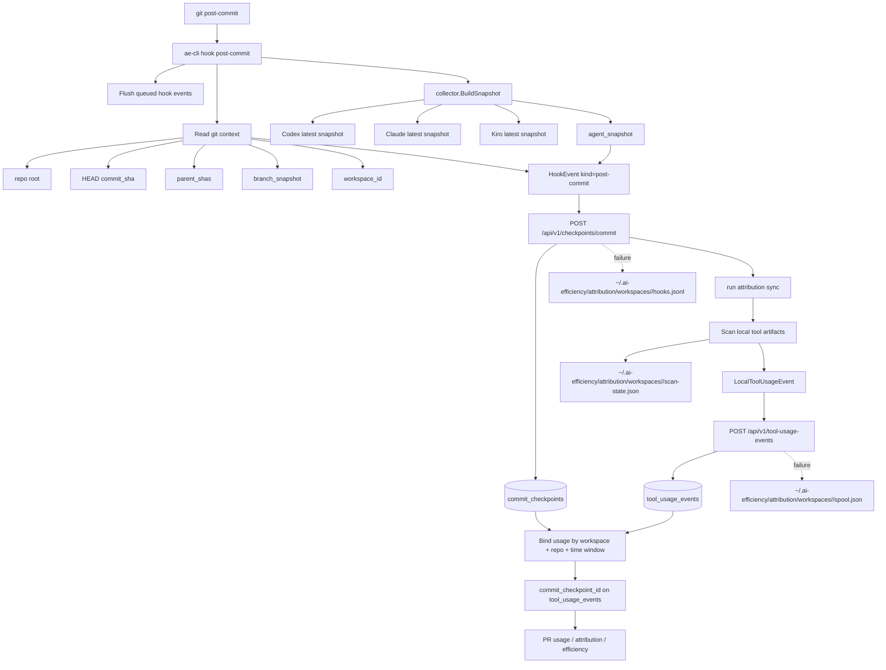
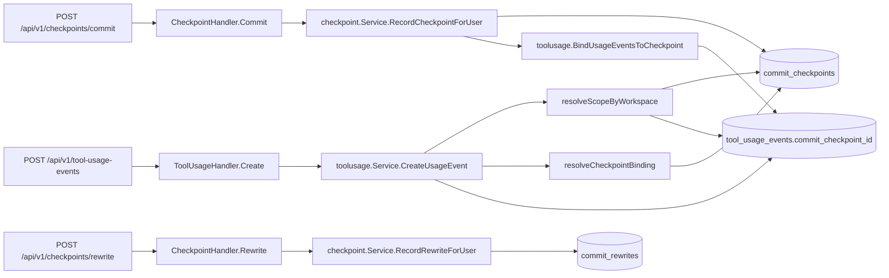
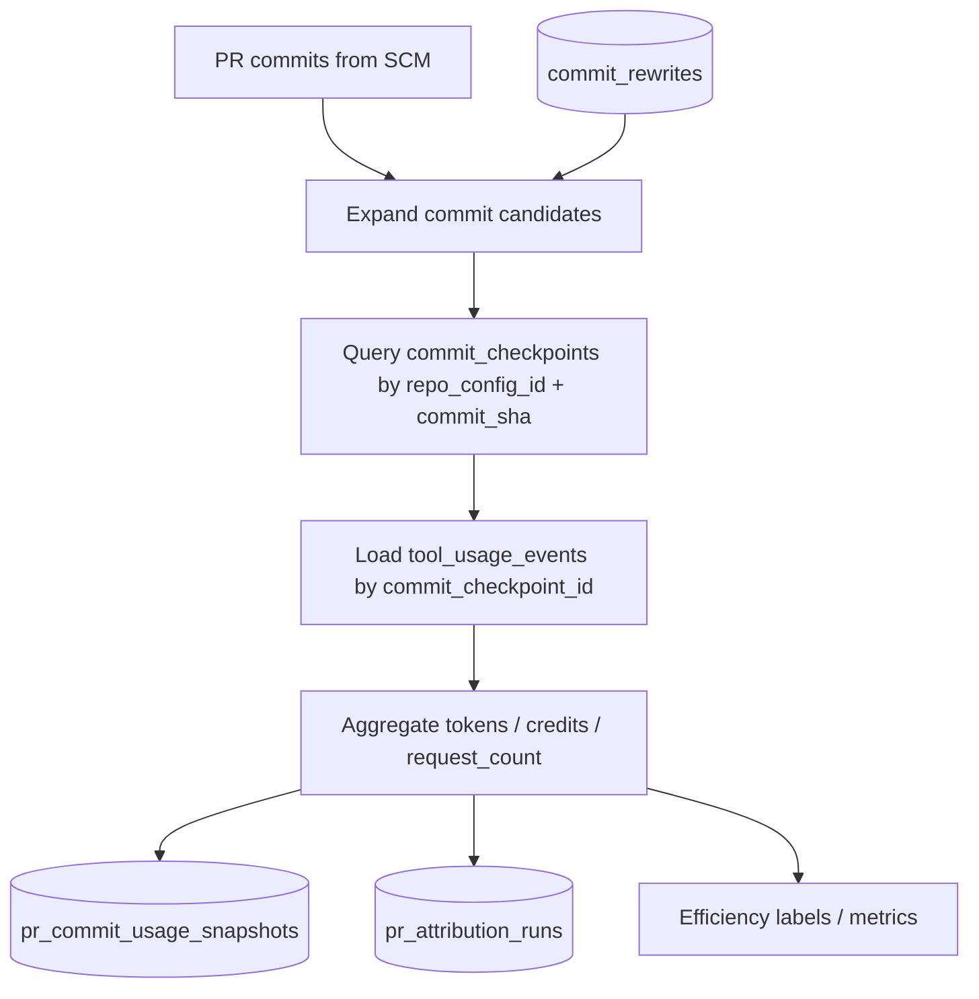

# ae-cli Hook Attribution Flow

本文档描述当前 `ae-cli hook post-commit` 相关链路：hook 读取哪些本地文件、抽取哪些数据结构、如何上报后端、后端如何落表，以及后续如何把 usage 关联到 commit / PR。

## 1. 总览

`post-commit` 有两条数据线：

1. **Commit checkpoint 线**：Git 已经生成 commit 后，hook 读取当前 `HEAD`，上报一条 `commit_checkpoint`。这条记录一定带 `commit_sha`。
2. **Tool usage 线**：hook 之后触发本地 attribution sync，扫描 Codex / Claude / Kiro 本地 artifact，上报 `tool_usage_event`。usage event 本身不带 commit id，后端用 `workspace_id + repo_config_id + 时间窗口` 绑定到 checkpoint。



## 2. Hook 入口行为

入口：`ae-cli/cmd/hook.go`

当前隐藏命令：

- `ae-cli hook post-commit`
- `ae-cli hook post-rewrite <rewrite_type>`
- `ae-cli hook attribution-sync`

当前修复分支里，三个入口共用 `hookCommandTimeout = 10s`。`post-commit` / `post-rewrite` 是 Git hook 热路径，超时、网络失败、解析失败按 fail-open 处理，不阻塞 Git；`hook attribution-sync` 也有同一个时间上限，但它是显式同步入口，`Flush` 或扫描失败时会把错误返回给调用方。

`post-commit` 执行顺序：

1. `Flush(ctx, cwd)`：先尝试重放当前 marker workspace 以及所有 pending workspace 的 hook event。
2. `git rev-parse --show-toplevel`：取 repo root。
3. `git rev-parse HEAD`：取已经创建好的 commit sha。
4. 读取 `<workspace>/.ae/session.json` 或从环境 bootstrap marker。
5. 若 marker 没有 `workspace_id`，用 repo root、git dir、common git dir 派生稳定 workspace id。
6. `collector.BuildSnapshot(DefaultPaths(repoRoot))`：构造 `agent_snapshot`。
7. 组装 `HookEvent{Kind: "post-commit"}`。
8. 若后端 client 支持 repo ensure，先调用 `POST /api/v1/repos/ensure-remote`。
9. 调用 `POST /api/v1/checkpoints/commit`。
10. checkpoint 上传成功后，调用 `attributionlocal.SyncEngine.RunForWorkspace` 上报 usage events。

分支行为：

- backend client 可用且 checkpoint 上传成功：当前 checkpoint 入库后，立即跑 attribution sync；sync 会先重放 usage spool，再扫描本地 artifact 并上传 usage event。
- backend client 可用但 repo ensure / checkpoint 上传失败：当前 checkpoint event 写入 `hooks.jsonl` 后返回，不继续扫描新的 usage。
- backend client 不可用：先用 nil client 跑 attribution sync，把新扫描到的 usage 写入 `spool.json`；再把当前 checkpoint event 写入 `hooks.jsonl`。
- `Flush` 重放的是 queue 里的旧 checkpoint / rewrite event。这些 event 已带自己的 `commit_sha` 或 old/new sha；即使由本次 hook 顺手上传，也不会改写成本次 commit。

## 3. 本地文件采集矩阵

### 3.1 `agent_snapshot` 采集

`agent_snapshot` 是 hook-time 快照，写入 `commit_checkpoints.agent_snapshot`。它只表达“commit 发生时本地最近工具状态”，不是正式 usage 归因事实。

| Tool | 默认文件 | 可覆盖 env | 采集过滤 | 采集字段 |
| --- | --- | --- | --- | --- |
| Codex | `~/.codex/sessions/**/*.jsonl` | `AE_CODEX_SESSION_FILES` | 文件内 `session_meta.payload.cwd` 必须等于 workspace root；取最近有效文件 | `source_session_id`, `input_tokens`, `cached_input_tokens`, `output_tokens`, `reasoning_tokens`, `total_tokens`, `raw_payload` |
| Claude | `~/.claude/**/*.jsonl` | `AE_CLAUDE_SESSION_FILES` | `type == "assistant"` 且 `cwd == workspace root`；取最近有效文件并累加该文件内 usage | `source_session_id`, `input_tokens`, `output_tokens`, `cached_input_tokens`, `raw_payload` |
| Kiro legacy JSON | `~/.kiro/**/*.json` | `AE_KIRO_SESSION_FILES` | `cwd == workspace root` | `conversation_id`, `credit_usage`, `context_usage_pct`, `raw_payload` |
| Kiro CLI SQLite | `~/Library/Application Support/kiro-cli/data.sqlite3` | `AE_KIRO_SESSION_FILES` | `conversations_v2.key == clean(workspace root)` | `conversation_id`, `credit_usage`, `context_usage_pct`, `raw_payload` |
| Kiro IDE | `~/Library/Application Support/Kiro/User/globalStorage/kiro.kiroagent/**` | `AE_KIRO_SESSION_FILES` | `workspace-sessions/**/sessions.json` 映射 workspace 到 chat session；execution 文件必须属于该 session 且 `status == "succeed"`；hook-time collector 默认最多取最近 50 个 execution 文件 | `conversation_id`, `credit_usage`, `context_usage_pct`, `raw_payload` |

`agent_snapshot` JSON 结构：

```json
{
  "codex": {
    "source_session_id": "codex-session-id",
    "input_tokens": 100,
    "cached_input_tokens": 20,
    "output_tokens": 30,
    "reasoning_tokens": 10,
    "total_tokens": 160,
    "raw_payload": {
      "type": "token_count",
      "info": {
        "total_token_usage": {
          "input_tokens": 100,
          "cached_input_tokens": 20,
          "output_tokens": 30,
          "reasoning_output_tokens": 10,
          "total_tokens": 160
        }
      }
    }
  },
  "claude": {
    "source_session_id": "claude-session-id",
    "input_tokens": 100,
    "output_tokens": 30,
    "cached_input_tokens": 20,
    "raw_payload": {}
  },
  "kiro": {
    "conversation_id": "kiro-conversation-id",
    "credit_usage": 0.12,
    "context_usage_pct": 35.5,
    "raw_payload": {}
  }
}
```

### 3.2 `tool_usage_events` 采集

`tool_usage_events` 是后端正式聚合用的 usage 事实。它们由 `attributionlocal.Scanner` 产生，经 `SyncEngine` 上报。

| Tool | 默认文件 | 增量状态 | 采集字段 | dedupe key |
| --- | --- | --- | --- | --- |
| Codex JSONL | `~/.codex/sessions/**/*.jsonl` | `scan-state.json.file_mod_unix` + `codex_session_ids` cache | `token_count` 的 token usage、timestamp、session id、response id、raw source | `codex-jsonl:<session_id>:<response_id>` |
| Codex SQLite compatibility | `~/.codex/logs_2.sqlite` | `scan-state.json.codex_sqlite[path].last_log_id` | `logs.feedback_log_body` 中 `response.completed` 行的 token counts、conversation id、response id、timestamp；只保留 conversation id 命中当前 workspace Codex JSONL `session_meta` 的行；首次无 watermark 时只回看最近 5000 行 | `codex:<conversation_id>:<response_id>` |
| Claude JSONL | `~/.claude/**/*.jsonl` | `scan-state.json.file_mod_unix` | assistant message usage、timestamp、session id、message id、raw payload | `claude:<session_id>:<message_id>` |
| Kiro legacy JSON | `~/.kiro/**/*.json` | `scan-state.json.file_mod_unix` | per-turn credit/token/context usage、file mtime as observed time | `kiro:<session_id>:<turn_index>` |
| Kiro CLI SQLite | `~/Library/Application Support/kiro-cli/data.sqlite3` | `scan-state.json.file_mod_unix` | latest request metadata、credit usage、context usage、timestamps | `kiro-cli:<conversation_id>:<request_id>` |
| Kiro IDE execution | `~/Library/Application Support/Kiro/User/globalStorage/kiro.kiroagent/**` | `scan-state.json.file_mod_unix` | succeeded execution 的 credit usage、context usage、start/end time | `kiro-ide:<chat_session_id>:<execution_id>` |

`LocalToolUsageEvent` 结构：

```go
type LocalToolUsageEvent struct {
    Tool              string
    WorkspaceID       string
    ToolSessionID     string
    ToolEventID       string
    DedupeKey         string
    RequestCount      int
    UsageUnit         UsageUnit // "token" or "credit"
    InputTokens       int64
    OutputTokens      int64
    CachedInputTokens int64
    ReasoningTokens   int64
    CreditUsage       float64
    ContextUsagePct   float64
    ObservedStartAt   time.Time
    ObservedEndAt     time.Time
    RawSourcePath     string
    RawSourceLocator  string
    RawPayload        map[string]any
}
```

## 4. CLI 上报结构

### 4.1 `POST /api/v1/checkpoints/commit`

由 `ae-cli/internal/client.CommitCheckpointRequest` 发送。

```json
{
  "event_id": "stable-checkpoint-event-id",
  "repo_full_name": "org/repo-or-remote-url",
  "workspace_id": "workspace-uuid",
  "commit_sha": "commit-sha",
  "parent_shas": ["parent-1"],
  "branch_snapshot": "feature/example",
  "head_snapshot": "commit-sha",
  "binding_source": "marker",
  "agent_snapshot": {},
  "captured_at": "2026-05-23T12:34:56Z"
}
```

说明：

- `event_id = sha256("checkpoint\x1f" + repoHint + "\x1f" + commitSHA)`，用于幂等。
- `commit_sha` 来自 `git rev-parse HEAD`，所以 `post-commit` checkpoint 本身不会是“没有 commit 的记录”。
- CLI 的内部 `HookEvent` 带 legacy `session_id`，但当前后端 `CommitCheckpointRequest` 不接收也不落库这个字段。
- 当前 CLI 的 `head_snapshot` 与 `commit_sha` 相同，都是 hook 时读到的 HEAD sha。
- `agent_snapshot` 只存在于 checkpoint 记录，不直接生成 usage event。

### 4.2 `POST /api/v1/tool-usage-events`

由 `ae-cli/internal/client.ToolUsageEventRequest` 发送。

```json
{
  "tool": "codex",
  "workspace_id": "workspace-uuid",
  "tool_session_id": "tool-session-id",
  "tool_event_id": "response-or-message-or-execution-id",
  "dedupe_key": "tool-specific-dedupe-key",
  "usage_unit": "token",
  "request_count": 1,
  "input_tokens": 100,
  "output_tokens": 30,
  "cached_input_tokens": 20,
  "reasoning_tokens": 10,
  "credit_usage": 0,
  "context_usage_pct": 0,
  "observed_start_at": "2026-05-23T12:30:00Z",
  "observed_end_at": "2026-05-23T12:30:00Z",
  "raw_source_path": "~/.codex/sessions/.../session.jsonl",
  "raw_source_locator": "line:42",
  "raw_payload": {}
}
```

说明：

- usage event 不带 `commit_sha`。
- 后端根据 `workspace_id` 解析 repo/user scope。
- 后端根据 `observed_end_at` 找可绑定的 checkpoint。
- 上传失败时写入 `~/.ai-efficiency/attribution/workspaces/<workspace_id>/spool.json`，后续 sync 重试。

### 4.3 `POST /api/v1/checkpoints/rewrite`

`post-rewrite` 用于记录 amend / rebase 等重写关系，不上传 usage。

```json
{
  "event_id": "stable-rewrite-event-id",
  "repo_full_name": "org/repo-or-remote-url",
  "workspace_id": "workspace-uuid",
  "rewrite_type": "amend",
  "old_commit_sha": "old-sha",
  "new_commit_sha": "new-sha",
  "binding_source": "marker",
  "captured_at": "2026-05-23T12:34:56Z"
}
```

后续 PR usage 查询会沿 `commit_rewrites.new_commit_sha -> old_commit_sha` 扩展候选 commit。

## 5. 后端路由和服务



## 6. 后端表设计

### 6.1 `commit_checkpoints`

Ent schema: `backend/ent/schema/commit_checkpoint.go`

| 字段 | 类型 | 必填 | 说明 |
| --- | --- | --- | --- |
| `id` | int | yes | Ent 主键 |
| `event_id` | string unique | yes | hook event 幂等键 |
| `user_id` | int nullable | no | authenticated CLI user |
| `workspace_id` | string | yes | 本地 worktree / gitdir 派生 id |
| `repo_config_id` | int | yes | 关联 repo config |
| `commit_sha` | string | yes | `post-commit` 时的 `HEAD` |
| `parent_shas` | JSON []string | yes | commit parent 列表 |
| `branch_snapshot` | string nullable | no | hook 时分支名 |
| `head_snapshot` | string nullable | no | hook 时 HEAD snapshot |
| `binding_source` | enum | yes | `marker` / `env_bootstrap` / `manual` / `unbound` |
| `agent_snapshot` | JSON object | no | hook-time collector 快照 |
| `captured_at` | time | yes | hook capture time，默认 server time，可由 CLI 上传 |

索引：

- unique `(repo_config_id, commit_sha)`
- unique `event_id`

### 6.2 `tool_usage_events`

Ent schema: `backend/ent/schema/tool_usage_event.go`

| 字段 | 类型 | 必填 | 说明 |
| --- | --- | --- | --- |
| `id` | int | yes | Ent 主键 |
| `tool` | string | yes | `codex` / `claude` / `kiro` |
| `workspace_id` | string | yes | 与 checkpoint 同一 workspace 才能绑定 |
| `repo_config_id` | int | yes | 从 workspace scope 解析 |
| `user_id` | int | yes | authenticated CLI user |
| `tool_session_id` | string | yes | 工具会话 id / conversation id |
| `tool_event_id` | string nullable | no | 工具内事件 id |
| `observed_start_at` | time | yes | 工具事件开始时间 |
| `observed_end_at` | time | yes | 工具事件结束时间 |
| `request_count` | int | no | 请求次数 |
| `usage_unit` | enum | yes | `token` / `credit` |
| `input_tokens` | int64 | no | input tokens |
| `output_tokens` | int64 | no | output tokens |
| `cached_input_tokens` | int64 | no | cached input tokens |
| `reasoning_tokens` | int64 | no | reasoning tokens |
| `credit_usage` | float | no | Kiro credit usage |
| `context_usage_pct` | float | no | context usage percent |
| `commit_checkpoint_id` | int nullable | no | 绑定后的 checkpoint id |
| `dedupe_key` | string unique | yes | usage 幂等键 |
| `raw_source_path` | string nullable | no | 本地来源文件 |
| `raw_source_locator` | string nullable | no | 行号、conversation、turn、execution 等定位 |
| `raw_payload` | JSON object | no | 原始或精简 payload |
| `created_at` | time | yes | 入库时间 |

索引：

- `(workspace_id, observed_end_at)`
- `(commit_checkpoint_id)`
- `(tool, tool_session_id)`
- unique `dedupe_key`

### 6.3 `commit_rewrites`

Ent schema: `backend/ent/schema/commit_rewrite.go`

用途：记录 `post-rewrite` 的 old -> new commit 映射，让 PR usage / attribution 查询当前 PR commit 时也能扩展到被 amend/rebase 前的旧 checkpoint。

核心字段：

- `event_id`
- `user_id`
- `workspace_id`
- `repo_config_id`
- `rewrite_type`
- `old_commit_sha`
- `new_commit_sha`
- `binding_source`
- `captured_at`

索引：

- unique `(repo_config_id, old_commit_sha, new_commit_sha, rewrite_type)`

### 6.4 `pr_commit_usage_snapshots`

Ent schema: `backend/ent/schema/pr_commit_usage_snapshot.go`

用途：PR usage refresh 的 per-commit 缓存结果。它把某个 PR commit 对应的 checkpoint usage 聚合后固化下来，供前端和后续汇总展示使用。

核心字段：

- `pr_record_id`
- `commit_sha`
- `commit_checkpoint_id`
- `captured_at`
- `input_tokens`
- `output_tokens`
- `cached_input_tokens`
- `reasoning_tokens`
- `credit_usage`
- `request_count`
- `sort_order`
- `created_at`
- `updated_at`

索引：

- unique `(pr_record_id, commit_sha)`

### 6.5 `pr_attribution_runs`

Ent schema: `backend/ent/schema/pr_attribution_run.go`

用途：记录一次 PR attribution settle 的结果。它不是原始 usage 事实表，而是把 matched commits、matched sessions、usage summary、metadata summary、validation summary 保存为一次归因运行结果。

核心字段：

- `pr_record_id`
- `trigger_mode`
- `triggered_by`
- `status`
- `result_classification`
- `matched_commit_shas`
- `matched_session_ids`
- `primary_usage_summary`
- `metadata_summary`
- `validation_summary`
- `error_message`
- `created_at`

## 7. Commit 绑定规则

### 7.1 checkpoint 创建时反向绑定

创建 checkpoint 后，后端查同 repo + workspace 的上一个 checkpoint：

```text
previousCapturedAt = latest checkpoint captured_at < current.captured_at
```

然后绑定：

```text
tool_usage_events.workspace_id == current.workspace_id
tool_usage_events.repo_config_id == current.repo_config_id
tool_usage_events.commit_checkpoint_id IS NULL
tool_usage_events.observed_end_at <= current.captured_at
tool_usage_events.observed_end_at > previousCapturedAt
```

这些 usage 会被设置：

```text
tool_usage_events.commit_checkpoint_id = current checkpoint id
```

### 7.2 usage 后到时正向绑定

如果 usage event 后于 checkpoint 创建才上传，`CreateUsageEvent` 会找：

```text
commit_checkpoints.workspace_id == usage.workspace_id
commit_checkpoints.repo_config_id == usage.repo_config_id
commit_checkpoints.captured_at >= usage.observed_end_at
ORDER BY captured_at ASC
LIMIT 1
```

找到后直接设置 `tool_usage_events.commit_checkpoint_id`。

### 7.3 会不会有没有 commit 的记录

- `commit_checkpoints`：不会。`post-commit` 必须读到 `HEAD` 和 `commit_sha` 才会上报，后端也要求 `commit_sha` 必填。
- `tool_usage_events`：可能暂时没有 commit 绑定。比如 usage 发生后一直没有新的 commit，或 observed time 晚于当前最新 checkpoint，它会保持 `commit_checkpoint_id = NULL`。
- `agent_snapshot`：不是单独记录，它嵌在 checkpoint 中，因此一定挂在某个 commit checkpoint 上。
- `commit_rewrites`：记录的是 old/new commit 映射，不是 usage；它可能指向已被 rewrite 的旧 SHA，但这是预期行为，用于后续查询扩展。

## 8. PR / 后续链路



当前后续使用方式：

- PR usage refresh：按 PR commit sha 找 `commit_checkpoints`，汇总其 `tool_usage_events`。
- PR attribution settle：按 PR commit sha 找 matched checkpoints；若 checkpoint 没有已绑定 usage，会进入 ambiguous 状态。
- Efficiency labeler：依赖 commit checkpoint 及其 usage 进行效能标签或指标计算。

## 9. 当前链路的语义边界

1. `agent_snapshot` 是 checkpoint 快照，不应当作为最终 usage 聚合事实。
2. `tool_usage_events` 才是 token / credit 聚合事实。
3. usage 与 commit 的关系目前是 **workspace + repo + observed time window**，不是“AI 明确生成了这个 commit”的强证明。
4. 未绑定 usage 是正常中间态；它不进入按 commit checkpoint 统计的 PR usage。
5. `post-commit` / `post-rewrite` fail-open：网络失败、解析失败、超时都不应阻塞 Git；失败数据通过 queue / spool 后续重试。
6. `hook attribution-sync` 是显式同步入口，有时间上限但不是完全 fail-open；错误会返回给调用方。

## 10. 本次 hook 可能上传或写入的内容

一次 `post-commit` 不只处理“当前 commit”。当前实现可能涉及四类数据：

| 类别 | 来源 | 成功时 | 失败时 | 是否一定属于当前 commit |
| --- | --- | --- | --- | --- |
| 历史 hook queue | `hooks.jsonl` 中旧 checkpoint / rewrite event | 重放到 `/checkpoints/commit` 或 `/checkpoints/rewrite` | 保留在 `hooks.jsonl` | 否。它带自己的 commit sha 或 old/new sha |
| 当前 checkpoint | 本次 `post-commit` 读到的 HEAD | 写入 `commit_checkpoints` | 写入当前 workspace 的 `hooks.jsonl` | 是 |
| 历史 usage spool | `spool.json` 中旧 usage event | 重放到 `/tool-usage-events` | 保留在 `spool.json` | 不一定。由后端按 observed time 绑定 |
| 新扫描 usage | 本地 Codex / Claude / Kiro artifact | 写入 `tool_usage_events` 或失败后写入 `spool.json` | 写入 `spool.json` | 不一定。由后端按 observed time 绑定 |

这也是排障时最容易混淆的点：一次 hook 的网络请求里可能包含旧队列数据，但这些旧数据本身携带独立 idempotency key 和 commit/rewrite sha。

## 11. 本地状态文件

| 文件 | 用途 |
| --- | --- |
| `~/.ai-efficiency/attribution/workspaces/<workspace_id>/hooks.jsonl` | checkpoint / rewrite hook event 上传失败后的重试队列 |
| `~/.ai-efficiency/attribution/workspaces/<workspace_id>/spool.json` | tool usage event 上传失败后的重试队列 |
| `~/.ai-efficiency/attribution/workspaces/<workspace_id>/scan-state.json` | 本地 artifact 增量扫描状态 |
| `~/.ai-efficiency/attribution/workspaces/<workspace_id>/collectors/latest.json` | workspace 级 hook-time collector snapshot cache |
| `~/.ae-cli/runtime/<session_id>/collectors/latest.json` | 若有 legacy `session_id`，也会写一份 session 级 collector cache |

`scan-state.json` 当前结构：

```json
{
  "codex_sqlite": {
    "~/.codex/logs_2.sqlite": {
      "last_log_id": 12345
    }
  },
  "codex_session_ids": {
    "~/.codex/sessions/2026/05/23/session.jsonl": {
      "mod_unix": 1770000000,
      "size": 123456,
      "session_ids": ["codex-session-id"]
    }
  },
  "file_mod_unix": {
    "~/.claude/session.jsonl": 1770000000,
    "~/.kiro/session.json": 1770000000
  }
}
```

## 12. 性能边界

当前修复分支的 hook 卡顿治理有这些边界：

- hook 入口总 context 上限是 10s。
- HTTP 请求使用该 context，可被 hook timeout 取消。
- `attributionlocal.Scanner` 多数文件循环会检查 context；Codex JSONL 已改为流式逐行读取。
- `collector.BuildSnapshot` 当前仍不是 context-aware；它主要靠收窄默认路径、按 mtime 排序、找到有效 snapshot 后停止来控时。
- Codex 默认只扫 `~/.codex/sessions/**/*.jsonl`，不再扫整个 `~/.codex`。
- Codex SQLite compatibility 首次无 watermark 时只看最近 5000 行，之后按 `last_log_id` 增量。
- Kiro IDE hook-time collector 默认最多取最近 50 个 execution 文件；attribution scanner 仍可能扫描更多 Kiro IDE execution，但会在文件之间检查 context。

## 13. 误绑定风险示例

当前 commit 绑定是时间窗口推断，不是强因果证明。典型风险：

- 用户在同一 workspace 里进行与代码无关的 AI 对话，随后提交代码；只要 observed time 落入 `(previous checkpoint, current checkpoint]`，usage 仍可能绑定到当前 commit。
- usage observed time 晚于当前 checkpoint 时，不会绑定当前 commit；它会等待未来 checkpoint，或者保持 `commit_checkpoint_id = NULL`。
- queue replay 会在本次 hook 中上传旧 checkpoint / rewrite event；这些不会被改写成本次 commit，但日志上看起来像“本次 hook 上传了多个 commit”。
- amend / rebase 后，PR usage 会通过 `commit_rewrites` 从新 sha 扩展到旧 sha；这是为了保留 rewrite 前 checkpoint 的 usage，不代表旧 sha 仍在 Git 当前历史里。
- `agent_snapshot` 只是 hook-time 快照，不能作为“这些 token 贡献了这个 commit”的证据。

## 14. 后续改造建议入口

如果要同时提高效率和绑定成功率，建议在这几个位置演进：

1. `collector.BuildSnapshot` 增加 context-aware 版本，避免 hook-time snapshot 扫描不可中断。
2. `attributionlocal.Scanner` 引入 scan mode：`HookFast` 只扫小窗口，`FullSync/Backfill` 做完整补齐。
3. Codex SQLite 初次 recent lookback 不应永久丢历史范围；保留 backfill cursor。
4. UI / API 明确区分 `bound` 与 `unbound` usage，PR usage 只统计 bound rows。
5. 对低置信 usage 绑定引入更明确的 eligibility 规则，例如只绑定 `(previous checkpoint, current checkpoint]`，晚于当前 checkpoint 的 usage 等下一次 commit 或保持 unbound。
