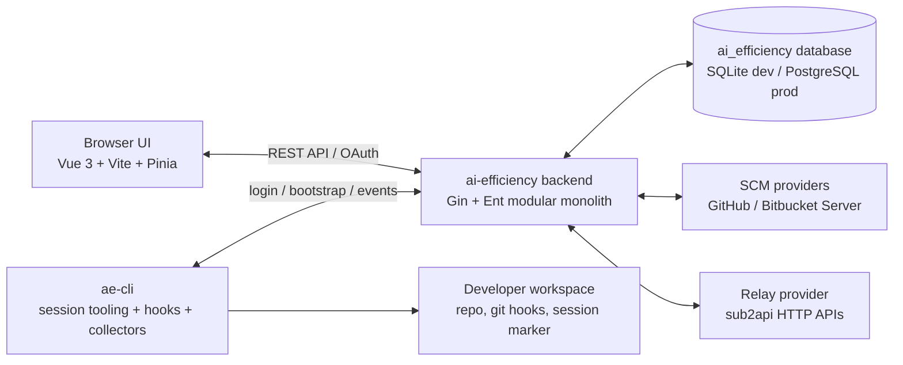
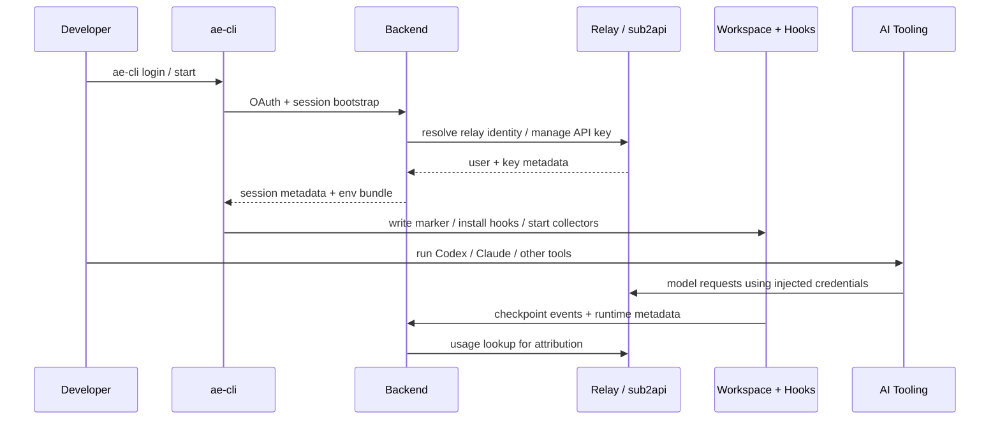
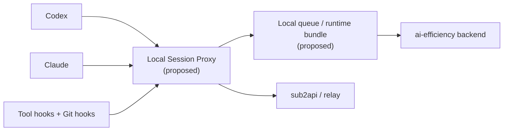

# AI Efficiency Platform Architecture

This document is the project-level architecture overview for `ai-efficiency`.

- Use this file for the current system map, runtime relationships, and module boundaries.
- Use the topic-specific specs in `docs/superpowers/specs/` for detailed contracts.
- When documents disagree, prefer the newest relevant spec plus the current code.

## Source-of-Truth Order

1. Topic-specific current specs:
   - `docs/superpowers/specs/2026-04-02-local-session-proxy-design.md`
   - `docs/superpowers/specs/2026-03-26-session-pr-attribution-design.md`
   - `docs/superpowers/specs/2026-03-24-oauth-cli-login-design.md`
2. This architecture overview
3. `docs/superpowers/specs/2026-03-17-ai-efficiency-platform-design.md` as the historical baseline

## Current System Context

### Notes

- `ai-efficiency` is a standalone system. It integrates with `sub2api` through relay/provider HTTP APIs rather than direct database coupling.
- The backend is the central orchestration point for auth, repo configuration, analysis, attribution, and SCM/webhook workflows.
- The frontend is built separately and packaged into the backend image during Docker build. Do not assume Go `embed` or a single self-contained binary unless the code is changed to do that explicitly.

## Current Runtime Flow

The implemented runtime still centers on backend bootstrap plus relay-issued credentials.

### Runtime Boundaries

- `ae-cli` owns local session setup, workspace state, hooks, and local metadata collection.
- The backend owns durable state, repo configuration, user/provider mapping, attribution, and SCM/webhook handling.
- Relay/sub2api remains the upstream auth/LLM/usage integration boundary.

## Proposed Session Runtime Direction

The local session proxy described below is a design direction from `2026-04-02-local-session-proxy-design.md`. It is not implemented in the current codebase by default.

### Status

- Current: backend bootstrap, relay provider integration, session metadata, checkpoints, attribution services
- Proposed: request-level local proxy, unified local event ingress, local usage fact source

## Module Responsibilities

### Backend

| Area | Paths | Responsibility |
| --- | --- | --- |
| Auth and identity | `backend/internal/auth`, `backend/internal/oauth` | Relay SSO, LDAP auth, local token issuance, user identity mapping |
| Relay integration | `backend/internal/relay` | Unified relay/sub2api adapter and usage/API key operations |
| SCM integration | `backend/internal/scm`, `backend/internal/webhook`, `backend/internal/prsync` | SCM provider abstraction, webhook ingestion, PR synchronization |
| Repo and analysis | `backend/internal/repo`, `backend/internal/analysis`, `backend/internal/efficiency` | Repo config, AI-friendliness scanning, efficiency aggregation and labeling |
| Session and attribution | `backend/internal/sessionbootstrap`, `backend/internal/checkpoint`, `backend/internal/attribution` | Session bootstrap lifecycle, commit checkpoints, PR/session attribution |
| API surface | `backend/internal/handler`, `backend/internal/middleware` | HTTP handlers, routing, auth middleware, settings endpoints |

### Frontend

| Area | Paths | Responsibility |
| --- | --- | --- |
| Views | `frontend/src/views` | Dashboard, repos, sessions, oauth, analysis-facing pages |
| Data access | `frontend/src/api`, `frontend/src/stores` | Backend API clients, state management, request orchestration |
| App shell | `frontend/src/components`, `frontend/src/router` | Layout, navigation, route composition |

### ae-cli

| Area | Paths | Responsibility |
| --- | --- | --- |
| Auth and backend access | `ae-cli/internal/auth`, `ae-cli/internal/client` | Login flow, backend API calls, token usage |
| Session runtime | `ae-cli/internal/session`, `ae-cli/internal/hooks`, `ae-cli/internal/collector` | Session lifecycle, workspace marker/hook management, local metadata collection |
| Tool execution | `ae-cli/internal/dispatcher`, `ae-cli/internal/router`, `ae-cli/internal/shell`, `ae-cli/internal/tmux` | Command dispatch, environment routing, shell/tmux integration |

## Documentation Expectations

Update this file when any of the following changes:

- component boundaries between frontend, backend, ae-cli, SCM, or relay
- runtime flow for login, session bootstrap, hooks, attribution, or local proxying
- source-of-truth precedence across the core specs

Also update the relevant spec in `docs/superpowers/specs/` when the change is contract-level rather than only diagram-level.
