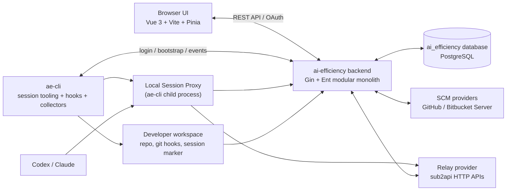
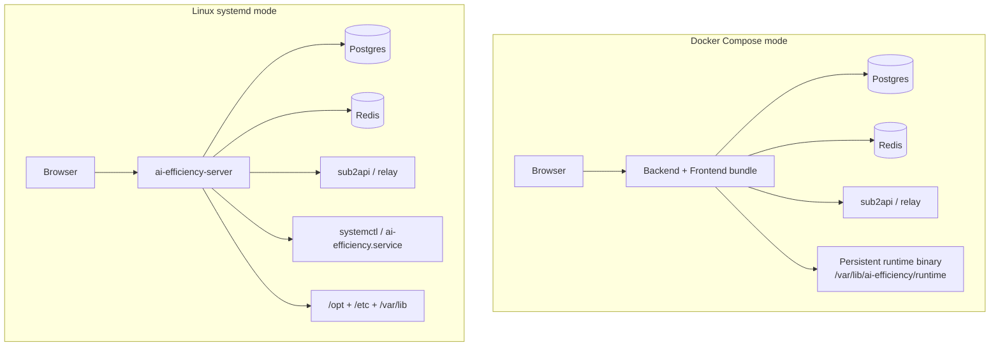
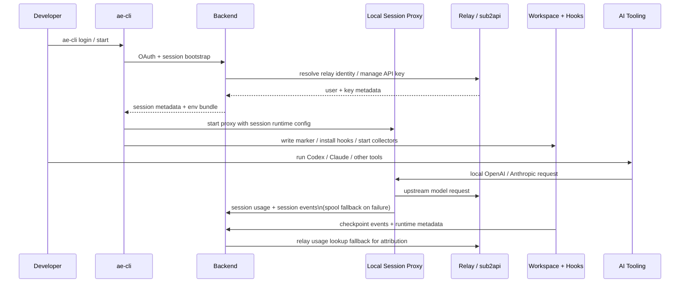
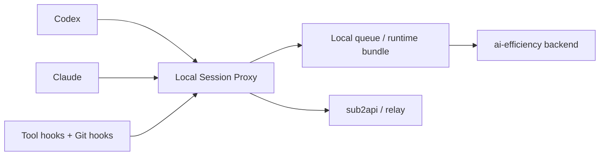

# AI Efficiency Platform Architecture

This document is the project-level architecture overview for `ai-efficiency`.

- Use this file for the current system map, runtime relationships, and module boundaries.
- Use the topic-specific specs in `docs/superpowers/specs/` for detailed contracts.
- When documents disagree, prefer the newest relevant spec plus the current code.
- This file should always reflect the latest implemented project-level architecture.
- Topic specs may intentionally preserve point-in-time design decisions and trade-offs; do not rewrite them wholesale just to mirror the latest code if doing so would erase architectural evolution.
- When newer specs supersede or conflict with older specs, record that relationship in the newer spec rather than back-editing historical specs to mirror the latest implementation.

## Source-of-Truth Order

1. Topic-specific current specs:
   - `docs/superpowers/specs/2026-04-14-llm-settings-runtime-editing-design.md`
   - `docs/superpowers/specs/2026-04-02-local-session-proxy-design.md`
   - `docs/superpowers/specs/2026-03-26-session-pr-attribution-design.md`
   - `docs/superpowers/specs/2026-03-24-oauth-cli-login-design.md`
2. This architecture overview
3. `docs/superpowers/specs/2026-03-17-ai-efficiency-platform-design.md` as the historical baseline

## Current System Context

### Notes

- `ai-efficiency` is a standalone system. It integrates with `sub2api` through relay/provider HTTP APIs rather than direct database coupling.
- The backend is the central orchestration point for auth, repo configuration, analysis, attribution, and SCM/webhook workflows.
- Backend runtime relay consumers currently resolve their primary relay instance from `relay.*` config first, and fall back to the enabled primary `RelayProvider` database record when static relay URL config is absent.
- The frontend is built separately and embedded into the backend binary during Docker build, so the backend process serves both API routes and the SPA entrypoint in deployed images.
- Official production deployment now has two supported paths: Docker Compose and Linux systemd.
- The business entrypoint remains the backend service that also serves the frontend bundle.
- Docker/Compose mode now runs the backend from a persistent runtime binary under the deployment state directory and updates that runtime binary directly instead of using an updater sidecar.
- When `AE_CONFIG_PATH` is unset, Docker/Compose and local runtime modes materialize a writable config file under the deployment state directory (or the current working directory outside managed deployment) so admin settings can persist.
- Linux systemd mode installs the backend under `/opt/ai-efficiency`, keeps config in `/etc/ai-efficiency/config.yaml`, and performs binary self-update plus `.backup` rollback.
- `deploy/` also includes non-production `dev` / `local` compose paths for local verification.
- Public health endpoints expose liveness/readiness, and admin settings expose deployment status plus update controls.

## Current Production Deployment

The current deployment model is split by runtime mode.

### Deployment Notes

- Official deploy assets live under `deploy/`.
- `deploy/docker-compose.yml` is the bundled-infra path.
- `deploy/docker-compose.external.yml` is the external-infra path.
- `deploy/docker-compose.dev.yml` is the source-build local validation path.
- `deploy/docker-compose.local.yml` is the directory-backed local validation path.
- `deploy/docker-deploy.sh` is the preflight entrypoint.
- `deploy/install.sh` is the Linux systemd installer entrypoint.
- `deploy/ai-efficiency.service` is the packaged systemd unit template.
- `deploy/migrate-sqlite-to-postgres.sh` is the one-time bootstrap path from local SQLite data into the local Postgres test environment.
- `deploy/.env.example` is the operator-facing configuration template.
- Backend deployment status, update, rollback, and restart APIs are first-class admin surfaces across Docker and non-Docker modes.

## Current Runtime Flow

The implemented runtime centers on backend bootstrap plus a session-bound local proxy started by `ae-cli`.

### Runtime Boundaries

- `ae-cli` owns local session setup, workspace state, hooks, collector wiring, and the lifecycle of the local session proxy.
- The backend owns durable state, repo configuration, user/provider mapping, attribution, and SCM/webhook handling.
- Relay/sub2api remains the upstream auth/LLM/usage integration boundary and attribution fallback source.
- SCM providers now reference reusable credentials instead of storing raw secret blobs inline.
- Repos still bind to exactly one SCM provider; clone protocol and clone credentials are provider-owned runtime concerns.

## Local Session Proxy Rollout

The local session proxy from `2026-04-02-local-session-proxy-design.md` is now partially implemented in the current codebase. `ae-cli start` boots a session-bound proxy for Codex and Claude, but the broader proxy-first attribution model is still in progress.

### Status

- Current: backend bootstrap, relay provider integration, session metadata, ae-cli-managed local proxy for Codex and Claude, session usage/session event ingest, checkpoints, attribution services
- Remaining direction: broader tool coverage, more unified event ingress semantics, and richer local usage facts so attribution depends less on relay fallback

## Module Responsibilities

### Backend

| Area | Paths | Responsibility |
| --- | --- | --- |
| Auth and identity | `backend/internal/auth`, `backend/internal/oauth` | Relay SSO, LDAP auth, local token issuance, user identity mapping |
| Credentials | `backend/internal/credential` | Reusable encrypted secret assets, payload validation, provider credential migration, and credential masking |
| Relay integration | `backend/internal/relay` | Unified relay/sub2api adapter and usage/API key operations |
| SCM integration | `backend/internal/scm`, `backend/internal/webhook`, `backend/internal/prsync` | SCM provider abstraction, webhook ingestion, PR synchronization |
| Repo and analysis | `backend/internal/repo`, `backend/internal/analysis`, `backend/internal/efficiency` | Repo-to-provider binding, provider-backed clone/auth resolution, AI-friendliness scanning, efficiency aggregation and labeling |
| Session and attribution | `backend/internal/sessionbootstrap`, `backend/internal/checkpoint`, `backend/internal/attribution` | Session bootstrap lifecycle, commit checkpoints, PR/session attribution |
| API surface | `backend/internal/handler`, `backend/internal/middleware` | HTTP handlers, routing, auth middleware, settings endpoints |

### Frontend

| Area | Paths | Responsibility |
| --- | --- | --- |
| Views | `frontend/src/views` | Dashboard, repos, sessions, oauth, analysis-facing pages |
| Data access | `frontend/src/api`, `frontend/src/stores` | Backend API clients, state management, request orchestration |
| App shell | `frontend/src/components`, `frontend/src/router` | Layout, navigation, route composition |

### ae-cli

| Area | Paths | Responsibility |
| --- | --- | --- |
| Auth and backend access | `ae-cli/internal/auth`, `ae-cli/internal/client` | Login flow, backend API calls, token usage |
| Session runtime | `ae-cli/internal/session`, `ae-cli/internal/hooks`, `ae-cli/internal/collector` | Session lifecycle, workspace marker/hook management, local metadata collection |
| Tool execution | `ae-cli/internal/dispatcher`, `ae-cli/internal/router`, `ae-cli/internal/shell`, `ae-cli/internal/tmux` | Command dispatch, environment routing, shell/tmux integration |

## Documentation Expectations

Update this file when any of the following changes:

- component boundaries between frontend, backend, ae-cli, SCM, or relay
- runtime flow for login, session bootstrap, hooks, attribution, or local proxying
- source-of-truth precedence across the core specs

Also update the relevant spec in `docs/superpowers/specs/` when the change is contract-level rather than only diagram-level.
