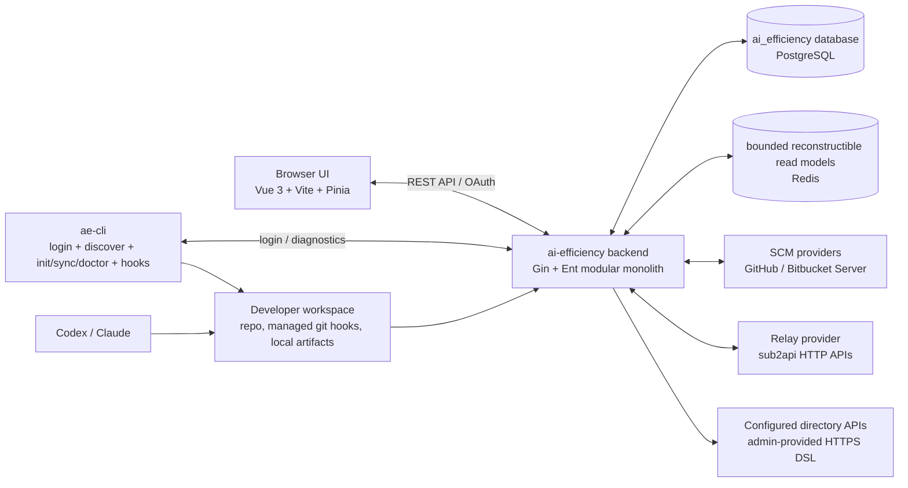
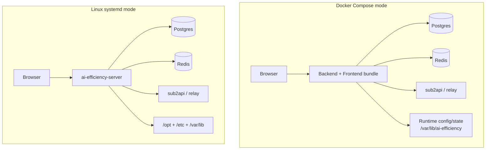
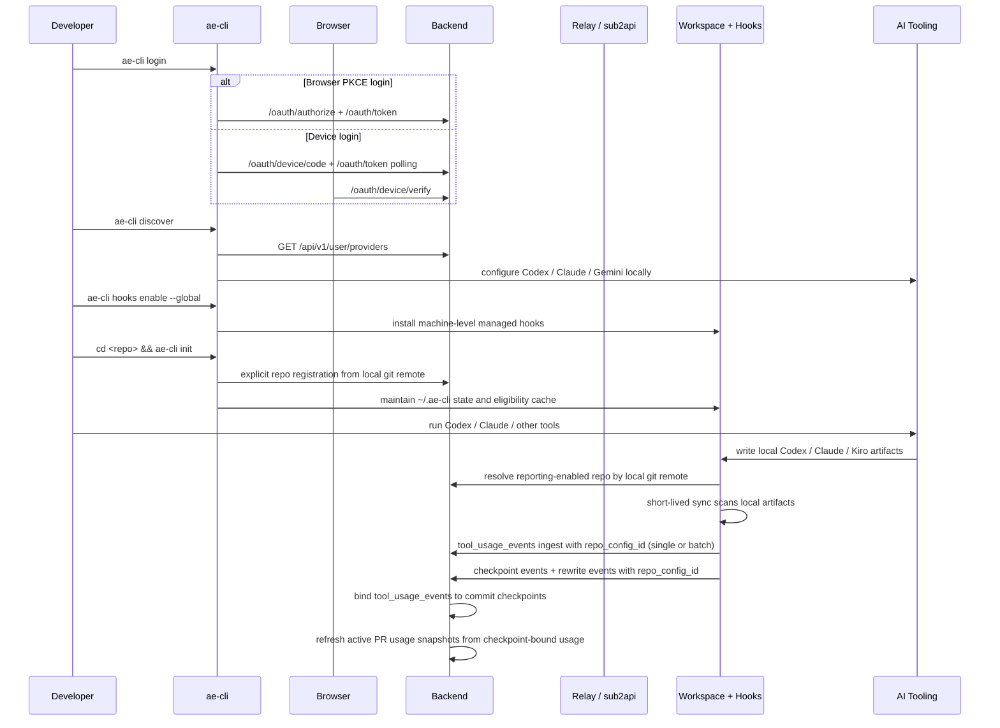
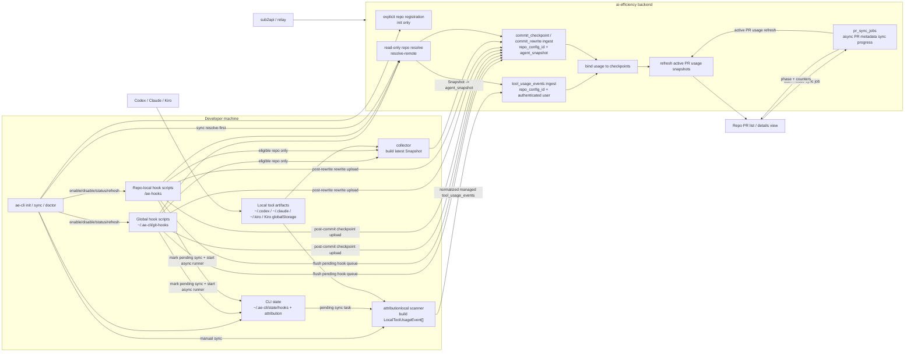

# AI Efficiency Platform Architecture

This document is the project-level architecture overview for `ai-efficiency`.

- Use this file for the current system map, runtime relationships, and module boundaries.
- Use the topic-specific specs in `docs/superpowers/specs/` for detailed contracts.
- When documents disagree, prefer the newest relevant spec plus the current code.
- This file should always reflect the latest implemented project-level architecture.
- Topic specs may intentionally preserve point-in-time design decisions and trade-offs; do not rewrite them wholesale just to mirror the latest code if doing so would erase architectural evolution.
- When newer specs supersede or conflict with older specs, record that relationship in the newer spec rather than back-editing historical specs to mirror the latest implementation.

## Source-of-Truth Order

1. Topic-specific current specs:
   - `docs/superpowers/specs/2026-07-14-end-to-end-page-loading-performance-design.md`
   - `docs/superpowers/specs/2026-07-10-multi-stage-quota-reset-approval-design.md`
   - `docs/superpowers/specs/2026-07-07-quota-reset-approval-design.md`
   - `docs/superpowers/specs/2026-06-26-team-usage-representative-quota-design.md`
   - `docs/superpowers/specs/2026-06-22-configurable-directory-sync-design.md`
   - `docs/superpowers/specs/2026-06-14-user-api-key-first-onboarding-design.md`
   - `docs/superpowers/specs/2026-06-04-admin-sub2api-subscription-assignment-design.md`
   - `docs/superpowers/specs/2026-06-02-repo-auto-binding-design.md`
   - `docs/superpowers/specs/2026-06-10-independent-cli-release-design.md`
   - `docs/superpowers/specs/2026-05-26-ae-cli-post-commit-async-attribution-sync-design.md`
   - `docs/superpowers/specs/2026-05-19-ae-cli-deterministic-tool-configuration-design.md`
   - `docs/superpowers/specs/2026-05-14-legacy-session-staged-cutover-design.md`
   - `docs/superpowers/specs/2026-05-13-sessionless-local-tool-attribution-design.md`
   - `docs/superpowers/specs/2026-04-15-oauth-device-login-design.md`
   - `docs/superpowers/specs/2026-04-14-llm-settings-runtime-editing-design.md`
   - `docs/superpowers/specs/2026-03-24-oauth-cli-login-design.md`
2. This architecture overview
3. Historical design context when needed:
   - `docs/superpowers/specs/2026-04-02-local-session-proxy-design.md`
   - `docs/superpowers/specs/2026-03-26-session-pr-attribution-design.md`
   - `docs/superpowers/specs/2026-03-17-ai-efficiency-platform-design.md`

## Current System Context

```mermaid
flowchart LR
    Browser["Browser UI<br/>Vue 3 + Vite + Pinia"]
    CLI["ae-cli<br/>login + discover + init/sync/doctor + hooks"]
    Tool["Codex / Claude"]
    Backend["ai-efficiency backend<br/>Gin + Ent modular monolith"]
    DB[("ai_efficiency database<br/>PostgreSQL")]
    Redis[("bounded reconstructible read models<br/>Redis")]
    SCM["SCM providers<br/>GitHub / Bitbucket Server"]
    Relay["Relay provider<br/>sub2api HTTP APIs"]
    Directory["Configured directory APIs<br/>admin-provided HTTPS DSL"]
    Workspace["Developer workspace<br/>repo, managed git hooks, local artifacts"]

    Browser <-->|REST API / OAuth| Backend
    CLI <-->|login / diagnostics| Backend
    CLI --> Workspace
    Tool --> Workspace
    Workspace --> Backend
    Backend <--> DB
    Backend <--> Redis
    Backend <--> SCM
    Backend <--> Relay
    Backend --> Directory
```

### Notes

- `ai-efficiency` is a standalone system. It integrates with `sub2api` through relay/provider HTTP APIs rather than direct database coupling.
- Release units remain in one repository but are published separately. Platform releases use `v*` tags for the backend/frontend/deploy unit, GHCR image, and Helm-consumed image tags. `ae-cli` releases use `ae-cli/v*` tags and publish only CLI artifacts; CLI installer and updater discovery filters that tag namespace instead of using the platform-owned repository latest release. The exact `v0.2.0-cli.1` tag is a one-time bridge for older CLIs that still read repository `/releases/latest`; it publishes only CLI artifacts and is excluded from the platform release workflow.
- The backend is the central orchestration point for auth, repo configuration, attribution, provider management, and SCM/webhook workflows.
- PostgreSQL remains authoritative for Work Items state and persisted revisions, users, Relay provider configuration versions, and the current Directory Sync facts that guard representative scope. Redis is an optional performance layer for bounded work-item counts, personal usage snapshots, representative-scope read models, and reconstructible team-usage snapshots; an unavailable Redis never becomes an authorization, mutation, credential, token-revocation, or fresh-quota dependency.
- Runtime config remains a startup bootstrap input, not the user-facing provider source of truth. On first startup the backend can seed the primary `RelayProvider` row from `relay.*` config, but `/user`, settings, and normal provider surfaces operate on DB-backed `RelayProvider` records rather than a runtime fallback provider contract.
- The frontend is built separately and embedded into the backend binary during Docker build, so the backend process serves both API routes and the SPA entrypoint in deployed images.
- The embedded SPA now exposes a regular-user `/user` surface as a personal AI onboarding workbench. The page keeps provider-first, group-second credential self-serve driven by the current relay user's user-scoped group facts (`allowed_groups` plus active subscription entries), but the primary flow is now group-scoped and API-key-first: users select an access group, create or regenerate a personal key, can immediately choose configuration paths once a key exists, and are encouraged to run a real connection test with the selected group's platform and model before relying on that access.
  Once a key exists, ordinary access groups still offer manual local configuration, automatic `ae-cli discover`, and app-specific `CC Switch` provider-import links for Codex, Claude Code, or Gemini according to the selected group platform. Access groups whose names strictly start with `Agent` instead enter an Agent client configuration branch: the page hides Codex/Claude/Gemini snippets, hides the `ae-cli` automatic configuration card, shows Hermes Agent, OpenClaw, and Custom Agent manual configuration, and offers only Hermes/OpenClaw CC Switch app-import links. Agent-client manual snippets and Hermes/OpenClaw app imports normalize the provider URL to an OpenAI-compatible versioned endpoint, normally `<provider.base_url>/v1` unless the configured provider URL already ends in a version segment. The UI explains this because Hermes Agent and OpenClaw use Chat Completions providers by default, even when the selected backend group platform is Anthropic or Gemini.
  User-owned API keys are partially masked in the browser but remain copyable when relay returns the key value. Create/regenerate operations require the relay user's own write credential because sub2api's `/api/v1/keys` endpoint requires a user JWT; the RelayProvider admin API key can list user keys and manage relay users but cannot replace user credentials for key creation. Create is idempotent per local user, relay provider, and group inside the backend process, so repeated browser clicks or concurrent requests return the same existing managed key instead of creating duplicates. Before create/regenerate, the backend ensures the local user is bound to an existing relay user and has a usable encrypted `relay_auth_password`: Relay SSO can capture the relay password only after an existing relay user authenticates successfully and must not create missing relay users, LDAP provisioning stores generated relay-side passwords, and `/user` write paths can recreate or relink a missing upstream relay user and rotate a missing/stale generated password before retrying the user-JWT write. LDAP bind passwords are never stored or forwarded to relay. New generated relay users get relay default subscriptions assigned because sub2api admin user creation has not always attached them reliably. Before assigning those default groups, the relay adapter lists the user's active subscriptions and skips groups that are already present; if a race still produces a duplicate assignment response, unambiguous `SUBSCRIPTION_ALREADY_EXISTS` responses and conflicts that are proven by a follow-up list to already have the active group are treated as idempotent success. Semantic `SUBSCRIPTION_ASSIGN_CONFLICT` responses remain errors for admin subscription operations so validity or notes mismatches stay visible there. Existing `provisioned_by_ai_efficiency_ldap` relay users with no group facts can receive the same default subscription assignment on later LDAP login. The same page can load model choices through `/api/v1/user/providers/:id/groups/:group_id/models?platform=...`, using the current user's own active group key and platform-specific sub2api model-list endpoint (`/v1/models` for OpenAI/Anthropic-compatible lists and `/v1beta/models` for Gemini native lists). It can then test the current user's own active provider key through `/api/v1/user/providers/:id/test` using the selected group's `group_id`, platform, and an explicitly selected or entered model; the backend probes sub2api with the platform-native completion endpoint (`/v1/chat/completions` for OpenAI, `/v1/messages` for Anthropic, and `/v1beta/models/{model}:generateContent` for Gemini). The `/user` surface no longer uses the old developer / non-developer toggle or progress-checklist framing, and advanced command references now live under the automatic-configuration path rather than as a global always-open section. The admin Relay Providers surface is CRUD-only and does not expose this test action. `ae-cli discover` now consumes the same user-provider credential surface at `/api/v1/user/providers`, with `/api/v1/providers` kept only as an older backend compatibility fallback.
- The embedded SPA also exposes an admin-only `/admin/users` surface backed primarily by the local `users` table and enriched with the current single Directory Sync snapshot. Admins can switch inside the same route between a user view and a department view. The user view supports search, pagination, department subtree filtering, derived access-status filtering, and row-level department display derived from directory members matched by email plus their current member-department memberships; unmatched local users remain visible unless a specific department filter is active. User-visible department labels use a backend-computed name-based `display_path` rather than the source `path`, because source paths can be numeric ID chains. Access status is local-state derived rather than a live sub2api inventory read: `disabled` takes precedence when `users.token_valid_after` or `users.relay_disabled_at` is set, or when a successful directory offboarding disable action exists; otherwise stored relay credentials show as `configured` and missing credentials show as `missing_credential`. The department view renders current departments as a collapsible tree using parent/depth metadata, shows direct and subtree member/matched-local-user counts based on current memberships with subtree-level member deduplication, shows representative match coverage when the directory DSL maps representative metadata, and drills back into the user view with the selected department subtree filter. Admins can inspect `username`, `email`, `role`, `auth_source`, `relay_user_id`, timestamps, and the encrypted `relay_auth_password` ciphertext. Plaintext relay password access is separated into an explicit per-user copy action that calls `/api/v1/admin/users/:id/relay-password/reveal`; the list API never returns plaintext. The same admin surface can also disable an individual upstream relay/sub2api user through `POST /api/v1/admin/users/:id/disable-access` after exact email confirmation. That direct admin-users disable action calls the optional `relay.UserDisabler` capability, records `users.relay_disabled_at`, and intentionally does not revoke local AI Efficiency login tokens or change relay subscriptions. The same admin surface can now load enabled relay providers' assignable subscription groups through the relay provider abstraction and manage sub2api subscriptions through one centralized workflow. The workflow supports selected local users, the current search/department/access-status filter across all pages, or all relay-mapped users, and can add, extend, remove, or reset quota for a selected subscription group by creating a persisted admin subscription job through `POST /api/v1/admin/users/subscription-jobs`; the frontend loads the latest subscription job when the page opens, displays its terminal state when complete, and polls active jobs instead of holding one long HTTP request open. Quota reset resolves each user's matching upstream subscription by group and calls sub2api's reset-quota admin endpoint for the daily, weekly, and monthly windows. Jobs are capped at 500 target users, snapshot target local users including `relay_user_id` before relay mutation starts, apply per-target deadlines plus a target-count-scaled job deadline, abandon stale active jobs with no progress for more than one hour, and report stale selected IDs as per-user failures. The older synchronous `POST /api/v1/admin/users/subscriptions/batch` and add-only `POST /api/v1/admin/users/:id/subscriptions` endpoints remain for compatibility. These subscription paths mutate relay subscription state only; they do not edit local user identity fields, fetch relay API keys, or fetch usage logs.
- The embedded SPA also exposes representative-scoped team usage as ordinary authenticated user surfaces rather than as admin pages. `/usage` is the personal AI Usage page and no longer loads or renders a representative member subject selector. It starts current-user usage, current-request quota, and representative-scope discovery independently; usage can render before quota or Team-tab discovery finishes, and a range change aborts both superseded personal requests. The usage request sends `include_group_quotas=false`, while `/api/v1/user/usage/group-quotas` owns fresh-only quota state. Team comparison is separated into `/usage/team`, which starts the four split requests `/api/v1/user/team-usage/summary`, `/api/v1/user/team-usage/trend`, `/api/v1/user/team-usage/members`, and `/api/v1/user/team-usage/organization` independently with the same normalized range. Summary cards render as soon as summary succeeds; the split trend response independently owns team-total, bounded group-comparison, and Top 12 member trends; the split members response owns one bounded ranking page; and the split organization response initially owns only authorized roots, then loads one parent's immediate departments and direct members on first expansion. A delay or failure in any one request or organization branch does not remove successful sibling sections or branches. The trend chart component is an async chunk and is not requested until trend data renders. Member ranking defaults to 50 rows, never exceeds 100, supports Next/Previous cursor navigation, and restarts only its own section when the backend reports `snapshot_expired`. Organization departments default to 25 and direct members to 50, both cap at 100, expose independent load-more cursors, cache loaded branches across collapse/re-expand, and restart only the affected branch after snapshot expiry. The compatibility route retains its complete historical JSON shape and emits `Deprecation`, `Sunset`, and successor `Link` headers for one release, but the current SPA no longer calls it. Neither surface renders quota cards or quota-edit controls. Scoped member drill-down is separated into `/usage/members/:user_id`, which calls `/api/v1/user/team-usage/subjects/:user_id/usage/dashboard` directly, never calls the personal quota endpoint, and relies on the backend as the authorization boundary. Team total is rendered independently from group comparison and deduplicates canonical members even when one member has multiple current department memberships. Group comparison uses represented root departments when a representative has multiple first-level groups, direct child departments when there is one represented root with child departments, and no comparison rows when there is only one leaf represented group; a multi-department member contributes to each matching comparison bucket while remaining single-counted in team total and parent aggregates. At most 12 comparison rows are returned, selected by selected-window tokens, billed usage, and stable department external ID, while the independent team-total series remains complete. Delegated quota control stays inside the selected-member detail surface and is implemented as sub2api user-group `rate_multiplier` writes through the relay provider boundary, not as local quota enforcement and not as shared group-limit edits. Every delegated write attempt is also recorded locally in `team_usage_rate_multiplier_audits`, with representative-readable `/api/v1/user/team-usage/audit` and admin-visible `/api/v1/admin/team-usage/audit` API paths; current representative UI surfaces do not render audit history.
- Representative scope resolution now uses a versioned Redis read model instead of rebuilding all current departments, members, memberships, and local-user bindings on every team-usage request. Authentication still validates the JWT and authoritative `users.token_valid_after` first. The scope service then reads the current actor row plus latest successful Directory Sync apply source/run as a lightweight guard, derives an opaque scope version from that guard and the scope schema version, isolates values by deployment namespace, actor, source/run, and current role, and re-reads that guard before returning. A changed run or role therefore selects a new key and scope version immediately, including when it changes during a cache read. Values have a fresh-only 48-54 minute jittered TTL; malformed values, Redis command failure, or lease failure rebuild from PostgreSQL, and no stale scope is accepted for delegated writes or subject visibility.
- Selected-member detail reads multiplier metadata for all unique active subscription groups through one optional Relay batch capability. The Sub2API adapter bounds its per-group upstream expansion to four workers, two seconds per group, and five seconds overall. Failed, missing, or ambiguous group metadata degrades only that row, returns a null effective multiplier, disables editing, and preserves current usage and quota fields. The authoritative mutation path still performs a single-group read, provider-group lock, whole-group replacement, readback verification, and local audit update; it never reuses the batch-read result.
- The embedded SPA also exposes sequential quota reset approvals for user subscription groups. The selected subscription group identifies only the relay quota reset target and never affects approval routing. When a request is created, the backend resolves the current directory source, requester memberships, hierarchy, approver configs, representatives, and local-user matches in one repeatable-read transaction and snapshots one compact versioned JSON workflow on `quota_reset_requests`; later directory or config changes do not rewrite that request. The first step merges candidates from every exact requester department: enabled config takes priority for each department, while an exact department with no config falls back only to its active synced representatives. Later steps walk all parent paths one edge per round, deduplicate converged departments, keep only departments with enabled config, and merge all usable configured approvers in the same round; representatives are not an ancestor fallback. Configured rounds with no usable candidate become admin-fallback steps, rounds with no config are skipped, and resolution with no steps creates one final admin-fallback step. Version 2 rows use the internal `workflow_pending` status, mapped to public `pending`, so an old Pod in a rolling deployment cannot process them as legacy single-stage requests. The original active-request partial unique index remains unchanged for rollback compatibility, while a second named index spans both pending states to prevent cross-version duplicates. `resolved_approver_user_ids` indexes only the current normal candidates for approval lists and Work Items, while `workflow_revision` provides compare-and-swap decision concurrency. One commented approval completes each active step; an earlier approving actor automatically satisfies any later step containing that actor, records the reuse in workflow state and `quota_reset_request_events`, and does not receive a duplicate activation notification. Admins may decide whichever step is active but cannot jump ahead; admin fallback keeps the active step actionable when it has no normal candidate. Required decision comments and all workflow, decision, reset, cancellation, and notification transitions remain durable in the request JSON and append-only event audit; historical version 1 rows retain the previous single-stage path. The final winning approval starts exactly one existing relay quota reset after commit on a context detached from client cancellation, with a 30-second deadline so success or failure can still be persisted. Organization & Login settings expose department-member approvers and an explicit `generic_webhook` or `wecom_group_robot` channel; generic webhooks receive structured payloads with public statuses, while the WeCom preset uses request-time `wecom_userid` snapshots for active-approver mentions, and webhook failures persist only safe HTTP status or numeric business error codes.
- The embedded SPA now exposes configurable Directory Sync under `/settings` -> Organization & Login and a separate admin offboarding review page at `/admin/directory/offboarding`. Directory Sync is owned by `backend/internal/directorysync` and stores admin-authored HTTP DSL sources, validate/preview/apply runs, current directory departments, canonical current directory members, and current member-department memberships. The settings UI treats run state as backend-owned: opening the page or selecting a source loads recent runs, applies the latest preview/apply run status, and polls the run detail endpoint only while the latest run is queued or running. The DSL is generic and declarative: it supports safe GET requests, header credential references resolved from the existing encrypted credential store, item extraction from JSONPath-like paths or a root-array `$`, mapping, explicit non-sensitive metadata mappings such as organization representative ids, and bounded execution. It does not embed vendor-specific SDKs, execute scripts, or mutate external directory systems. Preview runs never update current facts, and failed apply runs leave current facts and offboarding candidates unchanged. Apply completion replaces current departments, canonical members, membership links, and the run result plus `last_successful_run_id` in one transaction; the current company snapshot is resolved from the latest successful apply run rather than from source edit time. Successful full-company apply runs match directory members to local users by normalized email.
- Directory offboarding candidates are local relay-bound users whose normalized email is missing from the latest complete successful full-company directory snapshot. The backend derives both count and stable bounded pages from one shared SQL anti-join; pages order by username and local user id and batch-load prior action metadata, while the work-item badge consumes only the injected count interface. Confirmed offboarding is an explicit admin action: the backend rechecks that the user is still missing, calls the optional `relay.UserDisabler` capability through the configured relay provider boundary, and then sets `users.token_valid_after` through the auth service. It does not automatically assign, extend, remove, delete, or reset quota for relay/sub2api subscriptions; those remain under the `/admin/users` subscription job workflow.
- Work-item freshness is owned at both runtime layers: the backend invalidates Redis keys through a PostgreSQL UUID revision, while the Pinia store bounds browser reuse to 20 seconds from successful response completion and performs generation-safe refreshes after current-actor quota, Directory, and offboarding mutations.
- Browser login loads `/api/v1/auth/options` before choosing auth sources. If `auth.ldap.url` is configured it defaults to LDAP and also offers Relay SSO; otherwise it shows only Relay SSO. Dev Login is exposed only when the debug endpoint is explicitly enabled. Relay SSO is an existing-relay-account login path only: invalid credentials or a missing upstream relay user fail authentication and never create a sub2api user. LDAP passwords are used only for LDAP bind and are never forwarded to relay user create/update APIs. LDAP relay identity resolution prefers an exact relay email match before canonical username provisioning, and when a linked relay user has a valid role the local user role follows that relay role. When a successful LDAP login reuses an existing local `relay_sso` row by username/email, the backend updates the local `auth_source` to `ldap` so `/auth/me` and the `/user` profile reflect the actual latest login provider, while preserving any Relay SSO-captured `relay_auth_password` for later relay user JWT acquisition.
- Official production deployment now has two supported paths: Docker Compose and Linux systemd.
- The business entrypoint remains the backend service that also serves the frontend bundle.
- Docker/Compose mode runs the backend from the image-provided server binary and uses the mounted state directory only for runtime-editable application config.
- When `AE_CONFIG_PATH` is unset, Docker/Compose and local runtime modes materialize a writable config file under the runtime state directory (or the current working directory outside managed deployment) so admin settings can persist.
- Linux systemd mode installs the backend under `/opt/ai-efficiency` and keeps config in `/etc/ai-efficiency/config.yaml`; upgrades are operator-driven through the install script or release assets.
- `deploy/` also includes non-production `dev` / `local` compose paths for local verification.
- Public health endpoints expose liveness/readiness. Admin-only system version endpoints expose current build metadata and an explicit GitHub release check, but they do not apply updates. In-app deployment status, binary update, rollback, and restart APIs have been removed; upgrades are handled outside the application process.
- `ae-cli login` now supports both browser PKCE and OAuth device flow. Headless Linux environments are expected to use `ae-cli login --device`, while desktop/browser-capable environments still default to PKCE.
- Backend-issued auth tokens currently default to a 2-hour access JWT plus a 7-day refresh token. The frontend retries a non-auth `401` once via `/api/v1/auth/refresh`, and `ae-cli` refreshes `~/.ae-cli/token.json` before authenticated commands when the token is expired or within the refresh window. Access and refresh validation now also check `users.token_valid_after`; tokens issued before that revocation floor are rejected, which lets confirmed directory offboarding expire existing login state without introducing a full session table.
- Browser access and refresh credentials are owned by one generation-aware frontend session boundary shared by Pinia and Axios. Login, Dev Login, logout, and credential replacement advance or clear the owning generation; a same-session access-token refresh preserves that generation while synchronizing browser persistence and Pinia. Requests and current-user hydration cannot publish results from an invalidated generation, and an authenticated retry rechecks the owning generation and current token synchronously at the final Axios adapter boundary before delegating to the configured default or custom adapter.
- Frontend route policy starts public and ordinary authenticated route chunks without awaiting current-user hydration, while administrator lazy loaders remain blocked until the current role is verified for the still-current navigation. Promise-driven redirects are scoped to monotonic navigation generations plus captured route identity. Each normalized navigation object is bound to its exact attempt generation, so a failed or aborted attempt restores the last confirmed destination only when that exact attempt is still active; an older same-path failure cannot overwrite a newer pending attempt. Final refresh failure publishes a shared auth-expiry event, and the confirmed current destination owns Login and OAuth behavior; a redirecting event is consumed only after Login confirms, while final no-redirect policies consume it immediately. Axios does not navigate.
- `ae-cli discover` now provides the current user-facing tool-configuration path for supported local agents. It fetches provider-delivered base URLs plus group-scoped credentials from the backend, detects installed tools locally, and writes deterministic local config only for tools whose platform credential exists: Codex uses `openai`, Claude uses `anthropic`, and Gemini uses `gemini`.
- The old ae-cli session runtime/helper packages are no longer present in the active code path. Backend-side legacy `session` schema and runtime compatibility have also been removed; the remaining `matched_session_ids` / `session_ids` fields are historical names that now carry tool-native session identifiers.

## Frontend Task Zones

The Vue frontend keeps the existing route contract while grouping pages by user task rather than by backend resource type.

- `My Work`: `/`, `/work-items`, `/usage`, `/user`, and `/events` provide the ordinary company-user path for personal AI usage, pending work, setup, and readable usage records. `/` redirects to the personal AI Usage page at `/usage`, which now stays focused on usage and quota visibility instead of rendering AI access/setup guide cards. Missing reusable AI access is represented as an `ai_access_setup_count` item in `/work-items`, with `/user` as the detail/remediation target. `/work-items` is the shared pending-work entry and aggregates personal AI access setup, pending quota reset approval work, and admin-only directory offboarding candidates. The sidebar shows a hidden-when-zero `total_count` badge sourced from `/api/v1/work-items/counts`, with admin totals deduplicated as personal AI access setup plus admin quota-reset fallback count plus offboarding count. Personal usage and quota now arrive through independent responses: usage carries explicit freshness and may use an eligible recent snapshot, while `group_quotas` is always a current-request `ok`, `empty`, or `unavailable` section. `Usage Records` and `Code Repositories` remain secondary drill-down paths rather than the homepage's primary narrative.
- `AI Usage`: `/usage` is always the current user's personal AI Usage page and does not expose a choose-person dropdown. Its top tab strip always exposes `/usage/quota-reset`, where users track their own reset requests, handle the current steps assigned to them, review previously processed decisions, and, for admins, decide the active step; the quota reset queue tabs show actionable Work Items counts rather than history totals. Version 2 request details show ordered step progress and durable comments, while approval and rejection both require a comment dialog. Representatives use `/usage/team` for subtree-wide trend and member ranking, then open `/usage/members/:user_id` for a focused scoped-member detail page with subscription-group quota rows and delegated multiplier controls. `/usage/team` does not show quota cards, subscription quota rows, or multiplier controls.
- `Code & PR`: `/repos` and `/repos/:id` provide repository health, SCM binding state, PR usage summary, and advanced PR/commit detail workflows for developers, leads, and admins.
- `Administration`: `/admin/users`, `/admin/directory/offboarding`, and `/settings` are admin-only surfaces. `/admin/users` defaults to the user view with user, department, relay mapping, derived access status, access-status filtering, direct upstream relay-user disablement, and centralized sub2api subscription management with selected/current-filter/all-mapped scopes and add/extend/remove/reset-quota operations backed by persisted subscription jobs, while keeping plaintext relay password copy behind an explicit risk confirmation; on mobile it renders selectable user cards rather than a compressed wide table. The direct `/admin/users` disable action requires exact email confirmation, disables only the upstream relay/sub2api user, records `users.relay_disabled_at`, and does not revoke local tokens or change subscriptions. The same route also has a collapsible tree-style department view for current Directory Sync departments and drill-in department subtree filtering, using name-based display paths in filters and row labels, with representative matched/total badges when that metadata is present. `/admin/directory/offboarding` lists directory-derived offboarding candidates and requires exact email confirmation before disabling an upstream relay user and revoking local tokens. `/settings` is implemented as task-zone section components for AI Services, Code Platforms, Organization & Login, Deployment & Runtime, and Advanced Credentials, with bilingual primary sections and add/edit dialogs; Organization & Login now includes Directory Sync source configuration, quota reset approval settings, safe synthetic templates, and an AI prompt helper. Deployment & Runtime shows read-only backend build metadata and a manual latest-release check; in-app apply, rollback, and restart controls are not part of the current runtime surface.
- Auth pages: `/login`, `/oauth/authorize`, and `/oauth/device` share a standalone AuthShell and language toggle so sign-in, app authorization, and device login read as one product flow outside the main app shell. Device login also shows the signed-in account before approve or deny.

The task-zone frontend remains API-compatible with the previous route set. Connected tool counts are derived from `/api/v1/user/providers`, repository health is derived from existing repo records, and PR/event token summaries are frontend-only aggregations over existing response fields. The UI does not claim local CLI state unless that state is backed by server data.

## Current Production Deployment

The current deployment model is split by runtime mode.

```mermaid
flowchart TD
    subgraph Compose["Docker Compose mode"]
    Browser["Browser"]
    Backend["Backend + Frontend bundle"]
    State["Runtime config/state<br/>/var/lib/ai-efficiency"]
    DB[("Postgres")]
    Redis[("Redis")]
    Relay["sub2api / relay"]

    Browser --> Backend
    Backend --> DB
    Backend --> Redis
    Backend --> Relay
    Backend --> State
    end

    subgraph Systemd["Linux systemd mode"]
    Browser2["Browser"]
    Backend2["ai-efficiency-server"]
    FS["/opt + /etc + /var/lib"]
    Relay2["sub2api / relay"]
    DB2[("Postgres")]
    Redis2[("Redis")]

    Browser2 --> Backend2
    Backend2 --> DB2
    Backend2 --> Redis2
    Backend2 --> Relay2
    Backend2 --> FS
    end
```

### Deployment Notes

- Official deploy assets live under `deploy/`.
- `deploy/docker-compose.yml` is the bundled-infra path.
- `deploy/docker-compose.external.yml` is the external-infra path.
- `deploy/docker-compose.dev.yml` is the source-build local validation path.
- `deploy/docker-compose.local.yml` is the directory-backed local validation path.
- `deploy/docker-deploy.sh` is the preflight entrypoint.
- `deploy/install.sh` is the Linux systemd installer entrypoint.
- `deploy/ai-efficiency.service` is the packaged systemd unit template.
- `deploy/migrate-sqlite-to-postgres.sh` is the one-time bootstrap path from local SQLite data into the local Postgres test environment.
- `deploy/.env.example` is the operator-facing configuration template.
- Admin settings can display the current backend version and manually check the latest backend GitHub release through `/api/v1/system/version` and `/api/v1/system/version/check`. These endpoints are read-only and never replace binaries, restart services, or mutate deployment state.
- In-app deployment status, update, rollback, and restart APIs are no longer part of the runtime surface. Operators upgrade Docker deployments by refreshing the image and recreating the service, and upgrade systemd deployments through install/release tooling.

## Work Items Read Model

PostgreSQL owns the authoritative facts used by `/api/v1/work-items/counts`. The
`backend/internal/workitems` module accelerates that calculation with a Redis
read model; it does not move authorization, mutation decisions, or source facts
into Redis.

### Backend Cache Contract

- Cache keys include the explicit deployment namespace from `redis.namespace`
  / `AE_REDIS_NAMESPACE`, the persisted PostgreSQL UUID revision, actor id, and
  effective `user` or `admin` role. Namespaces are validated deployment inputs,
  so replicas in one deployment share keys without colliding with another
  deployment.
- Successful values have a jittered 24-27 second TTL and no stale-serving
  window. A revision mismatch makes every older Redis value unreachable even if
  that value remains physically present.
- Identical cold loads collapse first through a waiter-counted process-local
  flight and then across replicas through a token-protected Redis lease. Lease
  acquisition is followed by a second cache read, waiters recover after lease
  expiry, and release uses token-checked compare-and-delete.
- Redis command failure bypasses Redis and performs one bounded authoritative
  load through the local flight. Relay-derived degradation remains usable for
  that response but is not cacheable, so the next request retries the Relay
  lookup.
- Directory offboarding count and page reads share one PostgreSQL anti-join.
  Badge reads execute only the count path; pages default to 20 rows, cap page
  size at 100, order by username then local user id, and batch-load action
  metadata for the selected page.

### Mutation Invalidation

One `workitems.RevisionStore` is initialized after schema migration and shared
with the counts cache, quota reset service, and Directory Sync service. The
following PostgreSQL commits advance its UUID revision in the same Ent
transaction as the authoritative local mutation:

- quota request creation and every transition into or out of actionable
  `{pending, approved_reset_failed}` state, together with required audit events;
- Directory source update/delete and successful apply completion, together with
  current facts, run completion, and source pointers;
- successful offboarding finalization, together with
  `users.token_valid_after` and the succeeded action.

Relay quota reset and Relay user disable calls remain outside local database
transactions. After Relay disable succeeds, offboarding uses a synchronous
`context.WithTimeout(context.WithoutCancel(ctx), 5*time.Second)` finalization
transaction through the auth service's tx-aware token revocation seam. A failed
finalization rolls back token/action/revision state, then records
`partial_failed` under a new independent bounded context. Redis availability is
irrelevant to all of these commits.

### Browser Freshness And Mutation Refresh

The Pinia Work Items store starts a 20-second freshness window only when a count
response succeeds. Protected-route navigation and repeated desktop/mobile
sidebar mounts reuse that completed value. One active request is shared by
normal callers, and concurrent forced callers share exactly one queued forced
follow-up.

Invalidation preserves the displayed badge but advances a freshness generation,
expires the window, and prevents late success, error, or `finally` handling from
an older generation or auth session from overwriting current state. Auth reset
clears counts, freshness, queued work, and generations. Failed loads are not
marked fresh and remain retryable.

After successful current-actor quota cancel/approve/reject/retry operations,
Directory source updates, newly completed tracked apply runs, or confirmed
offboarding, the owning view invalidates counts and awaits one forced refresh.
Source creation, preview, failed apply, and already-completed historical runs do
not trigger this refresh. The offboarding view consumes the bounded
`{items,page,page_size,total}` contract, resets search to page 1, clamps an empty
last page, and keeps exact normalized-email confirmation before disable.

## Bounded HTTP Runtime

The backend owns one bounded inbound server and four reusable outbound HTTP connection pools. The server reads these startup defaults from writable runtime configuration:

- `server.read_header_timeout_seconds: 5` limits receipt of request headers, including slow-header connections.
- `server.idle_timeout_seconds: 120` limits keep-alive idle time.
- `server.request_timeout_seconds: 35` gives every Gin request context a common deadline; downstream requests derived from that context are cancelled with it.
- `server.readiness_timeout_seconds: 2` remains a smaller shared readiness budget.
- `ReadTimeout` and `WriteTimeout` intentionally remain unset while long synchronous Team Overview requests still exist. The browser and request context supply the temporary synchronous caller budgets instead.

During the monolithic Team Overview migration, the complete default caller ordering is: reverse proxy upstream timeout at least 60 seconds, browser Axios timeout 45 seconds (including the explicit Team Overview override and the raw token-refresh request), request context 35 seconds, shared downstream overall timeout 30 seconds, fixed version check timeout 10 seconds, and fixed quota notification webhook timeout 5 seconds. A proxy timeout below 60 seconds is unsupported deployment configuration for this migration window and must be corrected before rollout. The project does not own proxy configuration, so deployment verification must confirm that prerequisite explicitly.

Every outbound pool uses a 5-second connect timeout, 5-second TLS handshake timeout, 15-second response-header timeout, 90-second idle-connection timeout, at most 100 total idle connections, 20 idle connections per host, and 50 total connections per host. The pools differ by consumer and overall deadline:

| Pool | Consumers | Overall deadline | Additional behavior |
| --- | --- | --- | --- |
| Relay | Runtime Relay provider, DB-created Relay providers, Relay settings probes | 30 seconds | Carries request correlation and fixed Relay dependency timing |
| General downstream | Directory Sync and SCM providers | 30 seconds | Isolated from Relay telemetry and connections |
| Version check | Explicit GitHub release checks | 10 seconds | Preserves the stricter existing version-check budget |
| Quota notification webhook | Quota-reset outbound notifications | 5 seconds | Preserves the stricter existing webhook budget |

These four clients and their private transports are created once during startup rather than per request. Compatibility constructors outside production injection return distinct deadline-bearing clients over one documented package-level bounded fallback transport, so repeated compatibility construction does not leak private pools. Request contexts flow into downstream calls so cancellation and deadlines stop in-flight work instead of detaching background HTTP requests.

Config load rejects non-positive or excessive runtime durations and pool sizes before conversion to `time.Duration`. The supported operator ranges are 1-60 seconds for request headers, 1-3600 seconds for server and connection idle time, 1-30 seconds for readiness/connect/TLS handshake, 12-44 seconds for request context, 11-43 seconds for shared downstream overall, 1-60 seconds for response headers, and 1-10,000 for each HTTP pool field. Ordering further requires connect, TLS, and response-header phases below shared downstream overall, shared downstream overall below request context, and readiness below request context. The phase rule makes 42 seconds the effective maximum response-header value. The shared overall lower bound preserves the strict `shared > version 10s > webhook 5s` order, while the request upper bound preserves fixed browser 45s > request. Startup errors name the invalid configuration field.

Liveness performs no dependency calls. Readiness runs database, Redis, and Relay probes concurrently under one shared two-second budget and preserves deterministic result order. A probe panic is contained inside its child goroutine and becomes only the sanitized result `down/unavailable`. Only database failure or timeout produces body status `not_ready` and HTTP 503. Redis or Relay failure/not-configured produces body status `degraded` and HTTP 200 when the database is up; all dependencies up produces `ready` and HTTP 200.

Request telemetry is the first Gin middleware. Production middleware order is request telemetry, privacy-safe recovery, request timeout, CORS, canonical request-path redirect, embedded frontend, then route/group handlers. Gin's engine-level trailing-slash redirect is disabled so canonical redirects for every HTTP method, including registered API mutations, remain inside that middleware chain and retain correlation, CORS, and exact-once telemetry. The in-chain redirect uses 307, preserves the query in `Location`, and therefore lets clients replay the original method and body against the canonical route. Request telemetry accepts an incoming `X-Request-ID` only when the value is 1-128 ASCII characters from `[A-Za-z0-9._-]`; otherwise it generates a UUID. The selected ID is stored in the request context, returned on every response, allowed and exposed by CORS, and forwarded by the Relay transport on correlated downstream requests.

Each completed inbound request emits one `http_request` structured log with only the Gin route template (or the fixed value `unmatched`), canonical HTTP method, status class, duration in milliseconds, response bytes, release, and request ID. Gin's pre-finalization `Size() == -1` sentinel is recorded as zero for real zero-byte responses such as status-only handlers and embedded HEAD serving; telemetry does not fabricate a response body. Standard methods retain their uppercase fixed values; every other method is `OTHER`. Panic recovery discards Gin's raw request/panic dump and emits one zap `http_recovery` event with only fixed route, canonical method, `5xx`, release, request ID, and `error_class=panic` fields.

Each Relay round trip emits exactly one `dependency_request` after response-body EOF, close, or read error, rather than treating response headers as successful completion. A body timeout is therefore classified as `status_class=error` and `error_class=timeout`. Dependency labels remain fixed as `dependency=relay` and `operation=http_request`; methods use the same canonical classifier. Raw paths, queries, request/response bodies, route parameters, actors, panic values, credentials, and downstream response text are never logged. Relay readiness probes drain only a small bounded body, allowing normal health responses to reuse their connection without accepting an unbounded payload.

This runtime currently emits structured zap events only. Prometheus pool/cache metrics and sampled browser Web Vitals remain future #135 work. Cold/warm production evidence and final route-specific budget ratification remain future #136 work; the current defaults are not a substitute for that production measurement.
## Representative Scope Read Model

`backend/internal/representativescope` keeps PostgreSQL and the current applied
Directory Sync snapshot authoritative while avoiding repeated full-directory
materialization:

- Auth middleware validates the signed access token and reads the current user
  for `token_valid_after` before a team-usage handler runs. Scope resolution then
  reads the actor again for the current role and resolves the latest successful
  apply `{source_id, run_id}` through `directorysync.CurrentSnapshot`.
- Cache keys include the validated deployment namespace, actor id, current
  source/run ids, and actor role. The value contains only reconstructible scope
  data such as represented roots, subtree navigation, normalized member
  identities, local/Relay ids, and subject rows; it contains no JWT, password,
  API key, provider credential, or token-revocation state.
- A successful value lives for 48-54 minutes, which is the 60-minute maximum
  minus 10-20 percent jitter. There is no stale-serving window. Process-local
  callers share a cancellable flight and replicas share a token-protected Redis
  lease.
- After a hit or rebuild, the service reads the actor and current apply snapshot
  again. A concurrent role or directory-run change retries under the new key
  before any scope is returned. Redis failures and malformed values bypass the
  optimization and perform the authoritative PostgreSQL build; an authoritative
  error fails closed.

## Team Usage Snapshot Read Model

`backend/internal/teamusage` owns one shared authorized snapshot generation for the
split summary, split trend, split members, split organization, and the one-release compatibility overview adapter:

- Every request normalizes and validates start/end dates, `day|hour` granularity,
  and an IANA timezone, then resolves the current representative scope and enabled
  primary Relay provider row before cache access. Auth middleware has already
  checked the current token-revocation floor. A cache hit therefore never bypasses
  current authorization, scope version, actor role, Directory Sync run, or
  provider configuration checks.
- The Redis key hashes deployment namespace, provider id and persisted
  `configuration_version`, actor id, opaque scope version, a deterministic hash of
  the complete effective scope, and the normalized range/granularity/timezone.
  Legacy `page` and `page_size` remain accepted but ineffective and do not create
  separate cache generations.
- The value contains only a schema-versioned reconstructible `OverviewResponse`
  generation plus its generation/fresh/stale timestamps. It contains no request
  id, JWT, token-revocation state, provider credential, quota fact, or mutation
  decision. The summary and trend handlers create new request ids after projection,
  so request-local metadata is never shared through Redis. The current envelope is
  schema v2; pre-bound v1 values are rejected and rebuilt authoritatively so they
  cannot bypass the comparison limit or omit its truncation metadata.
- Values are fresh for 48-54 seconds and have a hard stale deadline 4-4.5 minutes
  after generation, both using 10-20 percent jitter below the documented 60-second
  and five-minute maxima. Only an eligible transient origin failure may reuse a
  stale generation; invalid input, invalid credentials, provider capability or
  configuration failure, authorization failure, caller cancellation, and hard
  expiry do not use stale data.
- Identical reads collapse through a waiter-counted local flight and a
  token-protected 30-second Redis lease. Redis read, write, lease, or release
  failure bypasses the optimization and performs the bounded authoritative read.
- Selected-window `range_actual_cost` and `range_total_tokens` are aggregated from
  the requested per-member trend window because the upstream batch endpoint has no
  range input. Batch stats supply only the explicitly separate today and historical
  comparison totals. The trend projection preserves the complete independent team
  total, limits top members and department comparisons to 12, and reports comparison
  truncation metadata. Summary, trend, members, organization, and compatibility overview call the same
  internal snapshot service and never make internal HTTP calls or perform a second
  Relay aggregate.
- The members projection re-ranks the complete snapshot by selected-window token
  total descending and stable subject identity, assigns global ranks before slicing,
  defaults to 50 rows, and rejects limits above 100. Its response contains only the
  current page, total count, window/freshness metadata, and an optional next cursor;
  it never embeds the recursive organization tree or duplicate member collections.
- Member cursors use a domain-separated HMAC key derived from the deployment-shared
  encryption secret. The signed payload binds actor, normalized range, opaque scope
  version, deterministic hash of the complete ranked member content, and next offset,
  and contains no email or display metadata. Tampered or cross-actor/range cursors
  fail with 400 `invalid_cursor`; changed scope or member content fails with 409
  `snapshot_expired`. The deterministic content identity lets an unchanged
  authoritative rebuild continue pagination during Redis failure without accepting
  a changed roster or ranking.
- The organization projection indexes the complete snapshot tree internally but
  returns only authorized roots or one supplied parent's immediate departments and
  exact direct members. The virtual root returns no members. Departments sort by
  normalized display name and stable external ID, default to 25, and cap at 100;
  direct members reuse global ranking, default to 50, and cap at 100. Department
  rows expose child/has-children, direct/aggregate/connected member counts, and
  aggregate range totals without recursive `children` or `member_tree` fields.
- Organization department and member cursors use a separate domain-derived HMAC
  key and bind collection kind, actor, normalized range, parent branch, scope
  version, deterministic canonical organization content, and next offset. Invalid
  cross-collection/actor/range/parent cursors fail with 400 `invalid_cursor`;
  changed scope or content fails with 409 `snapshot_expired`. Redis failure rebuilds
  unchanged authoritative content with the same identity. The frontend keeps exact
  range parameters and generation-safe state per parent, appends only the requested
  collection, and replaces only the affected branch after expiry. Recovery evicts
  that branch's cached descendants and clears only their expansion state while
  preserving unrelated siblings. Request identities remain monotonic across branch
  eviction so a late descendant response cannot overwrite a freshly reloaded branch.

## Personal Usage Read Model

`backend/internal/personalusage` owns current-user and enabled-primary-provider
resolution, Relay credential decryption, usage snapshot freshness, and fresh-only
quota composition. `backend/internal/handler/user_usage.go` is only the HTTP
adapter for auth context, query parsing, projection selection, and error status
mapping.

### Origin And API Contract

- The default `GET /api/v1/user/usage/dashboard` remains a combined compatibility
  response. `include_group_quotas=false` returns usage plus `usage_freshness` and
  omits quota fields. `GET /api/v1/user/usage/group-quotas` returns only
  `group_quotas` and `quota_freshness`.
- The optional `relay.UserUsageOriginReader` selects explicit usage and quota
  branches. A combined cold read logs in once for usage, starts at most five
  stats/trend/models/key/subscription child calls concurrently, and bounds the
  complete origin operation to 12 seconds. Stats, trend, and models succeed or
  fail as one atomic generation; quota failure remains section-local.
- `relay_providers.configuration_version` starts at 1 and increments in the same
  successful provider update statement as behavior-affecting changes. Personal
  usage keys use that persisted version, so an older provider configuration
  cannot alias a new snapshot.

### Cache And Freshness Contract

- Redis keys hash deployment namespace, provider id/version, local actor id,
  Relay subject id, `users.updated_at` binding version, normalized range,
  granularity, and timezone. Raw identity, query, credential, token, and quota
  values are not present in keys.
- Redis values contain only one schema-versioned usage generation: range, stats,
  trend, models, generation time, fresh deadline, and hard stale deadline. They
  never serialize API keys, subscriptions, `group_quotas`, or quota freshness.
- Usage is fresh for a jittered 24-27 seconds. Its hard stale deadline is a
  jittered 96-108 seconds after generation, always below two minutes, and Redis
  TTL lasts through that deadline. Only an eligible transient usage refresh
  failure can return `cache_status=stale`; invalid credentials, invalid local
  configuration, caller cancellation, and hard expiry never return stale.
- Identical refreshes collapse through a waiter-counted local flight and a
  token-protected Redis lease shared across replicas. Redis read, write, lease,
  or release errors degrade to one bounded authoritative read and do not change
  readiness, authorization, or mutation behavior.
- Quota and subscription facts are read on every requesting call, use
  `cache_status=uncached`, and report `ok`, `empty`, or `unavailable`. A warm
  combined dashboard therefore reads cached usage and performs only a fresh
  quota branch.

### Browser Lifecycle

The personal usage component starts usage and quota requests together with one
AbortController per branch and one shared generation number. A range or refresh
change aborts both older personal requests; only the current generation may
update usage, quota, errors, or loading state. Previous usage remains visible
during refresh, stale usage shows one localized marker, quota failure stays in
the quota section, and representative-scope discovery controls only Team-tab
visibility. Trend and model chart modules load asynchronously only after a
configured usage snapshot with stats exists. The scoped-member route continues
to use only its independently authorized team endpoint.

## Current Runtime Flow

The current implementation now uses one formal attribution path:

- sessionless flow centered on `ae-cli init`, `ae-cli sync`, tool-local artifacts, and git checkpoints

```mermaid
sequenceDiagram
    participant Dev as Developer
    participant CLI as ae-cli
    participant Browser as Browser
    participant BE as Backend
    participant Relay as Relay / sub2api
    participant WS as Workspace + Hooks
    participant Tool as AI Tooling

    Dev->>CLI: ae-cli login
    alt Browser PKCE login
        CLI->>BE: /oauth/authorize + /oauth/token
    else Device login
        CLI->>BE: /oauth/device/code + /oauth/token polling
        Browser->>BE: /oauth/device/verify
    end
    Dev->>CLI: ae-cli discover
    CLI->>BE: GET /api/v1/user/providers
    CLI->>Tool: configure Codex / Claude / Gemini locally
    Dev->>CLI: ae-cli hooks enable --global
    CLI->>WS: install machine-level managed hooks
    Dev->>CLI: cd <repo> && ae-cli init
    CLI->>BE: explicit repo registration from local git remote
    CLI->>WS: maintain ~/.ae-cli state and eligibility cache
    Dev->>Tool: run Codex / Claude / other tools
    Tool->>WS: write local Codex / Claude / Kiro artifacts
    WS->>BE: resolve reporting-enabled repo by local git remote
    WS->>WS: short-lived sync scans local artifacts
    WS->>BE: tool_usage_events ingest with repo_config_id (single or batch)
    WS->>BE: checkpoint events + rewrite events with repo_config_id
    BE->>BE: bind tool_usage_events to commit checkpoints
    BE->>BE: refresh active PR usage snapshots from checkpoint-bound usage
```

### Runtime Boundaries

- Quota-reset WeCom mentions require an explicit Directory Sync
  `member.metadata.wecom_userid` mapping. The workflow snapshots only that
  allowlisted notification identity and never treats a generic member external
  id, local user id, or email address as a WeCom userid.
- `ae-cli` owns the sessionless CLI workflow: explicit repo registration, hook management, short-lived attribution sync, and diagnostics.
- `ae-cli discover` is intentionally deterministic in the current codebase: no backend LLM loop and no `/api/v1/tools/discover` endpoint. It uses the selected provider directly (primary by default, `--provider` to override), maps installed tools to the backend-returned `group.platform`, and writes only the matching tool-native config files or environment hooks.
- `ae-cli` login selection is split between browser PKCE and device flow, but both paths still end in the same backend-issued JWT and `~/.ae-cli/token.json` storage model, with automatic refresh against `/api/v1/auth/refresh` when the stored token is nearing expiry.
- The backend owns durable state, repo discovery/ensure from local git remotes, repo configuration, user/provider mapping, attribution, PR usage snapshots, and SCM/webhook handling.
- The backend auth chain prefers LDAP for implicit login requests when the LDAP provider is registered, falls back to relay SSO when registered, and resolves/provisions relay identities for LDAP users with relay-side generated credentials rather than the LDAP login password. LDAP identity resolution first reuses an exact relay email match, then falls back to canonical username or legacy username lookup; a linked relay role of `admin` or `user` is synced into the local user record so LDAP login does not downgrade an existing relay admin account. Relay SSO stores the relay password encrypted for later relay user JWT acquisition only after the upstream relay login succeeds; it does not create missing relay users, so admins must provision or assign those relay accounts outside the SSO login attempt. LDAP logins preserve any saved relay SSO password when reusing the same local user. New LDAP users provisioned into relay receive a generated relay-side password that is stored encrypted, then get relay default subscriptions assigned by the relay adapter when configured; the relay adapter first skips active subscriptions already present for those default groups, and duplicate assignment responses are idempotent only when sub2api clearly reports the assignment already exists or a follow-up list proves the active group exists. Existing `provisioned_by_ai_efficiency_ldap` relay users with no group facts can be given those default subscriptions on later LDAP login. If auth or `/user` key creation finds a missing relay binding, a stored binding whose upstream relay user no longer exists, missing local relay password, or stale stored relay password, the backend resolves/creates the relay user as needed, rotates a generated relay password through the relay admin API, stores it encrypted, and uses it only for user-JWT key writes.
- The backend OAuth handler now manages both short-lived authorization codes and short-lived device entries in memory.
- In the current embedded-frontend deployment, OAuth browser entry routes such as `/oauth/authorize` and `/oauth/device` serve the bundled SPA directly by path, so proxy scheme/host rewriting cannot turn `frontend_url` into a self-redirect loop. Deployments without an embedded frontend still use the configured redirect.
- Relay/sub2api remains the upstream auth/LLM/usage integration boundary, admin subscription management boundary, and attribution fallback source.
- SCM providers now reference reusable credentials instead of storing raw secret blobs inline.
- Repo-to-`scm_provider` binding remains admin-managed, but the backend now performs deterministic auto-binding when exactly one active Code Platform matches a newly created repo's canonical remote host. GitHub SaaS provider URLs such as `https://api.github.com` match `github.com` remotes. GitHub Enterprise and Bitbucket Server match by canonical host, and Code Platforms can also configure `ssh_host` for split API/SSH deployments where the clone host differs from `base_url`. Existing unbound repos can be repaired through an admin-only batch action; ambiguous and no-match repos remain manually bindable.
- Active SCM-dependent product features such as PR sync and webhook registration require a bound repo and return `repo_unbound` when invoked before binding.
- Repository webhook registration uses `server.public_url` / `AE_SERVER_PUBLIC_URL` as the externally reachable backend origin. Callback URLs are derived as `/api/v1/webhooks/github` and `/api/v1/webhooks/bitbucket`; repair and registration must not derive these URLs from request `Host` headers.
- `webhook_failed` is an operational repo health status, not an attribution opt-out. Bound repos in this state remain eligible for local hook reporting, and admins can repair them through the webhook repair endpoints without deleting repo history.
- Bitbucket Server webhooks with a stored secret require `X-Hub-Signature: sha256=<hex>` validation over the exact request body.
- Bitbucket inbound webhook repo resolution prefers exact `full_name`, then case-insensitive `full_name`, then normalized identity from payload clone/self URLs. This keeps signed payloads from failing when Bitbucket sends uppercase project keys but local repo config was created from lowercase SSH remotes or split API/SSH host data.
- The repo scan, optimize-preview, and repo-chat product surfaces have been retired from the active API and frontend.
- Repo-level cached AI score summaries are no longer part of the active dashboard or repo UI/API contract.

## Attribution Runtime Status

The formal workflow uses the sessionless local attribution path that reads local tool artifacts and binds them to checkpoints without requiring a long-lived local daemon. The old session/local-proxy runtime has been retired.

```mermaid
flowchart LR
    Tools["Codex / Claude / Kiro"]

    subgraph Local["Developer machine"]
        CLI["ae-cli init / sync / doctor"]
        GlobalHooks["Global hook scripts<br/>~/.ae-cli/git-hooks"]
        RepoHooks["Repo-local hook scripts<br/><git common dir>/ae-hooks"]
        Artifacts["Local tool artifacts<br/>~/.codex / ~/.claude / ~/.kiro / Kiro globalStorage"]
        Collector["collector<br/>build latest Snapshot"]
        Scanner["attributionlocal scanner<br/>build LocalToolUsageEvent[]"]
        State["CLI state<br/>~/.ae-cli/state/hooks + attribution"]
    end

    subgraph Backend["ai-efficiency backend"]
        Register["explicit repo registration<br/>init only"]
        Resolve["read-only repo resolve<br/>resolve-remote"]
        Checkpoint["commit_checkpoint / commit_rewrite ingest<br/>repo_config_id + agent_snapshot"]
        Usage["tool_usage_events ingest<br/>repo_config_id + authenticated user"]
        Bind["bind usage to checkpoints"]
        PRSyncJobs["pr_sync_jobs<br/>async PR metadata sync progress"]
        PRUsage["refresh active PR usage snapshots"]
    end

    UI["Repo PR list / details view"]
    Relay["sub2api / relay"]

    CLI --> Register
    CLI -->|"enable/disable/status/refresh"| GlobalHooks
    CLI -->|"enable/disable/status/refresh"| RepoHooks
    CLI --> State
    CLI -->|"manual sync"| Scanner
    Tools --> Artifacts
    GlobalHooks --> Resolve
    RepoHooks --> Resolve
    CLI -->|"sync resolve-first"| Resolve
    GlobalHooks -->|"eligible repo only"| Collector
    RepoHooks -->|"eligible repo only"| Collector
    GlobalHooks -->|"flush pending hook queue"| Checkpoint
    RepoHooks -->|"flush pending hook queue"| Checkpoint
    GlobalHooks -->|"post-commit checkpoint upload"| Checkpoint
    RepoHooks -->|"post-commit checkpoint upload"| Checkpoint
    GlobalHooks -->|"post-rewrite rewrite upload"| Checkpoint
    RepoHooks -->|"post-rewrite rewrite upload"| Checkpoint
    GlobalHooks -->|"mark pending sync + start async runner"| State
    RepoHooks -->|"mark pending sync + start async runner"| State
    State -->|"pending sync task"| Scanner
    Artifacts --> Collector
    Artifacts --> Scanner
    Collector -->|"Snapshot -> agent_snapshot"| Checkpoint
    Scanner -->|"normalized managed tool_usage_events"| Usage
    Resolve --> Checkpoint
    Resolve --> Usage
    Usage --> Bind
    Checkpoint --> Bind
    Bind --> PRUsage
    UI -->|"start / reuse sync job"| PRSyncJobs
    PRSyncJobs -->|"phase + counters"| UI
    PRSyncJobs -->|"active PR usage refresh"| PRUsage
    PRUsage --> UI
    Relay --> Backend
```

### Status

- Current formal CLI/runtime path:
  `ae-cli hooks enable --global` is the recommended one-time machine-level hook setup in the `/user` guide, while `ae-cli init` remains the per-repo registration/cache bootstrap command and can still optionally enable managed hooks with `--hooks repo` or `--hooks global`; the default is `--hooks none`. `ae-cli sync` remains a manual backfill/recovery command, but it now works through the same workspace-level pending sync task and async runner contract as managed hooks. Unlike the hidden git hook path, foreground `ae-cli sync` may refresh current-repo eligibility with its own longer timeout before consuming pending hook events, so cache misses or slow backend resolve calls do not make the explicit recovery command fail on the hook-time short resolve window. Managed git hooks are resolve-first paths: they use read-only `resolve-remote`, run only for backend-known reporting-enabled repositories, and never create repos. If a stable hook binding already has an expired positive eligibility cache entry with `repo_config_id`, and the fresh `resolve-remote` refresh is unavailable or times out inside the hook eligibility window, the hook may use that stale positive entry to keep checkpoint upload and pending sync task creation durable; an explicit fresh not-eligible response still wins over stale cache. All checkpoint, rewrite, and managed tool-usage uploads carry `repo_config_id`. The local collection layer is split in two: `ae-cli/internal/collector` builds bounded hook-time `agent_snapshot` caches, while `ae-cli/internal/attributionlocal` extracts `tool_usage_events` for backend ingest. `Codex` is normalized under `tool = "codex"`; the scanner reads global `~/.codex/sessions/**/*.jsonl` plus a compatibility `~/.codex/logs_2.sqlite` branch gated by jsonl-discovered session ids, with first-run sqlite reads limited to a recent row window before normal watermark-based incrementals. The sqlite parser handles both older text counters and newer websocket `response.completed` JSON usage payloads. Codex session matching accepts exact `session_meta.cwd` matches and same-Git-common-dir linked worktree matches, so a Codex process launched from the canonical checkout can still be attributed to a commit made from a linked worktree. `Kiro` is normalized under `tool = "kiro"` across legacy `~/.kiro/sessions/cli/*.json`, modern `~/Library/Application Support/kiro-cli/data.sqlite3`, and Kiro IDE execution metadata under `~/Library/Application Support/Kiro/User/globalStorage/kiro.kiroagent/**`; Kiro IDE attribution uses `workspace-sessions/<workspace>/sessions.json` as the chat-session index and execution detail JSON files with `usageSummary[].unit=credit` as the durable credit fact source, so the current stable Kiro contract is credits/request-count rather than tokens. Backend ingests `tool_usage_events`, binds them to checkpoints, and refreshes PR usage snapshots from checkpoint-bound usage.
- Trigger boundary:
  `collector` is only triggered inside eligible git-hook handling (`post-commit` / `post-rewrite`) and writes hook-time `Snapshot` data into checkpoint `agent_snapshot`. Hook commands run with a short overall timeout and fail open on timeout so local artifact scanning, backend calls, or queued replay cannot block `git commit`. Before a new checkpoint or rewrite is uploaded, the current code replays only queued workspace hook events whose `server_url`, `auth_subject`, `repo_config_id`, `repo_key`, and `workspace_id` match the current stable context. `post-commit` no longer performs the full `tool_usage_events` scan inline; instead it writes or refreshes a workspace `sync-task.json`, then opportunistically starts a detached async runner. Full `Codex` / `Claude` / `Kiro` artifact scanning and managed tool-usage upload now happen in that async runner or via a later manual `ae-cli sync`, outside the hook timeout. Pending/running/error state for the runner is tracked under attribution workspace state and surfaced through CLI diagnostics; a running task is only considered active while its `runner_pid` is still alive, so stale runner leases can be recovered by diagnostics or a later sync. Runner execution is bounded by a total runtime timeout, and each managed tool-usage HTTP upload attempt has its own shorter timeout, so a stuck backend connection leaves a recoverable pending task instead of an indefinitely running process. Durable sync first replays already-spooled events before scanning current artifacts, then writes newly scanned events into `spool.json` and replays them with newest `observed_end_at` first; this keeps scanned backlog visible even if a cold scan is slow while still preventing fresh usage from being hidden behind older newly-merged spool entries. Managed tool-usage replay uses `/api/v1/tool-usage-events/batch` in bounded chunks when the backend supports it, falling back to the single-event endpoint for older servers or validation isolation; this keeps historical backlog catch-up from spending one HTTPS round trip per event. Managed tool-usage spool files and uploads omit raw local source paths, source locators, and raw payloads; transient 429/502/503/504 upload responses are retried before the remaining events stay in spool, and spooling after a failed upload is still reported as runner failure so the workspace task remains retryable. `attributionlocal` scanning remains the only source that produces `tool_usage_events` for PR/commit aggregation.
- Reporting durability:
  Reporting durability is now at-least-once for locally captured events while local state is writable. Hook checkpoint/rewrite failures are stored in a locked workspace queue, first-run repo eligibility failures are stored in an unresolved hook queue, and tool-usage events are spooled before scan state advances. Replay never deletes events solely because the current auth/server/repo binding differs; those events remain pending for the binding that can upload them. Events that the backend permanently rejects are moved to visible dead-letter files instead of blocking later valid events.
- Local state and hook ownership:
  Active user-level CLI state lives under `~/.ae-cli/`: auth in `~/.ae-cli/token.json`, global managed hook scripts in `~/.ae-cli/git-hooks`, hook eligibility and installation state under `~/.ae-cli/state/hooks`, and attribution state under `~/.ae-cli/state/attribution`. Attribution workspace state now includes `scan-state.json`, `spool.json`, `hooks.jsonl`, `upload-ledger.jsonl`, `dead-letter-tool-usage.jsonl`, and workspace-level `sync-task.json`; unresolved first-run hook events live in `~/.ae-cli/state/hooks/unresolved-hooks.jsonl`. Repo-local managed hooks live under the canonical git common directory at `<git common dir>/ae-hooks`. Managed hooks resolve the runtime binary from `AE_CLI_BIN`, then `~/.local/bin/ae-cli`, then `PATH`. AE-managed hook installation owns the configured `core.hooksPath` layer it writes and does not chain previous hooks; `--force` authorizes overwriting the relevant path.
- Current formal frontend surface:
  the repo list page is a scoped inventory workbench: `GET /api/v1/repos/inventory` summarizes Platform -> org/project scopes, using stable `provider_key` values (`scm_provider:<id>` for bound providers and `unbound` for unbound repos) for tab/query selection while `name` remains display text; `GET /api/v1/repos` accepts `scm_provider_id`, `scope`, and `binding_state` so repo table pagination applies only to the selected platform scope. Repo detail pages show PR usage summaries and commit usage details directly, rather than user-facing attribution status controls. `POST /api/v1/repos/:id/sync-prs` creates or reuses a backend `pr_sync_jobs` record and the backend process performs PR metadata sync plus active PR usage refresh asynchronously. Repo detail pages recover the latest repo-level sync job through `GET /api/v1/repos/:id/pr-sync-job/latest`, then poll `GET /api/v1/pr-sync-jobs/:id` while the job is active. `StartSyncJob` abandons stale queued/running jobs that have not recorded progress for more than one hour, which prevents a lost in-process worker from permanently blocking a new sync attempt. PR list summaries use bounded aggregate queries, while only the current page rows receive PR-level freshness evaluation. Bitbucket Server PR sync records SCM `createdDate` so recent-window filters are based on actual PR age rather than first ingestion time. PR usage numbers still come from `tool_usage_events -> commit_checkpoints -> pr_commit_usage_snapshots`; freshness fields explain missing or stale usage without counting unbound evidence as valid PR usage.
- Current global event surface:
  `/events` is a protected top-level page for browsing backend-ingested `tool_usage_events`. It shows summary cards plus event-level rows, scopes regular users to their own events, and only exposes full raw source/path/payload detail to admins.
- Remaining direction:
  richer reporting surfaces and any later cleanup of historical attribution-only fields/tables that are no longer product-primary

## Module Responsibilities

### Backend

| Area | Paths | Responsibility |
| --- | --- | --- |
| Auth and identity | `backend/internal/auth`, `backend/internal/oauth` | Config-aware login source exposure, LDAP-first auth when configured, relay SSO fallback, local token issuance, user identity mapping |
| Credentials | `backend/internal/credential` | Reusable encrypted secret assets, payload validation, provider credential migration, and credential masking |
| Relay integration | `backend/internal/relay` | Unified relay/sub2api adapter, optional upstream user disablement, subscription add/extend/remove/reset-quota management, user/group usage reads, group rate-multiplier read/replace extensions, and usage/API key operations |
| Directory sync | `backend/internal/directorysync` | Configurable HTTP directory DSL validation/execution, current department/member/membership facts, scheduled transactional apply runs, shared bounded offboarding count/page anti-join, and confirmed relay-user disable plus tx-aware token/revision finalization |
| Quota reset approvals | `backend/internal/quotareset` | Department-derived versioned JSON workflow on the existing request row, exact-department configured approvers with representative fallback, configured ancestor rounds, current-candidate indexing, compare-and-swap sequential decisions, rollback-safe active-request uniqueness, transactional actionable-state/revision transitions, durable comments/events, bounded Relay reset execution, and explicit generic/WeCom webhook rendering |
| Work items | `backend/internal/workitems` | Auth-scoped pending work counters, the PostgreSQL UUID revision, and the namespace/revision/actor/role-isolated Redis read model with bounded authoritative fallback; counts include best-effort relay-derived personal AI access setup plus locally derived quota reset and count-only injected Directory offboarding dependencies |
| HTTP runtime and telemetry | `backend/internal/httpclient`, `backend/internal/health`, `backend/internal/telemetry`, `backend/internal/middleware` | Bounded reusable downstream transports, parallel deadline-bounded readiness, validated request IDs, normalized request logs, and fixed Relay dependency timing |
| Representative scope and team usage | `backend/internal/representativescope`, `backend/internal/readcache`, `backend/internal/teamusage` | Resolve representative subtree scope from current directory metadata and member-department memberships, derive and twice-check opaque scope versions, reuse namespace/provider/actor/scope/range-isolated Redis team snapshots with bounded stale-if-error and authoritative fallback, serve split summary, bounded split trend, snapshot-bound paged members, shallow paged organization branches, and the legacy overview adapter from one generation, enforce delegated subject visibility and ancestor-only multiplier policy, and persist local `team_usage_rate_multiplier_audits` |
| SCM integration | `backend/internal/scm`, `backend/internal/webhook`, `backend/internal/prsync` | SCM provider abstraction, webhook ingestion, PR synchronization, and active-PR usage snapshot refresh |
| Repo and efficiency | `backend/internal/repo`, `backend/internal/efficiency` | Explicit repo registration, read-only hook eligibility resolution, deterministic repo binding from configured SCM metadata, PR labeling, and dashboard-facing summary inputs |
| Session and attribution | `backend/internal/checkpoint`, `backend/internal/attribution`, `backend/internal/prusage` | Commit checkpoints, rewrite mapping, checkpoint-bound tool usage propagation, and PR usage summary/detail snapshot generation |
| API surface | `backend/internal/handler`, `backend/internal/middleware` | HTTP handlers, routing, auth middleware, settings endpoints, representative `/user/team-usage/*` endpoints, quota reset user/admin endpoints including approver candidate lookup, work item count endpoint, admin team-usage audit, admin-users direct relay-user disablement/subscription jobs, and admin directory sync/offboarding endpoints |

### Frontend

| Area | Paths | Responsibility |
| --- | --- | --- |
| Views | `frontend/src/views` | Dashboard, Work Items, repos, events, oauth, personal AI Usage, selected-member usage detail, representative Team Overview, admin users, paginated admin Directory offboarding, and admin/settings pages with immediate affected-mutation count refresh |
| Data access | `frontend/src/api`, `frontend/src/stores` | Backend API clients, representative team-usage clients, paginated Directory clients, and the generation-safe Work Items count store with completion-based 20-second freshness, invalidation/reset ownership, and one queued forced follow-up |
| Browser session and identity | `frontend/src/auth/browserSession.ts`, `frontend/src/stores/auth.ts`, `frontend/src/api/client.ts` | Generation-aware credential ownership shared by Pinia and Axios, per-generation current-user single-flight, same-session refresh rotation, final adapter-boundary retry validation, and auth-expiry publication |
| Route and session policy | `frontend/src/router/authGuard.ts`, `frontend/src/router/index.ts` | Parallel public/ordinary chunk and identity scheduling, fail-closed administrator role verification, exact attempt-generation lifecycle settlement, navigation-generation-gated follow-ups, failed-attempt recovery, and confirmation-based destination expiry consumption |
| App shell | `frontend/src/components`, `frontend/src/router` | Layout, navigation with a freshness-bounded pending-work badge across protected routes and mobile remounts, route composition, and representative `/team-usage` route entry |

### ae-cli

| Area | Paths | Responsibility |
| --- | --- | --- |
| Auth and backend access | `ae-cli/internal/auth`, `ae-cli/internal/client` | Login flow, backend API calls, token usage |
| Sessionless runtime | `ae-cli/internal/session`, `ae-cli/internal/hooks`, `ae-cli/internal/hookstate`, `ae-cli/internal/collector`, `ae-cli/internal/attributionlocal` | Git-context workspace identity, hook management, context-bound hook state, hook-time snapshot collection, and local tool-usage event extraction/upload |
| Tool selection | `ae-cli/internal/router` | Lightweight tool-routing helpers used by the current CLI surface |

## Documentation Expectations

Update this file when any of the following changes:

- component boundaries between frontend, backend, ae-cli, SCM, or relay
- runtime flow for login, hooks, attribution, or legacy compatibility boundaries
- source-of-truth precedence across the core specs

Also update the relevant spec in `docs/superpowers/specs/` when the change is contract-level rather than only diagram-level.
