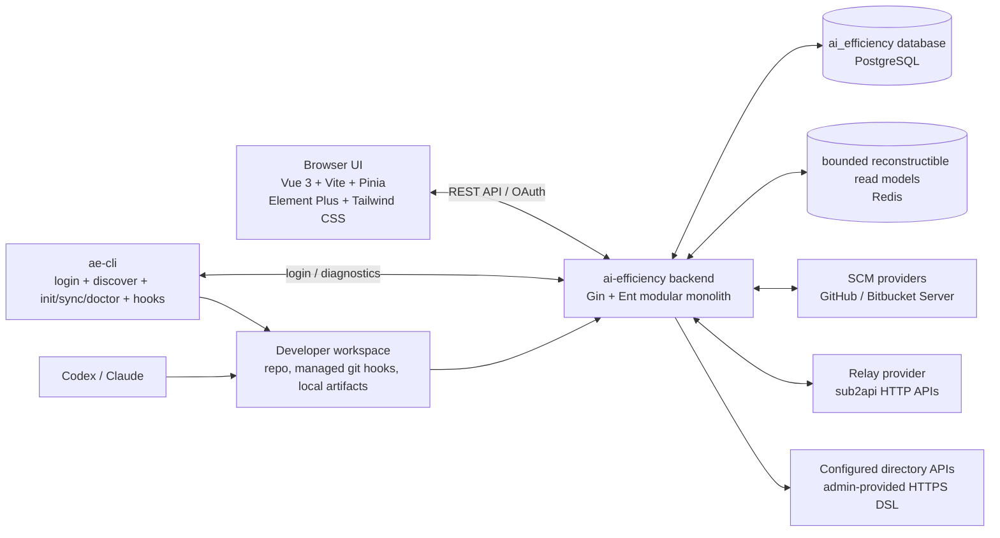
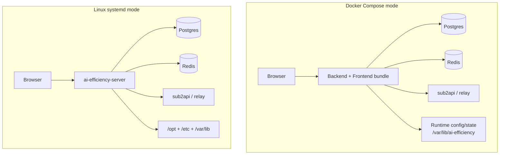
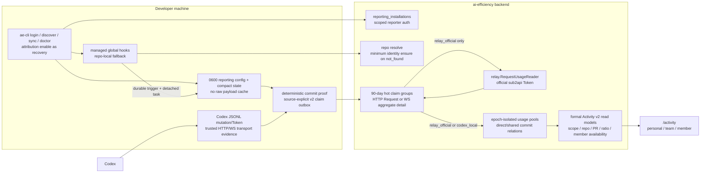

# AI Efficiency Platform Architecture

This document is the project-level architecture overview for `ai-efficiency`.

- Use this file for the current system map, runtime relationships, and module boundaries.
- Use [`docs/contracts/`](./contracts/README.md) for detailed current behavior contracts.
- When documents disagree, apply the source-of-truth order below.
- This file should always reflect the latest implemented project-level architecture.
- Use [`docs/history/`](./history/README.md) only for point-in-time rationale and evidence, never for current behavior or backlog.

## Source-of-Truth Order

1. Current code
2. The directly relevant neutral contract under [`docs/contracts/`](./contracts/README.md)
3. This architecture overview

Open GitHub Issues own unimplemented target state and work status. ADRs preserve
independently useful architectural rationale. A tracked root `CONTEXT.md` owns
domain vocabulary when present. Historical records explain the past but cannot
override this order. Platform Sessions and the local session proxy are retired.

## Current System Context


```mermaid
flowchart LR
    Browser["Browser UI<br/>Vue 3 + Vite + Pinia<br/>Element Plus + Tailwind CSS"]
    CLI["ae-cli<br/>login + discover + init/sync/doctor + hooks"]
    Tool["Codex / Claude"]
    Backend["ai-efficiency backend<br/>Gin + Ent modular monolith"]
    DB[("ai_efficiency database<br/>PostgreSQL")]
    Redis[("bounded reconstructible read models<br/>Redis")]
    SCM["SCM providers<br/>GitHub / Bitbucket Server"]
    Relay["Relay provider<br/>sub2api HTTP APIs"]
    Directory["Configured directory APIs<br/>admin-provided HTTPS DSL"]
    Workspace["Developer workspace<br/>repo, managed git hooks, local artifacts"]

    Browser <-->|REST API / OAuth| Backend
    CLI <-->|login / diagnostics| Backend
    CLI --> Workspace
    Tool --> Workspace
    Workspace --> Backend
    Backend <--> DB
    Backend <--> Redis
    Backend <--> SCM
    Backend <--> Relay
    Backend --> Directory
```

### Notes

- `ai-efficiency` is a standalone system. It integrates with `sub2api` through relay/provider HTTP APIs rather than direct database coupling.
- Release units remain in one repository but are published separately. Platform releases use `v*` tags for the backend/frontend/deploy unit, GHCR image, and Helm-consumed image tags. `ae-cli` releases use `ae-cli/v*` tags and publish only CLI artifacts; CLI installer and updater discovery filters that tag namespace instead of using the platform-owned repository latest release. The exact `v0.2.0-cli.1` tag is a one-time bridge for older CLIs that still read repository `/releases/latest`; it publishes only CLI artifacts and is excluded from the platform release workflow.
- The backend is the central orchestration point for auth, repo configuration, attribution, provider management, and SCM/webhook workflows.
- PostgreSQL remains authoritative for Work Items state and persisted revisions, users, Relay provider configuration versions, and the current Directory Sync facts that guard representative scope. `backend/internal/directorysync` is the only writer of those facts, while `backend/internal/directoryfacts` resolves the latest successful apply source/run and provides request-scoped read-only interpretation to consumers. Redis is an optional performance layer for bounded work-item counts, personal usage snapshots, representative-scope read models, reconstructible team-usage read models, and Relay group/model display metadata; an unavailable Redis never becomes an authorization, mutation, credential, token-revocation, or fresh-quota dependency.
- PostgreSQL also remains authoritative for repository inventory. The repo module aggregates inventory by provider and scope in one SQL query, versions cached snapshots with a PostgreSQL UUID, and uses Redis only as a reconstructible approximately 60-second read model. Repository inventory reuses `backend/internal/readcache` for the Redis adapter, token-protected lease, cancellation-aware process-local flight, and context sleep while retaining its key, revision, envelope, fresh-only TTL, and authoritative fallback policy inside `backend/internal/repo`. Repository writes commit their local row change and revision advance in one transaction; Redis failure falls back to SQL and never blocks a mutation.
- Runtime config remains a startup bootstrap input, not the user-facing provider source of truth. On first startup the backend can seed the primary `RelayProvider` row from `relay.*` config, but `/user`, settings, and normal provider surfaces operate on DB-backed `RelayProvider` records rather than a runtime fallback provider contract.
- `backend/internal/relayruntime` owns process Relay clients and shared provider display metadata behind the existing `relay.Provider` boundary. Clients are keyed by provider ID plus persisted `configuration_version`, re-read the current provider row on resolution, and live for at most five minutes. Provider mutations increment the persisted version, evict the local client after commit, and publish a best-effort secret-free invalidation containing only schema version, provider ID, and configuration version; missed or unavailable Redis notifications recover through persisted version checks and the client lifetime bound.
- Backend startup is the only production router composition path. It constructs the Relay runtime before the provider handler, injects that runtime explicitly, and then builds the router through one error-returning `SetupRouter` entry point that validates the required caches, revision store, directory service, bounded webhook client, request telemetry, Web Vitals handler, release, request timeout, and a separately supplied Team Usage cursor secret. The production Team Usage constructor separately requires its snapshot cache and cursor secret and has no uncached fallback; package tests use test-only helpers when intentionally exercising legacy uncached behavior.
- The Vue frontend is compiled during Docker build and its `dist` output is embedded into the backend binary, so the platform remains one backend-served release and deployment unit for both API routes and the SPA. There is no separate frontend process or CDN in the current architecture, and the embedded server currently provides gzip rather than Brotli or ETag validation.
- Generic frontend interaction is owned by directly used, automatically imported Element Plus 2.x components and `@element-plus/icons-vue`; the default theme and default control size are the baseline. Tailwind CSS continues to own responsive layout and page composition, while Chart.js remains isolated behind the existing chart components. The detailed component, responsive, and bundle contracts live in `docs/ui-guidelines.md`; there is no application mirror-wrapper layer around Element Plus.
- Embedded frontend delivery is owned by `backend/internal/web`. Its representation server resolves the requested regular file, or the actual `index.html` SPA fallback, before assigning content type, compression, and cache policy. It caches the resolved raw bytes and lazily memoizes one gzip representation per compressible HTML, JavaScript, CSS, JSON, or SVG file; negotiated responses preserve existing `Vary` values while adding `Accept-Encoding`. Resolved hashed files under `assets/` receive `public, max-age=31536000, immutable`, while HTML, SPA fallbacks, and non-hashed files receive `no-cache`. `/oauth/authorize` and `/oauth/device` register both GET and HEAD and, for the embedded deployment, reuse the same resolved `index.html` representation and response policy instead of redirecting back through a separate frontend origin.
- Frontend bootstrap awaits `initializeI18n()` before creating and mounting Vue, so only the selected `en-US` or `zh-CN` dictionary is dynamically loaded on the initial path. A language switch retains the currently committed locale and messages while the requested dictionary loads, then atomically commits messages, locale, persisted preference, and the document language; superseded requests cannot overwrite the latest choice. Usage and team-trend parents similarly keep shells, tables, legends, loading states, and empty states outside the Chart.js dependency boundary. They instantiate asynchronously imported line or doughnut canvas components only when chartable data exists, with explicit loading, empty, and canvas heights preserving layout before the renderer arrives.
- The embedded SPA now exposes a regular-user `/user` surface as a personal AI onboarding workbench. The page keeps provider-first, group-second credential self-serve driven by the current relay user's user-scoped group facts (`allowed_groups` plus active subscription entries), but the primary flow is now group-scoped, API-key-first, and explicitly action-driven. Opening the page or switching provider/group always shows access-group selection, independent of credential completion. A missing-key group offers `Create API key and continue`; an existing-key group offers an explicit next action to the connection test. Test success remains visible until the user chooses the next action to configure tools, while failure remains visible with retry. The stepper Current Step always matches the visible panel rather than being inferred from key/test completion facts. Step titles remain keyboard-accessible review navigation for reachable steps. The frontend onboarding workflow owns provider/Access Group selection, credential and per-group secret state, Current Step, model and protocol selection, Connection Test results, configuration-method choice, and the request generations that reject superseded provider, credential, model, and test responses. `UserView` retains rendering, ResizeObserver layout, clipboard feedback, sensitive-action confirmation, and explicit user intent. Configuration remains reachable once a key exists, so connection testing is recommended rather than a configuration gate.
  Once a key exists, ordinary access groups still offer manual local configuration, automatic `ae-cli discover`, and app-specific `CC Switch` provider-import links for Codex, Claude Code, or Gemini according to the selected group platform. The automatic configuration path keeps the primary discover command provider-only so it retains default multi-tool installation detection, and the same command card includes a collapsed platform-specific `--tool` fallback for the selected Codex, Claude, or Gemini group when installation detection skips that tool; the fallback explains that `--tool` bypasses installation detection only and supports repeated or comma-separated values. Access groups whose names strictly start with `Agent` instead enter an Agent client configuration branch: the page hides Codex/Claude/Gemini snippets, hides the `ae-cli` automatic configuration card, shows Hermes Agent, OpenClaw, and Custom Agent manual configuration, and offers only Hermes/OpenClaw CC Switch app-import links. Agent-client manual snippets and Hermes/OpenClaw app imports normalize the provider URL to an OpenAI-compatible versioned endpoint, normally `<provider.base_url>/v1` unless the configured provider URL already ends in a version segment. The UI explains this because Hermes Agent and OpenClaw use Chat Completions providers by default, even when the selected backend group platform is Anthropic or Gemini.
  User-owned API keys are partially masked in the browser but remain copyable when relay returns the key value. Create/regenerate operations require the relay user's own write credential because sub2api's `/api/v1/keys` endpoint requires a user JWT; the RelayProvider admin API key can list user keys and manage relay users but cannot replace user credentials for key creation. Create is idempotent per local user, relay provider, and group inside the backend process, so repeated browser clicks or concurrent requests return the same existing managed key instead of creating duplicates. Before create/regenerate, the backend ensures the local user is bound to an existing relay user and has a usable encrypted `relay_auth_password`: Relay SSO can capture the relay password only after an existing relay user authenticates successfully and must not create missing relay users, LDAP provisioning stores generated relay-side passwords, and `/user` write paths can recreate or relink a missing upstream relay user and rotate a missing/stale generated password before retrying the user-JWT write. LDAP bind passwords are never stored or forwarded to relay. New generated relay users get relay default subscriptions assigned because sub2api admin user creation has not always attached them reliably. Before assigning those default groups, the relay adapter lists the user's active subscriptions and skips groups that are already present; if a race still produces a duplicate assignment response, unambiguous `SUBSCRIPTION_ALREADY_EXISTS` responses and conflicts that are proven by a follow-up list to already have the active group are treated as idempotent success. Semantic `SUBSCRIPTION_ASSIGN_CONFLICT` responses remain errors for admin subscription operations so validity or notes mismatches stay visible there. Existing `provisioned_by_ai_efficiency_ldap` relay users with no group facts can receive the same default subscription assignment on later LDAP login. The same page can load model choices through `/api/v1/user/providers/:id/groups/:group_id/models?platform=...`, using the current user's own active group key and platform-specific sub2api model-list endpoint (`/v1/models` for OpenAI/Anthropic-compatible lists and `/v1beta/models` for Gemini native lists). It can then test the current user's own active provider key through `/api/v1/user/providers/:id/test` using the selected group's `group_id`, platform, an explicitly selected or entered model, and one backend-declared stable protocol. OpenAI groups recommend Responses and may expose Chat Completions plus capability-gated Messages; Anthropic recommends Messages with Responses and Chat compatibility; Gemini recommends GenerateContent with Chat compatibility; Antigravity recommends Messages with its dedicated GenerateContent route; Grok recommends Responses with Chat and Messages compatibility; Composite recommends Chat Completions and exposes Responses, Messages, and GenerateContent through its model-routed generic endpoints, but not the Antigravity-dedicated route. The probe uses a fixed short non-streaming request, performs no AI Efficiency retry or protocol fallback, and succeeds only for a legal terminal response with non-empty assistant text. Claude/Anthropic Messages probes additionally carry the Claude CLI headers, system block, and metadata identity shape that sub2api recognizes; this profile is confined to those `ProtocolCompleter` connection tests and is not added to other platform probes or ordinary Relay requests. Its current-page result is bound to provider, group, personal key, model, and protocol; context changes invalidate it and request generations prevent stale asynchronous writes. Failures preserve the bounded complete relay/upstream body received by AI Efficiency. Protocol selection affects only this test and never changes generated client configuration, and a successful probe does not assert that a local Claude Code client is configured. The `/user` surface no longer uses the old developer / non-developer toggle or progress-checklist framing, and advanced command references now live under the automatic-configuration path rather than as a global always-open section. The admin Relay Providers surface is CRUD-only and does not expose this test action. `ae-cli discover` now consumes the same user-provider credential surface at `/api/v1/user/providers`, with `/api/v1/providers` kept only as an older backend compatibility fallback.
  OpenAI Responses probes additionally carry a Connection Test-only Codex Client Identity Profile so sub2api can recognize them when Codex-client restrictions are enabled. This profile does not alter other probe protocols or ordinary Relay traffic, and a successful probe does not assert that a local Codex client is installed or configured.
- The embedded SPA also exposes an admin-only `/admin/users` surface backed primarily by the local `users` table and enriched with the current single Directory Sync snapshot. Admins can switch inside the same route between a user view and a department view. The user view supports search, pagination, department subtree filtering, derived access-status filtering, and row-level department display derived from directory members matched by email plus their current member-department memberships; unmatched local users remain visible unless a specific department filter is active. User-visible department labels use a backend-computed name-based `display_path` rather than the source `path`, because source paths can be numeric ID chains. Access status is local-state derived rather than a live sub2api inventory read: `disabled` takes precedence when `users.token_valid_after` or `users.relay_disabled_at` is set, or when a successful directory offboarding disable action exists; otherwise stored relay credentials show as `configured` and missing credentials show as `missing_credential`. The department view renders current departments as a collapsible tree using parent/depth metadata, shows direct and subtree member/matched-local-user counts based on current memberships with subtree-level member deduplication, shows representative match coverage when the directory DSL maps representative metadata, and drills back into the user view with the selected department subtree filter. Admins can inspect `username`, `email`, `role`, `auth_source`, `relay_user_id`, timestamps, and the encrypted `relay_auth_password` ciphertext. Plaintext relay password access is separated into an explicit per-user copy action that calls `/api/v1/admin/users/:id/relay-password/reveal`; the list API never returns plaintext. The same admin surface can also disable an individual upstream relay/sub2api user through `POST /api/v1/admin/users/:id/disable-access` after exact email confirmation. That direct admin-users disable action calls the optional `relay.UserDisabler` capability, records `users.relay_disabled_at`, and intentionally does not revoke local AI Efficiency login tokens or change relay subscriptions. The same admin surface can now load enabled relay providers' assignable subscription groups through the relay provider abstraction and manage sub2api subscriptions through one centralized workflow. The workflow supports selected local users, the current search/department/access-status filter across all pages, or all relay-mapped users, and can add, extend, remove, or reset quota for a selected subscription group by creating a persisted admin subscription job through `POST /api/v1/admin/users/subscription-jobs`; the frontend loads the latest subscription job when the page opens, displays its terminal state when complete, and polls active jobs instead of holding one long HTTP request open. Quota reset resolves each user's matching upstream subscription by group and calls sub2api's reset-quota admin endpoint for the daily, weekly, and monthly windows. Jobs are capped at 500 target users, snapshot target local users including `relay_user_id` before relay mutation starts, apply per-target deadlines plus a target-count-scaled job deadline, abandon stale active jobs with no progress for more than one hour, and report stale selected IDs as per-user failures. The older synchronous `POST /api/v1/admin/users/subscriptions/batch` and add-only `POST /api/v1/admin/users/:id/subscriptions` endpoints remain for compatibility. These subscription paths mutate relay subscription state only; they do not edit local user identity fields, fetch relay API keys, or fetch usage logs.
- The embedded SPA also exposes representative-scoped team usage as ordinary authenticated user surfaces rather than as admin pages. `/usage` is the personal AI Usage page and no longer loads or renders a representative member subject selector. It starts current-user usage, current-request quota, and representative-scope discovery independently; usage can render before quota or Team-tab discovery finishes, and a range change aborts both superseded personal requests. The usage request sends `include_group_quotas=false`, while `/api/v1/user/usage/group-quotas` owns fresh-only quota state. Team comparison is separated into `/usage/team`, which starts the split summary, trend, members, and shallow organization requests independently without rendering quota cards or quota-edit controls. Scoped member drill-down is separated into `/usage/members/:user_id`, which calls `/api/v1/user/team-usage/subjects/:user_id/usage/dashboard` directly, never calls the personal quota endpoint, and relies on the backend as the authorization boundary. Team total is rendered independently from group comparison and deduplicates canonical members even when one member has multiple current department memberships. Group comparison uses represented root departments when a representative has multiple first-level groups, direct child departments when there is one represented root with child departments, and no comparison rows when there is only one leaf represented group; a multi-department member contributes to each matching comparison bucket while remaining single-counted in team total and parent aggregates. Delegated quota control stays inside the selected-member detail surface and is implemented as sub2api user-group `rate_multiplier` writes through the relay provider boundary, not as local quota enforcement and not as shared group-limit edits. Every delegated write attempt is also recorded locally in `team_usage_rate_multiplier_audits`, with representative-readable `/api/v1/user/team-usage/audit` and admin-visible `/api/v1/admin/team-usage/audit` API paths; current representative UI surfaces do not render audit history.
- Representative scope resolution uses a versioned Redis read model instead of rebuilding all current departments, members, memberships, and local-user bindings on every team-usage request. Authentication still validates the JWT and authoritative `users.token_valid_after` first. The scope service then reads the current actor row and obtains one source/run-pinned view from `directoryfacts` as its lightweight guard. The shared reader owns department hierarchy/display paths, current memberships with compatibility fallback, matched-user resolution, and the union of department/member representative metadata. Representative scope retains only authorization and subject-selection policy. The cache derives an opaque version from the guard and schema version, isolates values by deployment namespace, actor, source/run, and current role, and re-reads that guard before returning. A changed run or role therefore selects a new key and scope version immediately, including when it changes during a cache read. Values have a fresh-only 48-54 minute jittered TTL; malformed values, Redis command failure, or lease failure rebuild from PostgreSQL, and no stale scope is accepted for delegated writes or subject visibility.
- Selected-member detail reads multiplier metadata for all unique active subscription groups through one optional Relay batch capability. The Sub2API adapter bounds its per-group upstream expansion to four workers, two seconds per group, and five seconds overall. Failed, missing, or ambiguous group metadata degrades only that row, returns a null effective multiplier, disables editing, and preserves current usage and quota fields. The authoritative mutation path still performs a single-group read, provider-group lock, whole-group replacement, readback verification, and local audit update; it never reuses the batch-read result.
- Team summary, trend, members, and organization retain independent versioned Redis response lanes, leases, freshness, and stale-if-error boundaries. For authorized scopes of at most 500 subjects, a second Redis layer shares one 60-second scope origin across all four cold lanes. That origin is keyed by deployment namespace, provider configuration version, opaque scope version/hash, and normalized range; it contains only Relay IDs, per-user stats, and validated trend points, never names, emails, credentials, request IDs, or response DTOs. One local flight and token-protected Redis lease collapse the origin load across requests and Pods. The loader resolves the complete scope, fetches stats in at-most-100-user chunks, performs one aggregate `/api/v1/admin/dashboard/users-trend` request, and completes missing range totals before each lane projects its typed response. Redis failure remains fail-open, origin errors are not cached, values are rejected above 2 MiB, and scopes above 500 retain the bounded lane-specific fallback. The first-party page starts all four requests independently, so a delayed or failed section does not remove successful siblings, and the trend chart stays behind an async component boundary until a Trend response renders. The completed compatibility window left no current caller, so the legacy aggregate route, DTO, recursive tree projection, and compatibility headers are removed.
- Team members are served as an independent snapshot-bound ranking page, defaulting to 50 rows and capped at 100. Next/Previous cursor navigation restarts only the members section after `snapshot_expired`.
- Team organization is the fourth independent split request. It initially returns only authorized roots and then loads one parent's immediate departments and direct members on first expansion. Department and member collections have independent cursors, cached collapse/re-expand state, and branch-local error and snapshot-expiry recovery.
- The embedded SPA also exposes sequential quota reset approvals for user subscription groups. The selected subscription group identifies only the relay quota reset target and never affects approval routing. When a request is created, the backend resolves the current directory source, requester memberships, hierarchy, approver configs, representatives, and local-user matches in one repeatable-read transaction and snapshots one compact versioned JSON workflow on `quota_reset_requests`; later directory or config changes do not rewrite that request. The resolver retains the full current department set for deterministic hierarchy and cycle handling, while member, membership, user, and config queries are bounded to the requester, relevant ancestor rounds, and candidate identities. String or numeric, scalar or array leader metadata uses separate indexed containment reads, and department-declared representative ids use a source/external-id index. The first step merges candidates from every exact requester department: enabled config takes priority for each department, while an exact department with no config falls back only to its active synced representatives. Later steps walk all parent paths one edge per round, deduplicate converged departments, keep only departments with enabled config, and merge all usable configured approvers in the same round; representatives are not an ancestor fallback. Configured rounds with no usable candidate become admin-fallback steps, rounds with no config are skipped, and resolution with no steps creates one final admin-fallback step. Version 2 rows use the internal `workflow_pending` status, mapped to public `pending`, so an old Pod in a rolling deployment cannot process them as legacy single-stage requests. The original active-request partial unique index remains unchanged for rollback compatibility, while a second named index spans both pending states to prevent cross-version duplicates. `resolved_approver_user_ids` indexes only the current normal candidates for approval lists and Work Items, `workflow` has a separate GIN index for historical decision containment, and `workflow_revision` provides compare-and-swap decision concurrency. One commented approval completes each active step; an earlier approving actor automatically satisfies any later step containing that actor, records the reuse in workflow state and `quota_reset_request_events`, and does not receive a duplicate activation notification. Admins may decide whichever step is active but cannot jump ahead; admin fallback keeps the active step actionable when it has no normal candidate. Required decision comments and all workflow, decision, reset, cancellation, and notification transitions remain durable in the request JSON and append-only event audit; historical version 1 rows retain the previous single-stage path. The final winning approval starts exactly one existing relay quota reset after commit on a context detached from client cancellation, with a 30-second deadline so success or failure can still be persisted. Organization & Login settings expose department-member approvers and an explicit `generic_webhook` or `wecom_group_robot` channel; generic webhooks receive structured payloads with public statuses, while the WeCom preset uses request-time `wecom_userid` snapshots for active-approver mentions, and webhook failures persist only safe HTTP status or numeric business error codes.
- The embedded SPA now exposes configurable Directory Sync under `/settings` -> Organization & Login and a separate admin offboarding review page at `/admin/directory/offboarding`. `backend/internal/directorysync` owns admin-authored HTTP DSL sources, validate/preview/apply runs, and all writes of current directory departments, canonical members, and member-department memberships. `backend/internal/directoryfacts` is the shared read/interpreter module used by Admin Users, representative scope, quota reset, and Activity. One request-scoped view is pinned to the latest successful apply source/run; every fact query carries both IDs, and bounded page/actor reads remain bounded instead of loading the full directory. Run history is a bounded read model: `GET /api/v1/admin/directory/sources/:id/runs` returns `limit`/`offset` pages with a default of 20 and maximum of 100, projects only display/progress summary fields, and orders rows by `started_at DESC NULLS FIRST, id DESC`. Its count, page, and page-independent `latest_active_run` queries share one read-only repeatable-read snapshot; lifecycle transitions therefore cannot mix a running summary with a null active-run result. Complete warnings, summary, preview diff, error message, and other diagnostic fields remain available only through the selected-run detail endpoint. Each history response carries a nullable `latest_active_run` restricted to the newest queued/running preview or apply run. The settings UI uses that value to recover run state and polls only that active run or a just-created active run; selecting a terminal or older history row fetches its complete detail once without changing the active polling lifecycle. The DSL is generic and declarative: it supports safe GET requests, header credential references resolved from the existing encrypted credential store, item extraction from JSONPath-like paths or a root-array `$`, mapping, explicit non-sensitive metadata mappings such as organization representative ids, and bounded execution. It does not embed vendor-specific SDKs, execute scripts, or mutate external directory systems. Preview runs never update current facts, and failed apply runs leave current facts and offboarding candidates unchanged. Before destructive fact replacement, apply resolves the complete department hierarchy in bounded, deterministic, non-recursive application work. Each current `directory_departments` row keeps the nullable upstream `parent_external_id` fact and separately stores nullable `effective_parent_external_id`; a missing same-source parent becomes an effective root, while each closed cycle drops only the edge owned by the first department ordered by ASCII-space-trimmed, ASCII-lowercased name and then external id using UTF-8 byte order. The row's `source_id` and `last_seen_run_id` scope and version that derived relation. Apply completion replaces current departments with their effective parents, canonical members, membership links, run result, source pointers, and the shared work-item revision in one transaction; `directoryfacts` consumes that stored relation directly and never reconstructs missing-parent or cycle-anchor repairs from upstream parents. Successful full-company apply runs match directory members to local users by normalized email.
- Directory offboarding candidates are local relay-bound users whose normalized email is missing from the latest complete successful full-company directory snapshot. The backend derives both count and stable bounded pages from one shared SQL anti-join; pages order by username and local user id and batch-load prior action metadata, while the work-item badge consumes only the injected count interface. Confirmed offboarding is an explicit admin action: the backend rechecks that the user is still missing, calls the optional `relay.UserDisabler` capability through the configured relay provider boundary, and then sets `users.token_valid_after` through the auth service. It does not automatically assign, extend, remove, delete, or reset quota for relay/sub2api subscriptions; those remain under the `/admin/users` subscription job workflow.
- Work-item freshness is owned at both runtime layers: the backend invalidates Redis keys through a PostgreSQL UUID revision, while the Pinia store bounds browser reuse to 20 seconds from successful response completion and performs generation-safe refreshes after current-actor quota, Directory, and offboarding mutations.
- Browser login loads `/api/v1/auth/options` before choosing auth sources. If `auth.ldap.url` is configured it defaults to LDAP and also offers Relay SSO; otherwise it shows only Relay SSO. Dev Login is exposed only when the debug endpoint is explicitly enabled. Relay SSO is an existing-relay-account login path only: invalid credentials or a missing upstream relay user fail authentication and never create a sub2api user. LDAP passwords are used only for LDAP bind and are never forwarded to relay user create/update APIs. LDAP relay identity resolution prefers an exact relay email match before canonical username provisioning, and when a linked relay user has a valid role the local user role follows that relay role. When a successful LDAP login reuses an existing local `relay_sso` row by username/email, the backend updates the local `auth_source` to `ldap` so `/auth/me` and the `/user` profile reflect the actual latest login provider, while preserving any Relay SSO-captured `relay_auth_password` for later relay user JWT acquisition.
- `backend/internal/adminusers` owns administrator hierarchy reads for targets, list count/page, page enrichment, department options, immediate children, summaries, and the complete compatibility response. Every path reads `directory_departments.effective_parent_external_id` exactly as persisted by the successful Directory Sync apply; request SQL binds its source, selected department, and candidate arrays explicitly and does not rewrite or infer earlier positional placeholders. The same effective-subtree predicate and target reader back visible pages plus persisted and compatibility current-filter mutations. Only requested subtree, page-candidate ancestor, requested-summary descendant, and complete-response preorder relations remain recursive; none count the source, walk raw parent paths, or infer missing-parent and cycle-anchor repairs. The complete `/api/v1/admin/users/departments` route retains its response shape through one persisted-parent preorder query plus one shared summary query, so its query-role count is independent of department cardinality and the handler owns no second hierarchy/member aggregation algorithm. Deployments upgrading existing directory snapshots must complete a successful apply with effective-hierarchy storage available before activating these readers because `NULL` is both the valid persisted root and the legacy column value, so request paths cannot safely infer a backfill. Representative-scope hierarchy reads remain unchanged in this ticket. Department options default to 20 and cap at 100; immediate-child navigation defaults to 25 and caps at 100. Page enrichment stays bounded by the 100-user page and its candidate-department/ancestor closure, and the frontend mounts one responsive row tree rather than duplicate mobile and desktop records.
- Official production deployment now has two supported paths: Docker Compose and Linux systemd.
- The business entrypoint remains the backend service that also serves the frontend bundle.
- Docker/Compose mode runs the backend from the image-provided server binary and uses the mounted state directory only for runtime-editable application config.
- When `AE_CONFIG_PATH` is unset, Docker/Compose and local runtime modes materialize a writable config file under the runtime state directory (or the current working directory outside managed deployment) so admin settings can persist.
- Linux systemd mode installs the backend under `/opt/ai-efficiency` and keeps config in `/etc/ai-efficiency/config.yaml`; upgrades are operator-driven through the install script or release assets.
- `deploy/` also includes non-production `dev` / `local` compose paths for local verification.
- Public health endpoints expose liveness/readiness. Admin-only system version endpoints expose current build metadata and an explicit GitHub release check, but they do not apply updates. In-app deployment status, binary update, rollback, and restart APIs have been removed; upgrades are handled outside the application process.
- `ae-cli login` now supports both browser PKCE and OAuth device flow. Headless Linux environments are expected to use `ae-cli login --device`, while desktop/browser-capable environments still default to PKCE.
- Backend-issued auth tokens currently default to a 2-hour access JWT plus a 7-day refresh token. The frontend retries a non-auth `401` once via `/api/v1/auth/refresh`, and `ae-cli` refreshes `~/.ae-cli/token.json` before authenticated commands when the token is expired or within the refresh window. Access and refresh validation now also check `users.token_valid_after`; tokens issued before that revocation floor are rejected, which lets confirmed directory offboarding expire existing login state without introducing a full session table.
- Browser access and refresh credentials are owned by one generation-aware frontend session boundary shared by Pinia and Axios. Login, Dev Login, logout, and credential replacement advance or clear the owning generation; a same-session access-token refresh preserves that generation while synchronizing browser persistence and Pinia. Requests and current-user hydration cannot publish results from an invalidated generation, and an authenticated retry rechecks the owning generation and current token synchronously at the final Axios adapter boundary before delegating to the configured default or custom adapter.
- Frontend route policy starts public and ordinary authenticated route chunks without awaiting current-user hydration, while administrator lazy loaders remain blocked until the current role is verified for the still-current navigation. Promise-driven redirects are scoped to monotonic navigation generations plus captured route identity. Each normalized navigation object is bound to its exact attempt generation, so a failed or aborted attempt restores the last confirmed destination only when that exact attempt is still active; an older same-path failure cannot overwrite a newer pending attempt. Final refresh failure publishes a shared auth-expiry event, and the confirmed current destination owns Login and OAuth behavior; a redirecting event is consumed only after Login confirms, while final no-redirect policies consume it immediately. Axios does not navigate.
- `ae-cli discover` now provides the current user-facing tool-configuration path for supported local agents. It fetches provider-delivered base URLs plus group-scoped credentials from the backend and writes deterministic local config only for tools whose platform credential exists: Codex uses `openai`, Claude uses `anthropic`, and Gemini uses `gemini`. Automatic detection recognizes the Codex CLI, `ChatGPT.app`, and legacy `Codex.app`. Repeated `--tool` values explicitly select supported tools and bypass installation detection, while platform credential matching remains mandatory.
- The old ae-cli session runtime/helper packages are no longer present in the active code path. Backend-side legacy `session` schema and runtime compatibility have also been removed; the remaining `matched_session_ids` / `session_ids` fields are historical names that now carry tool-native session identifiers.

## Frontend Task Zones

The Vue frontend keeps the existing route contract while grouping pages by user task rather than by backend resource type.

- `My Work`: `/`, `/work-items`, `/usage`, and `/user` provide the ordinary company-user path for personal AI usage, pending work, and setup. `/` redirects to the personal AI Usage page at `/usage`, which now stays focused on usage and quota visibility instead of rendering AI access/setup guide cards. Missing reusable AI access is represented as an `ai_access_setup_count` item in `/work-items`, with `/user` as the detail/remediation target. `/work-items` is the shared pending-work entry and aggregates personal AI access setup, pending quota reset approval work, and admin-only directory offboarding candidates. The sidebar shows a hidden-when-zero `total_count` badge sourced from `/api/v1/work-items/counts`, with admin totals deduplicated as personal AI access setup plus admin quota-reset fallback count plus offboarding count. Personal usage and quota now arrive through independent responses: usage carries explicit freshness and may use an eligible recent snapshot, while `group_quotas` is always a current-request `ok`, `empty`, or `unavailable` section. AI Coding Activity remains the secondary developer analysis path rather than the homepage's primary narrative; Repository integration management appears only for administrators, and legacy `/events` links redirect to `/activity`.
- `AI Usage`: `/usage` is always the current user's personal AI Usage page and does not expose a choose-person dropdown. Its Today / 7 Days / 30 Days selector shares one browser-profile preference with `/usage/team` and `/usage/members/:user_id`; each view restores that preference before its first request, falls back to 30 days when storage is missing or invalid, and stores an explicit selection independently of request success. Activity date ranges remain URL-owned. Its top tab strip always exposes `/usage/quota-reset`, where users track their own reset requests, handle the current steps assigned to them, review previously processed decisions, and, for admins, decide the active step; the quota reset queue tabs show actionable Work Items counts rather than history totals. Version 2 request details show ordered step progress and durable comments, while approval and rejection both require a comment dialog. The route loads only the active queue on entry, gives requester/approval/admin queues independent request and error state, loads hidden queues on first selection, and refreshes only the active or mutation-affected queues without serving stale history after an authoritative read failure. Representatives use `/usage/team` for subtree-wide trend and member ranking, then open `/usage/members/:user_id` for a focused scoped-member detail page with subscription-group quota rows and delegated multiplier controls. `/usage/team` does not show quota cards, subscription quota rows, or multiplier controls.
- Quota Reset loads only the requester queue on entry. Requester, approval, and admin queues own independent request/error state; hidden queues load on first selection, and mutations refresh only active or affected queues plus the Work Items badge. Authoritative queue history is never replaced by stale data after a read failure.
- `AI Coding Activity`: `/activity`, `/activity/members/:user_id`, `/activity/teams`, and `/activity/teams/:team_id` own committed-code Token analysis. The backend supplies the scope total, Usage-backed ratio, local-day trend, Repository direct/shared projection, PR involved projection, server search/sort/cursor pages, and filter-safe SCM coverage. The frontend renders the ratio, trend, Repository/PR Top 5, and responsive full lists without deriving aggregate accounting or exposing Request-level operational detail. Repository and PR selection remain shareable in-page `repo_id` / `pr_record_id` filters rather than separate analysis routes. Team member navigation shows identity, department, data availability, and the authorized detail action without personal Token or ranking fields.
- `Relay Planning`: `/admin/relay-planning` is an explicit admin-only department x Platform workflow. Its initial preview automatically recommends a target Group count from indivisible source members, then lets the administrator add or delete proposed Groups before Confirm while keeping at least one Target. New Target names are reviewed department-leaf and Platform suggestions; Confirm duplicates each Group, renames it, reconciles Accounts, activates it, and only then migrates members, while persisted creation state permits a failed Target to resume without another duplicate. Template Group (copy configuration) remains separate from the optional Migration Source Group (old subscription/API Key migration). After Preview, an administrator can search any local user, verify that user's identity through the selected Relay Provider, assign the user to one explicit Target, and choose one same-Platform Source or target-only addition. The frontend's reviewed-plan workflow owns the active Preview, explicit Target/member/Account edits, plan-scoped user and Account searches, canonical request construction, relationship fingerprint, operation key, stale replacement, retry restoration, and Confirm handoff; the route view retains planning inputs, mapping list, renewal, Rebind, saved Account administration, rendering, and explicit user intent. Replan is entered from one mapping, preserves every existing stable Target Group ID and saved department relationship, and may append read-only proposed Targets using the same Add Group editor, Template Account defaults, naming, Confirm, and retry lifecycle as initial Preview; it does not remove, deactivate, or silently reshuffle existing Groups. It opens from the Replan Baseline as a zero-change plan, including Managed Mapping Members outside the current department and those whose current local-to-Relay identity is unavailable; a Managed Mapping Member with unavailable identity remains visible in its Replan Roster with a safe warning and blocks the complete Confirm before any Relay write, including otherwise valid edits in the same plan. If a Target Group in the Replan Baseline is absent from current Relay facts, it is an Unavailable Replan Target. Replan keeps it and its Replan Roster visible, proposes no automatic replacement or member relocation, and blocks the complete Confirm until a fresh Preview observes the repaired Target. Other candidates keep the existing usage and ranking presentation but start unselected and unassigned, and remaining target capacity never recommends or places them automatically. It shows current and department-based names for each available managed Target; renames are opt-in per Target or through explicit Apply All and run through the same Confirm/stale/retry gate without changing Group identity or unrelated relationships. Mapping maintenance reads and adopts privacy-safe per-target Account relationships, applies reviewed same-Platform Account pools only through Confirm, and warns about drift, multiple Accounts, reuse, unavailable Groups, unmanaged members, and cross-mapping conflicts. Its list starts independent Group, provider relationship, Account, and Directory reads together; mapped departments are resolved in one bounded query. Mapping Renewal Preview and Replan use one request-scoped provider-wide identity/subscription snapshot, one Group collection, one same-Platform Account collection, and at most one API Key read per relevant user, with no cross-request relationship cache. Explicit removal, `Move Here`, `Add Additionally`, and unmanaged-member adoption remain admin edits that require final confirmation; department changes never trigger them automatically. A removal reuses an already-active saved Source subscription. Legacy Managed Mapping Members without per-member Source provenance must explicitly review a valid same-Platform Source or Target-only destination before Confirm; Template and managed Target Groups are rejected as Sources. The reviewed choice crosses Preview, Execute, retry, and one fresh provider relationship plus affected-user active API Key readback; inactive Keys remain untouched, and any Source, Target, or eligible Key mismatch keeps the deleted desired assignment and marks the operation `needs_retry`. Every maintenance Preview carries a compact versioned relationship fingerprint with separate Group, Account, mapping/retry, Relay identity, subscription, and API-Key hashes. Confirm rejects stale categories before any Relay write, while usage changes remain advisory. Mapping Renewal Confirm uses one bounded relationship snapshot for preflight, direct reviewed-subscription mutations with bounded concurrency, and one bounded readback snapshot. Each mapping retains per-Group/member operation state and errors so failed creation, rename, move, or removal steps can be reopened and retried. Destination and source mapping updates commit atomically and return per-mapping persistence results. The read-only preview reuses a valid schema-v3 Team Usage prewarm generation for provider-wide 30-day usage and falls back to exact Relay sources when that generation is absent or invalid; current subscription membership and migratable active API Key facts remain authoritative per candidate. There is no background synchronizer or direct sub2api database coupling.
- `Administration`: `/repos`, `/repos/:id`, `/admin/users`, `/admin/directory/offboarding`, and `/settings` are admin-only surfaces. Repository pages are limited to inventory, SCM binding, webhook health/repair, and explicit PR synchronization operations; PR/Token analysis lives only under Activity. `/admin/users` defaults to the user view with user, department, relay mapping, derived access status, access-status filtering, direct upstream relay-user disablement, and centralized sub2api subscription management with selected/current-filter/all-mapped scopes and add/extend/remove/reset-quota operations backed by persisted subscription jobs, while keeping plaintext relay password copy behind an explicit risk confirmation; on mobile it renders selectable user cards rather than a compressed wide table. The direct `/admin/users` disable action requires exact email confirmation, disables only the upstream relay/sub2api user, records `users.relay_disabled_at`, and does not revoke local tokens or change subscriptions. The same route also has a collapsible tree-style department view for current Directory Sync departments and drill-in department subtree filtering, using name-based display paths in filters and row labels, with representative matched/total badges when that metadata is present. `/admin/directory/offboarding` lists directory-derived offboarding candidates and requires exact email confirmation before disabling an upstream relay user and revoking local tokens. `/settings` is a navigation-only shell that imports and mounts exactly one task-zone section at a time: AI Services, Code Platforms, Organization & Login, Deployment & Runtime, or Advanced Credentials. Each section owns its requests, CRUD state, and dialogs; Code Platforms loads credentials only when add/edit opens. A shared Pinia owner deduplicates credential summaries and Directory Sync source summaries across Advanced/Organization consumers and section remounts for five minutes, with one active request per resource and a serialized forced refresh after owned mutations. Organization & Login includes Directory Sync source configuration, quota reset approval settings, safe synthetic templates, and an AI prompt helper without keeping hidden polling components mounted. Deployment & Runtime shows read-only backend build metadata and a manual latest-release check; in-app apply, rollback, and restart controls are not part of the current runtime surface.
- Auth pages: `/login`, `/oauth/authorize`, and `/oauth/device` share a standalone AuthShell and language toggle so sign-in, app authorization, and device login read as one product flow outside the main app shell. Device login also shows the signed-in account before approve or deny.

The task-zone frontend retains compatibility redirects for the previous Activity entry routes. Connected tool counts are derived from `/api/v1/user/providers`, repository health is derived from existing repo records, and formal Activity Token analysis is read from backend-owned v2 aggregates rather than frontend row summation. The UI does not claim local CLI state unless that state is backed by server data.

## Current Production Deployment

The current deployment model is split by runtime mode.


```mermaid
flowchart TD
    subgraph Compose["Docker Compose mode"]
    Browser["Browser"]
    Backend["Backend + Frontend bundle"]
    State["Runtime config/state<br/>/var/lib/ai-efficiency"]
    DB[("Postgres")]
    Redis[("Redis")]
    Relay["sub2api / relay"]

    Browser --> Backend
    Backend --> DB
    Backend --> Redis
    Backend --> Relay
    Backend --> State
    end

    subgraph Systemd["Linux systemd mode"]
    Browser2["Browser"]
    Backend2["ai-efficiency-server"]
    FS["/opt + /etc + /var/lib"]
    Relay2["sub2api / relay"]
    DB2[("Postgres")]
    Redis2[("Redis")]

    Browser2 --> Backend2
    Backend2 --> DB2
    Backend2 --> Redis2
    Backend2 --> Relay2
    Backend2 --> FS
    end
```

### Team Usage Prewarm Runtime

The platform image contains both `ai-efficiency-server` and
`ai-efficiency-prewarmer`, but they have independent process lifecycles. The
optional prewarmer is initially deployed only through Helm; Docker Compose and
systemd continue to launch the server alone.

```text
Browser -> Backend Deployment (N stateless HTTP Pods)
                    | authorization-first schema-v3 reads
                    v
                  Redis <--- one refresh lease / immutable values / manifests
                    ^
                    | provider-wide source refresh
Prewarmer Deployment (1 optional Pod) -> Relay HTTP API
                    |
                    +-> PostgreSQL provider row/version
```

Every Backend Pod always attempts an eligible, authorization-first schema-v3
read. Worker absence, an unpublished or invalid manifest, and Redis failure are
normal cache misses; the exact Relay-backed fallback remains authoritative for
correctness. Backend readiness never depends on the Worker, and Worker
readiness or failure never changes Backend readiness.

### Deployment Notes

- Official deploy assets live under `deploy/`.
- `deploy/docker-compose.yml` is the bundled-infra path.
- `deploy/docker-compose.external.yml` is the external-infra path.
- `deploy/docker-compose.dev.yml` is the source-build local validation path.
- `deploy/docker-compose.local.yml` is the directory-backed local validation path.
- `deploy/docker-deploy.sh` is the preflight entrypoint.
- `deploy/install.sh` is the Linux systemd installer entrypoint.
- `deploy/ai-efficiency.service` is the packaged systemd unit template.
- `deploy/migrate-sqlite-to-postgres.sh` is the one-time bootstrap path from local SQLite data into the local Postgres test environment.
- `deploy/.env.example` is the operator-facing configuration template.
- Helm is the only initial deployment path for the optional Team Usage prewarmer. Docker Compose and systemd omit the worker.
- Admin settings can display the current backend version and manually check the latest backend GitHub release through `/api/v1/system/version` and `/api/v1/system/version/check`. These endpoints are read-only and never replace binaries, restart services, or mutate deployment state.
- In-app deployment status, update, rollback, and restart APIs are no longer part of the runtime surface. Operators upgrade Docker deployments by refreshing the image and recreating the service, and upgrade systemd deployments through install/release tooling.
- Prometheus metrics use a second listener configured by `metrics.listen_address` / `AE_METRICS_LISTEN_ADDRESS`. It defaults to `127.0.0.1:9090`; Docker binds `:9090` only inside its un-published private network. The public application listener never serves the scrape payload.

## Work Items Read Model

PostgreSQL owns the authoritative facts used by `/api/v1/work-items/counts`. The
`backend/internal/workitems` module accelerates that calculation with a Redis
read model; it does not move authorization, mutation decisions, or source facts
into Redis.

### Backend Cache Contract

- Cache keys include the explicit deployment namespace from `redis.namespace`
  / `AE_REDIS_NAMESPACE`, the persisted PostgreSQL UUID revision, actor id, and
  effective `user` or `admin` role. Namespaces are validated deployment inputs,
  so replicas in one deployment share keys without colliding with another
  deployment.
- Successful values have a jittered 24-27 second TTL and no stale-serving
  window. A revision mismatch makes every older Redis value unreachable even if
  that value remains physically present.
- Identical cold loads collapse first through a waiter-counted process-local
  flight and then across replicas through a token-protected Redis lease. Lease
  acquisition is followed by a second cache read, waiters recover after lease
  expiry, and release uses token-checked compare-and-delete.
- Redis command failure bypasses Redis and performs one bounded authoritative
  load through the local flight. Relay-derived degradation remains usable for
  that response but is not cacheable, so the next request retries the Relay
  lookup.
- Directory offboarding count and page reads share one PostgreSQL anti-join.
  Badge reads execute only the count path; pages default to 20 rows, cap page
  size at 100, order by username then local user id, and batch-load action
  metadata for the selected page.

### Mutation Invalidation

One `workitems.RevisionStore` is initialized after schema migration and shared
with the counts cache, quota reset service, and Directory Sync service. The
following PostgreSQL commits advance its UUID revision in the same Ent
transaction as the authoritative local mutation:

- quota request creation and every transition into or out of actionable
  `{pending, approved_reset_failed}` state, together with required audit events;
- Directory source update/delete and successful apply completion, together with
  current facts, run completion, and source pointers;
- successful offboarding finalization, together with
  `users.token_valid_after` and the succeeded action.

Relay quota reset and Relay user disable calls remain outside local database
transactions. After Relay disable succeeds, offboarding uses a synchronous
`context.WithTimeout(context.WithoutCancel(ctx), 5*time.Second)` finalization
transaction through the auth service's tx-aware token revocation seam. A failed
finalization rolls back token/action/revision state, then records
`partial_failed` under a new independent bounded context. Redis availability is
irrelevant to all of these commits.

### Browser Freshness And Mutation Refresh

The Pinia Work Items store starts a 20-second freshness window only when a count
response succeeds. Protected-route navigation and repeated desktop/mobile
sidebar mounts reuse that completed value. One active request is shared by
normal callers, and concurrent forced callers share exactly one queued forced
follow-up.

Invalidation preserves the displayed badge but advances a freshness generation,
expires the window, and prevents late success, error, or `finally` handling from
an older generation or auth session from overwriting current state. Auth reset
clears counts, freshness, queued work, and generations. Failed loads are not
marked fresh and remain retryable.

After successful current-actor quota cancel/approve/reject/retry operations,
Directory source updates, newly completed tracked apply runs, or confirmed
offboarding, the owning view invalidates counts and awaits one forced refresh.
Source creation, preview, failed apply, and already-completed historical runs do
not trigger this refresh. The offboarding view consumes the bounded
`{items,page,page_size,total}` contract, resets search to page 1, clamps an empty
last page, and keeps exact normalized-email confirmation before disable.

## Team Usage Read Models

`backend/internal/teamusage` owns the common authorization and cache guardrails for
four current split read-model lanes. Summary, Trend, Members, and Organization each
have an independent typed response cache. Eligible cache misses project from one
shared Redis-backed scope origin. The one-release compatibility Overview completed
its production window and has been removed; these four lanes are the complete Team
Usage aggregate read surface:

- Every split request normalizes and validates start/end dates, `day|hour` granularity,
  and an IANA timezone, then resolves the current representative scope and enabled
  primary Relay provider row before cache access. Auth middleware has already checked
  the current token-revocation floor. A cache hit therefore never bypasses current
  authorization, scope version, actor role, Directory Sync run, or provider
  configuration checks.
- Each Redis key hashes deployment namespace, provider id and persisted
  `configuration_version`, actor id, opaque scope version, a deterministic hash of
  the complete effective scope, and the normalized range/granularity/timezone.
  Summary, Trend, Members, and Organization use distinct versioned key spaces, so
  no payload can satisfy another lane. There is no fifth aggregate cache or legacy
  `page`/`page_size` compatibility input.
- The shared `team-usage-origin` key omits actor id but binds the complete opaque
  scope version and deterministic scope hash, so only actors with the same current
  authorized scope can address the same value. It also binds provider version and
  normalized range/granularity/timezone. Values live for 60 seconds and serialize
  only Relay IDs, per-user stats, and validated trend points. Current subject
  metadata is re-resolved and authorized before a cached origin is hydrated. If
  the current Relay ID set differs from the cached set, hydration discards the
  cached payload and performs a fresh authoritative origin load so a remapped
  subject is never projected with another generation's missing data.
- A Summary value contains only a typed normalized window and summary aggregate.
  A Trend value contains only its normalized window, bounded `top_members`,
  `top_member_trend`, and `department_trend`. A Members value contains only its
  normalized window and complete immutable ranked member rows. An Organization
  value contains one nullable parent, its immediate department rows, and complete
  branch-local ranked direct-member rows. Its key additionally hashes the normalized
  parent. None contains a request id, JWT,
  token-revocation state, provider credential, quota fact, or mutation decision.
  Request middleware owns the validated request id, and each handler copies that same id into its response
  header and DTO after projection. Old `team-usage-snapshot` values are unreachable
  and expire under their existing Redis TTL.
- Values are fresh for 144-162 seconds and have a hard stale deadline 4-4.5
  minutes after generation, both using 10-20 percent jitter below the documented
  three-minute and five-minute maxima. Writers emit only that current fresh
  window; readers also accept same-schema historical 48-54 second envelopes
  through their original deadlines so an upgrade does not discard eligible
  stale fallback. Only an eligible transient origin failure may reuse a
  stale generation; invalid input, invalid credentials, provider capability or
  configuration failure, authorization failure, caller cancellation, and hard
  expiry do not use stale data.
- Identical response reads collapse through their existing waiter-counted local
  flights and token-protected 30-second Redis leases. On a response miss, eligible
  full scopes also collapse through a separate local flight and Redis lease for the
  shared origin. Redis read, write, lease, or release failure bypasses the affected
  optimization and performs the bounded authoritative read.
- One eligible scope-origin load resolves authorized Relay identities, fetches
  complete-range stats in at-most-100-user chunks, and calls the aggregate
  `users-trend` capability once for the complete Relay ID set. It filters returned
  points to authorized IDs and uses those points to complete only missing range
  totals. The Sub2API endpoint does not accept requested user IDs and applies its
  limit to the global token-ranked user set, so the adapter always requests the
  supported maximum of 5,000 users even for a small authorized scope. A response
  containing exactly 5,000 unique users is rejected as possibly truncated rather
  than treating an omitted authorized user as zero usage. Consequently, a Relay
  deployment with more than 5,000 active users can still leave lower-ranked
  authorized users unavailable until Sub2API exposes filtering or pagination.
  A legal origin larger than 2 MiB remains authoritative for the current
  request but is not written to Redis. Scopes above 500 use the previous bounded
  lane-specific generation path.
- Summary projects aggregate counts and totals from the shared origin without
  ranking members or constructing an organization tree. Its `relay_member_count`
  counts authorized subjects with a positive hydrated Relay binding, while cost
  and token totals remain deduplicated by Relay user ID when multiple subjects
  share one binding. Members ranks the complete
  authorized rows once. Trend does not compose Summary or Members DTOs; its projection
  preserves the complete independent team total, caps top members and department
  comparisons at 12, retains stable subject/department identities and unavailable
  reasons, and uses `team_usage_trend` telemetry independently from the other split
  lanes. A whole-origin transient Trend failure prefers an eligible
  stale Trend generation; a cold request still returns the explicit `provider_error`
  section state without storing that outage snapshot over a good generation.
- The Members response cache uses `team-usage-members` values and
  `team_usage_members` telemetry. It maps selected-window billed usage and token
  totals from the shared origin, ranks the complete supported scope once by token
  total then stable subject identity, and does not construct the organization tree.
  A transient origin failure prefers an eligible stale response generation, while
  Redis failure performs the same bounded authoritative read.
- The Members lane assigns global ranks before caching and slicing, defaults to 50
  rows, and rejects limits above 100. Its response contains only the
  current page, total count, window/freshness metadata, and an optional next cursor;
  it never embeds the recursive organization tree or duplicate member collections.
- Member cursors use a domain-separated HMAC key derived from the deployment-shared
  encryption secret. The signed payload binds actor, normalized range, opaque scope
  version, deterministic hash of the complete ranked member content, and next offset,
  and contains no email or display metadata. Tampered or cross-actor/range cursors
  fail with 400 `invalid_cursor`; changed scope or member content fails with 409
  `snapshot_expired`. The deterministic content identity lets an unchanged
  authoritative rebuild continue pagination during Redis failure without accepting
  a changed roster or ranking.
- The Organization lane selects one authorized branch directly from the flat,
  versioned representative scope and never constructs or serializes the recursive
  compatibility tree. It returns only authorized roots or one supplied parent's
  immediate departments and exact direct members. For eligible scopes, it filters
  the authorized full-scope origin down to subjects in the requested child subtrees
  plus the parent's direct subjects. The scope-above-500 fallback resolves only those
  branch subjects and loads complete-range stats in batches of at most 100 Relay user
  IDs. If those branch stats need range completion, only the branch Relay IDs are
  passed to the aggregate adapter; the fallback does not expand its requested-ID
  set back to the complete represented scope. Multi-membership members are deduplicated inside each aggregate while
  remaining visible in each department they directly belong to. The virtual root
  returns no members. Departments sort by normalized display name and stable
  external ID, default to 25, and cap at 100. For eligible scopes it projects the
  branch from the already authorized shared origin instead of loading branch-local
  Relay stats; scopes above 500 retain the bounded branch-local fallback. Direct members receive dense
  branch-local ranks by selected-window token total then stable subject identity,
  default to 50, and cap at 100. Department rows expose child/has-children,
  direct/aggregate/connected member counts, and aggregate range totals without
  recursive `children` or `member_tree` fields.
- Each Organization cache key binds provider/version, actor, scope version/hash,
  normalized range, and nullable parent. Cached parent metadata must exactly match
  that key; mismatched root/child or child/child values are rejected and rebuilt.
  The `team-usage-organization` value contains only the branch window, parent,
  department rows, and ranked direct-member rows, and emits the stable
  `team_usage_organization` cache metric. Transient branch failure may use only
  that branch's eligible stale generation; Redis failure rebuilds only that branch.
- Organization department and member cursors use a separate domain-derived HMAC
  key and bind collection kind, actor, normalized range, parent branch, scope
  version, deterministic canonical organization content, and next offset. Invalid
  cross-collection/actor/range/parent cursors fail with 400 `invalid_cursor`;
  changed scope or content fails with 409 `snapshot_expired`. Redis failure rebuilds
  unchanged authoritative content with the same identity. The frontend keeps exact
  range parameters and generation-safe state per parent, appends only the requested
  collection, and replaces only the affected branch after expiry. Recovery evicts
  that branch's cached descendants and clears only their expansion state while
  preserving unrelated siblings. Request identities remain monotonic across branch
  eviction so a late descendant response cannot overwrite a freshly reloaded branch.

## Personal Usage Read Model

`backend/internal/personalusage` owns current-user and enabled-primary-provider
resolution, Relay credential decryption, usage snapshot freshness, and fresh-only
quota composition. `backend/internal/handler/user_usage.go` is only the HTTP
adapter for auth context, query parsing, projection selection, and error status
mapping.

### Origin And API Contract

- The default `GET /api/v1/user/usage/dashboard` remains a combined compatibility
  response. `include_group_quotas=false` returns usage plus `usage_freshness` and
  omits quota fields. `GET /api/v1/user/usage/group-quotas` returns only
  `group_quotas` and `quota_freshness`; `GET /api/v1/user/usage/group-pool-usage`
  returns the privacy-safe OAuth pool projection and its freshness metadata.
- Group quota rows map the selected dashboard range to the matching subscription
  window (`today`/hour -> daily, `7d` -> weekly, `30d` -> monthly). A reset row is
  rendered only when that subscription window has a valid reset timestamp. API
  key-only rows and subscriptions without a timestamp retain `Used / Quota` but
  do not claim a subscription reset.
- The optional `relay.GroupOAuthPoolUsageReader` lists only the current user's
  effective groups and active OAuth accounts, then reads cached `seven_day`
  snapshots through the Relay API. The result is the average utilization across
  valid snapshots, with valid/active coverage, snapshot time, and the next pool
  reset. It is explicitly not a personal `Used / Quota` or a strict
  `sum(used) / sum(quota)` calculation; API keys, inactive accounts, and accounts
  outside the filtered group are excluded. Missing snapshots hide that pool row.
- The optional `relay.UserUsageOriginReader` selects explicit usage and quota
  branches. A combined cold read logs in once for usage, starts at most five
  stats/trend/models/key/subscription child calls concurrently, and bounds the
  complete origin operation to 12 seconds. Stats, trend, and models succeed or
  fail as one atomic generation; quota failure remains section-local.
- `relay_providers.configuration_version` starts at 1 and increments in the same
  successful provider update statement as behavior-affecting changes. Personal
  usage keys use that persisted version, so an older provider configuration
  cannot alias a new snapshot.

### Cache And Freshness Contract

- Redis keys hash deployment namespace, provider id/version, local actor id,
  Relay subject id, `users.updated_at` binding version, normalized range,
  granularity, and timezone. Raw identity, query, credential, token, and quota
  values are not present in keys.
- Redis values contain only one schema-versioned usage generation: range, stats,
  trend, models, generation time, fresh deadline, and hard stale deadline. They
  never serialize API keys, subscriptions, `group_quotas`, or quota freshness.
- Usage is fresh for a jittered 24-27 seconds. Its hard stale deadline is a
  jittered 96-108 seconds after generation, always below two minutes, and Redis
  TTL lasts through that deadline. Only an eligible transient usage refresh
  failure can return `cache_status=stale`; invalid credentials, invalid local
  configuration, caller cancellation, and hard expiry never return stale.
- Identical refreshes collapse through a waiter-counted local flight and a
  token-protected Redis lease shared across replicas. Redis read, write, lease,
  or release errors degrade to one bounded authoritative read and do not change
  readiness, authorization, or mutation behavior.
- Quota and subscription facts are read on every requesting call, use
  `cache_status=uncached`, and report `ok`, `empty`, or `unavailable`. A warm
  combined dashboard therefore reads cached usage and performs only a fresh
  quota branch.

### Browser Lifecycle

The personal usage component starts usage, quota, and OAuth pool requests together
with one AbortController per branch and one shared generation number. A range or
refresh change aborts all older personal requests; only the current generation
may update usage, quota, pool, errors, or loading state. Previous usage remains
visible during refresh, stale usage shows one localized marker, quota failure
stays in the quota section, and pool failure or missing snapshots hides only the
pool row. Representative-scope discovery controls only Team-tab visibility.
Trend and model chart modules load asynchronously only after a configured usage
snapshot with stats exists. The scoped-member route continues to use only its
independently authorized team endpoint and never loads personal OAuth pool data.

## Representative Scope Read Model

`backend/internal/representativescope` keeps PostgreSQL and the current applied
Directory Sync snapshot authoritative while avoiding repeated full-directory
materialization:

- Auth middleware validates the signed access token and reads the current user
  for `token_valid_after` before a team-usage handler runs. Scope resolution then
  reads the actor again for the current role and resolves the latest successful
  apply `{source_id, run_id}` through `directorysync.CurrentSnapshot`.
- Cache keys include the validated deployment namespace, actor id, current
  source/run ids, and actor role. The value contains only reconstructible scope
  data such as represented roots, subtree navigation, normalized member
  identities, local/Relay ids, and subject rows; it contains no JWT, password,
  API key, provider credential, or token-revocation state.
- A successful value lives for 48-54 minutes, which is the 60-minute maximum
  minus 10-20 percent jitter. There is no stale-serving window. Process-local
  callers share a cancellable flight and replicas share a token-protected Redis
  lease.
- After a hit or rebuild, the service reads the actor and current apply snapshot
  again. A concurrent role or directory-run change retries under the new key
  before any scope is returned. Redis failures and malformed values bypass the
  optimization and perform the authoritative PostgreSQL build; an authoritative
  error fails closed.

## Repository Inventory Read Model

`backend/internal/repo` owns both authoritative repository configuration rows and their bounded inventory projection:

- `GET /api/v1/repos/inventory` executes one aggregate query with a left join to SCM providers and one row per provider/scope group. It never materializes all `RepoConfig` entities to calculate counts.
- Redis keys use `ae:<namespace>:repos:inventory:v1:rev:<postgres-uuid>`. Values have a jittered 48-54 second TTL and no stale-serving window; keys and payloads omit provider secrets, repository names, raw query strings, and user data.
- Identical cold reads collapse through a waiter-counted process-local flight and token-protected Redis lease. Redis command failure bypasses cache/lease behavior and runs one bounded SQL load.
- Repository create, remote metadata refresh, update, delete, bind/unbind, auto-bind, webhook repair, and SCM provider update/delete writes advance the inventory UUID inside the same Ent transaction. Failed revision updates roll back local writes. Checkpoint-owned auto-creation advances the same revision in its checkpoint transaction and defers external webhook work until after commit.
- An unfiltered repo list returns only the server-selected provider/scope page plus an additive stable `selection`. Explicit filters remain authoritative; pages cap at 100 and order by `created_at DESC, id DESC`.
- The frontend starts list and inventory requests together and renders list rows without waiting for inventory. Inventory later hydrates platform/scope controls without a duplicate list request. Repo detail and PR core content render independently from admin provider options, and repository/PR records each own one responsive DOM subtree.

## Bounded HTTP Runtime

The backend owns one bounded inbound server and four reusable outbound HTTP connection pools. The server reads these startup defaults from writable runtime configuration:

- `server.read_header_timeout_seconds: 5` limits receipt of request headers, including slow-header connections.
- `server.idle_timeout_seconds: 120` limits keep-alive idle time.
- `server.request_timeout_seconds: 35` gives every Gin request context a common deadline; downstream requests derived from that context are cancelled with it.
- `server.readiness_timeout_seconds: 2` remains a smaller shared readiness budget.
- `ReadTimeout` and `WriteTimeout` intentionally remain unset while bounded Team Usage and other downstream-backed requests retain their existing caller budgets. The browser and request context supply the synchronous request deadlines instead.

The current default caller ordering is: reverse proxy upstream timeout at least 60 seconds, browser Axios timeout 45 seconds, request context 35 seconds, shared downstream overall timeout 30 seconds, fixed version check timeout 10 seconds, and fixed quota notification webhook timeout 5 seconds. The deprecated Overview-specific route and compatibility headers no longer participate in this ordering. A proxy timeout below 60 seconds remains unsupported deployment configuration for current long-running reads; the project does not own proxy configuration, so deployment verification must confirm that prerequisite explicitly.

Every outbound pool uses a 5-second connect timeout, 5-second TLS handshake timeout, 15-second response-header timeout, 90-second idle-connection timeout, at most 100 total idle connections, 20 idle connections per host, and 50 total connections per host. The pools differ by consumer and overall deadline:

| Pool | Consumers | Overall deadline | Additional behavior |
| --- | --- | --- | --- |
| Relay | Runtime Relay provider, DB-created Relay providers, Relay settings probes | 30 seconds | Carries request correlation and fixed Relay dependency timing |
| General downstream | Directory Sync and SCM providers | 30 seconds | Isolated from Relay telemetry and connections |
| Version check | Explicit GitHub release checks | 10 seconds | Preserves the stricter existing version-check budget |
| Quota notification webhook | Quota-reset outbound notifications | 5 seconds | Preserves the stricter existing webhook budget |

These four clients and their private transports are created once during startup rather than per request. Compatibility constructors outside production injection return distinct deadline-bearing clients over one documented package-level bounded fallback transport, so repeated compatibility construction does not leak private pools. Request contexts flow into downstream calls so cancellation and deadlines stop in-flight work instead of detaching background HTTP requests.

Config load rejects non-positive or excessive runtime durations and pool sizes before conversion to `time.Duration`. The supported operator ranges are 1-60 seconds for request headers, 1-3600 seconds for server and connection idle time, 1-30 seconds for readiness/connect/TLS handshake, 12-44 seconds for request context, 11-43 seconds for shared downstream overall, 1-60 seconds for response headers, and 1-10,000 for each HTTP pool field. Ordering further requires connect, TLS, and response-header phases below shared downstream overall, shared downstream overall below request context, and readiness below request context. The phase rule makes 42 seconds the effective maximum response-header value. The shared overall lower bound preserves the strict `shared > version 10s > webhook 5s` order, while the request upper bound preserves fixed browser 45s > request. Startup errors name the invalid configuration field.

Liveness performs no dependency calls. Readiness runs database, Redis, and Relay probes concurrently under one shared two-second budget and preserves deterministic result order. A probe panic is contained inside its child goroutine and becomes only the sanitized result `down/unavailable`. Only database failure or timeout produces body status `not_ready` and HTTP 503. Redis or Relay failure/not-configured produces body status `degraded` and HTTP 200 when the database is up; all dependencies up produces `ready` and HTTP 200.

Request telemetry is the first Gin middleware. Production middleware order is request telemetry, privacy-safe recovery, request timeout, CORS, canonical request-path redirect, embedded frontend, then route/group handlers. Gin's engine-level trailing-slash redirect is disabled so canonical redirects for every HTTP method, including registered API mutations, remain inside that middleware chain and retain correlation, CORS, and exact-once telemetry. The in-chain redirect uses 307, preserves the query in `Location`, and therefore lets clients replay the original method and body against the canonical route. Request telemetry accepts an incoming `X-Request-ID` only when the value is 1-128 ASCII characters from `[A-Za-z0-9._-]`; otherwise it generates a UUID. The selected ID is stored in the request context, returned on every response, allowed and exposed by CORS, and forwarded by the Relay transport on correlated downstream requests.

Each completed inbound request emits one `http_request` structured log with only the Gin route template (or the fixed value `unmatched`), canonical HTTP method, status class, duration in milliseconds, response bytes, release, and request ID. Gin's pre-finalization `Size() == -1` sentinel is recorded as zero for real zero-byte responses such as status-only handlers and embedded HEAD serving; telemetry does not fabricate a response body. Standard methods retain their uppercase fixed values; every other method is `OTHER`. Panic recovery discards Gin's raw request/panic dump and emits one zap `http_recovery` event with only fixed route, canonical method, `5xx`, release, request ID, and `error_class=panic` fields.

Each Relay round trip emits exactly one `dependency_request` after response-body EOF, close, or read error, rather than treating response headers as successful completion. A body timeout is therefore classified as `status_class=error` and `error_class=timeout`. Dependency labels remain fixed as `dependency=relay` and `operation=http_request`; methods use the same canonical classifier. Raw paths, queries, request/response bodies, route parameters, actors, panic values, credentials, and downstream response text are never logged. Relay readiness probes drain only a small bounded body, allowing normal health responses to reuse their connection without accepting an unbounded payload.

## Relay Provider Runtime And Metadata

`backend/internal/relayruntime.Manager` is the process and shared-cache owner
behind provider-facing handlers and `usersetup`; handlers do not maintain a
second provider client or metadata cache.

- Provider clients are constructed only from decrypted current Ent rows and
  cached by `(provider_id, configuration_version)` for at most five minutes.
  Every `Resolve` re-reads the row. A stale in-flight row is rejected after a
  newer local or subscribed invalidation is observed.
- Create, update, and delete commit first, evict the mutating replica, then
  publish a best-effort Redis event containing only schema version, provider ID,
  and configuration version. Publish/subscription failure does not roll back a
  successful mutation or expose provider secrets.
- Relay group and model display metadata is fresh-only for at most five minutes,
  with key-derived 10-20 percent downward TTL jitter to avoid synchronized expiry.
  Hashed keys bind deployment namespace, provider ID/version, collection kind,
  platform, and group where applicable. Values contain only sanitized group
  identity/display/type fields or model ID/display name; quota limits, rate
  multipliers, users, credentials, and API keys are never cached.
- Identical reads use one process-local flight and a short Redis lease across
  replicas. Malformed values and Redis read/write/lease failures fall back to a
  bounded authoritative Relay read. A waiter gives a healthy remote holder a
  short window, then falls back before the refresh budget can be consumed by an
  abandoned lease.
- Current Relay membership is fetched for every allowed-group request. Model and
  provider-test handlers verify the requested group against that current
  membership and select a current active group API key before cached model
  display metadata can be returned. Provider version changes and revoked
  membership therefore never inherit authority from a warm metadata value.

## Performance Observability

`backend/internal/telemetry.Metrics` owns one explicit Prometheus registry per
backend process. The registry is not global and its handler is mounted only on
the dedicated metrics listener. Request counters, duration/response-byte
histograms, and in-flight gauges use the normalized Gin route template,
canonical method, status class, and backend release. Relay dependency counters
and duration histograms retain the #118 body-completion point and use only the
fixed dependency/operation, canonical method, status class, and release.

Pull-based pool collectors export current database open/in-use/idle
connections, wait count/duration, and max-idle/max-idle-time/max-lifetime
closures. Redis pool metrics separately expose current total/idle connections
and pending requests plus cumulative waits, wait duration, timeouts, and stale
connections removed. These pool measurements are separate from the application
cache counter. Production startup binds that counter once to each stable read
model name: `work_items_counts`, `personal_usage`, `representative_scope`,
`team_usage_summary`, `team_usage_trend`, `team_usage_members`,
`team_usage_organization`, `team_usage_origin`, `repository_inventory`, and
`provider_metadata`. Every
domain records only the closed outcomes `fresh`,
`miss`, `stale`, `error`, `refresh`, `lease_acquired`, `lease_wait`, and
`lease_failed`; fresh-only caches do not fabricate stale events. No observer
receives a revision, actor, role, provider, scope, date range, Redis key/token,
or cached value. Redis failure still uses each domain's existing authoritative
fallback. A non-miss lease-TTL error follows that fallback immediately instead
of being treated as lease expiry.

Authenticated frontend pages make one 10-percent sampling decision by default.
Sampling waits for Vue Router's initial redirects and authorization guards to
finish, then reads the final route and current access token. Only a selected
page dynamically imports `web-vitals`, captures that normalized initial route,
and submits LCP, INP, CLS, and TTFB to protected
`POST /api/v1/telemetry/web-vitals` with a keepalive bearer request. The handler
uses a 4 KiB strict JSON limit and a process-wide 50 samples/second, 100-sample
burst token bucket. Backend validation owns the metric/navigation allowlists,
normalizes the route again, supplies the release label, converts duration
milliseconds to seconds, and aggregates directly into fixed-memory
histograms. It stores no raw sample, metric ID, user, query, route parameter,
DOM text, or response content.

The internal Grafana baseline under `deploy/observability` declares its
Prometheus import input and provides request, dependency, and Web Vitals
p75/p95 views plus database, Redis, and cache panels. Quantiles remain grouped
by release, and HTTP API routes and browser routes have independent filters.
Prometheus owns bounded TSDB retention outside this process. Cold/warm
production evidence, sample sufficiency, and route-specific budget ratification
remain #136 work; these metrics and local tests are not themselves a production
performance claim.

## Current Runtime Flow

The current implementation has a compact Codex Token-ledger path plus the
existing sessionless compatibility path for older CLIs, Claude, and Kiro. The
compact path is centered on one machine enrollment, global Git checkpoints,
local edge aggregation, immutable usage buckets, and append-only allocation
revisions. It does not require per-repository `ae-cli init`; a managed reporter
hook can create the minimum Repository identity when canonical-remote
resolution returns `not_found`.

```mermaid
sequenceDiagram
    participant Dev as Developer
    participant CLI as ae-cli
    participant Browser as Browser
    participant BE as Backend
    participant Relay as Relay / sub2api
    participant WS as Workspace + Hooks
    participant Tool as AI Tooling

    Dev->>CLI: ae-cli login
    alt Browser PKCE login
        CLI->>BE: /oauth/authorize + /oauth/token
    else Device login
        CLI->>BE: /oauth/device/code + /oauth/token polling
        Browser->>BE: /oauth/device/verify
    end
    CLI->>BE: best-effort reporting enrollment + activation
    Dev->>CLI: ae-cli discover
    CLI->>BE: GET /api/v1/user/providers
    CLI->>Tool: configure Codex / Claude / Gemini locally
    CLI->>BE: retry activation with selected provider
    CLI->>WS: install global hooks; formal mode creates no v1 baseline
    Dev->>CLI: ae-cli attribution enable (advanced recovery)
    CLI->>Tool: remove only a matching legacy AE-managed OTLP exporter
    Dev->>Tool: run Codex
    Tool->>WS: write mutation + JSONL Token + trusted HTTP/WS transport evidence
    WS->>BE: resolve repo by canonical local git remote
    opt reporter resolve returns not_found
        WS->>BE: ensure minimum Repository identity
    end
    WS->>BE: minimized checkpoint/rewrite evidence
    WS->>WS: detached runner proves commit and builds v2 claim group
    WS->>BE: source-explicit provider-scoped claims
    alt Responses HTTP
        BE->>Relay: exact Request usage lookup
        Relay-->>BE: official Token + owner/model/time
    else Responses WebSocket
        BE->>BE: validate and apply local model/15m Token aggregates
    end
    BE->>BE: materialize one formal pool + commit relations
    BE->>BE: aggregate scope -> repo -> PR Activity
```

### Runtime Boundaries

- Quota-reset WeCom mentions require an explicit Directory Sync
  `member.metadata.wecom_userid` mapping. The workflow snapshots only that
  allowlisted notification identity and never treats a generic member external
  id, local user id, or email address as a WeCom userid.
- `ae-cli` owns installation enrollment, compact Codex claim/outbox state, global or repo-local hook management, deterministic commit evidence, legacy sessionless compatibility, and diagnostics. Formal mode creates no v1 baseline. A reporter-authenticated managed hook that receives `not_found` from canonical-remote resolution idempotently ensures the minimum Repository identity and continues the same Git event; `ae-cli init` remains only an explicit fallback-hook/advanced registration command.
- `ae-cli discover` is intentionally deterministic in the current codebase: no backend LLM loop and no `/api/v1/tools/discover` endpoint. It uses the selected provider directly (primary by default, `--provider` to override), maps installed tools to the backend-returned `group.platform`, and writes only the matching tool-native config files or environment hooks.
- `ae-cli` login selection is split between browser PKCE and device flow, but both paths still end in the same backend-issued JWT and `~/.ae-cli/token.json` storage model, with automatic refresh against `/api/v1/auth/refresh` when the stored token is nearing expiry.
- The backend owns durable repo configuration, reporting installations, hot v2 claims, HTTP Relay reconciliation, direct WebSocket aggregate materialization, epoch-isolated formal usage pools and commit relations, checkpoint-backed allocation authorization, Activity reads, legacy PR usage snapshots, and SCM/webhook handling. It no longer serves v1 bucket/revision/report, legacy Activity, or AE OTLP contracts, and the corresponding v1 PostgreSQL tables plus installation columns have been removed.
- The backend auth chain prefers LDAP for implicit login requests when the LDAP provider is registered, falls back to relay SSO when registered, and resolves/provisions relay identities for LDAP users with relay-side generated credentials rather than the LDAP login password. LDAP identity resolution first reuses an exact relay email match, then falls back to canonical username or legacy username lookup; a linked relay role of `admin` or `user` is synced into the local user record so LDAP login does not downgrade an existing relay admin account. Relay SSO stores the relay password encrypted for later relay user JWT acquisition only after the upstream relay login succeeds; it does not create missing relay users, so admins must provision or assign those relay accounts outside the SSO login attempt. LDAP logins preserve any saved relay SSO password when reusing the same local user. New LDAP users provisioned into relay receive a generated relay-side password that is stored encrypted, then get relay default subscriptions assigned by the relay adapter when configured; the relay adapter first skips active subscriptions already present for those default groups, and duplicate assignment responses are idempotent only when sub2api clearly reports the assignment already exists or a follow-up list proves the active group exists. Existing `provisioned_by_ai_efficiency_ldap` relay users with no group facts can be given those default subscriptions on later LDAP login. If auth or `/user` key creation finds a missing relay binding, a stored binding whose upstream relay user no longer exists, missing local relay password, or stale stored relay password, the backend resolves/creates the relay user as needed, rotates a generated relay password through the relay admin API, stores it encrypted, and uses it only for user-JWT key writes.
- The backend OAuth handler now manages both short-lived authorization codes and short-lived device entries in memory.
- In the current embedded-frontend deployment, OAuth browser entry routes such as `/oauth/authorize` and `/oauth/device` serve the bundled SPA directly by path, so proxy scheme/host rewriting cannot turn `frontend_url` into a self-redirect loop. Deployments without an embedded frontend still use the configured redirect.
- Relay/sub2api remains the upstream auth/LLM/usage integration boundary and admin subscription management boundary. For accepted Responses HTTP claims, its exact Request usage row is the Token authority. For accepted Responses WebSocket claims, normalized Codex JSONL increments are the Token authority because no supported Relay Request identity exists; the two sources are mutually exclusive per group.
- WebSocket local Token is owned by the authenticated reporting installation and frozen provider, but cannot revalidate upstream Relay user/API-key ownership. Activity may use it for committed-code attribution; billing, chargeback, and security audit may not.
- SCM providers now reference reusable credentials instead of storing raw secret blobs inline.
- Repo-to-`scm_provider` binding remains admin-managed, but the backend now performs deterministic auto-binding when exactly one active Code Platform matches a newly created repo's canonical remote host. GitHub SaaS provider URLs such as `https://api.github.com` match `github.com` remotes. GitHub Enterprise and Bitbucket Server match by canonical host, and Code Platforms can also configure `ssh_host` for split API/SSH deployments where the clone host differs from `base_url`. Existing unbound repos can be repaired through an admin-only batch action; ambiguous and no-match repos remain manually bindable.
- Active SCM-dependent product features such as PR sync and webhook registration require a bound repo and return `repo_unbound` when invoked before binding.
- Repository webhook registration uses `server.public_url` / `AE_SERVER_PUBLIC_URL` as the externally reachable backend origin. Callback URLs are derived as `/api/v1/webhooks/github` and `/api/v1/webhooks/bitbucket`; repair and registration must not derive these URLs from request `Host` headers.
- `webhook_failed` is an operational repo health status, not an attribution opt-out. Bound repos in this state remain eligible for local hook reporting, and admins can repair them through the webhook repair endpoints without deleting repo history.
- Bitbucket Server webhooks with a stored secret require `X-Hub-Signature: sha256=<hex>` validation over the exact request body.
- Bitbucket inbound webhook repo resolution prefers exact `full_name`, then case-insensitive `full_name`, then normalized identity from payload clone/self URLs. This keeps signed payloads from failing when Bitbucket sends uppercase project keys but local repo config was created from lowercase SSH remotes or split API/SSH host data.
- The repo scan, optimize-preview, and repo-chat product surfaces have been retired from the active API and frontend.
- Repo-level cached AI score summaries are no longer part of the active dashboard or repo UI/API contract.

## Attribution Runtime Status

The current production Codex path is the formal v2 attribution ledger. HTTP
groups use trusted Request/turn evidence and Relay-official Token. The released
WebSocket path uses trusted transport/turn evidence plus aggregated Codex
JSONL Token. Both require the same deterministic Git commit proof, are mutually
exclusive per group, and store the contribution once in epoch-isolated
long-lived pools. It has no long-lived local daemon. The v1
bucket/revision/report, legacy Activity, AE OTLP surfaces, and their legacy
database objects have been removed. Production runs `v0.1.0-preview.90` from
commit `996c23ea` as Helm revision 90/chart `0.1.76`; both backend and
prewarmer roles use the same runtime image digest.
The older sessionless `tool_usage_events` lane remains available for older CLIs
and non-Codex tools.


```mermaid
flowchart LR
    Codex["Codex"]

    subgraph Local["Developer machine"]
        CLI["ae-cli login / discover / sync / doctor<br/>attribution enable as recovery"]
        Hooks["managed global hooks<br/>repo-local fallback"]
        Evidence["Codex JSONL mutation/Token<br/>trusted HTTP/WS transport evidence"]
        Claims["deterministic commit proof<br/>source-explicit v2 claim outbox"]
        State["0600 reporting config + compact state<br/>no raw payload cache"]
    end

    subgraph Backend["ai-efficiency backend"]
        Install["reporting_installations<br/>scoped reporter auth"]
        Resolve["repo resolve<br/>minimum identity ensure on not_found"]
        Hot["90-day hot claim groups<br/>HTTP Request or WS aggregate detail"]
        Relay["relay.RequestUsageReader<br/>official sub2api Token"]
        Pools["epoch-isolated usage pools<br/>direct/shared commit relations"]
        Activity["formal Activity v2 read models<br/>scope / repo / PR / ratio / member availability"]
    end

    UI["/activity<br/>personal / team / member"]

    CLI --> Install
    CLI --> Hooks
    CLI --> State
    Codex --> Evidence
    Hooks --> Resolve
    Hooks -->|"durable trigger + detached task"| State
    State --> Claims
    Evidence --> Claims
    Claims --> Hot
    Hot -->|"relay_official only"| Relay
    Relay --> Hot
    Hot -->|"relay_official or codex_local"| Pools
    Pools --> Activity
    Activity --> UI
```

### Status

- Current compact Codex path:
  A successful new or already-valid `ae-cli login`, and a successful non-dry-run `ae-cli discover` that persisted at least one supported tool configuration, run the same idempotent best-effort activation path. It preserves the stable installation and selected Relay provider, recovers only a missing reporter credential, enables reporting while disabling legacy AE OTel, removes only an exporter whose endpoint and credential still exactly match this installation, and installs machine-level managed hooks without rolling back login or tool configuration on failure. Formal mode neither creates nor requires a v1 baseline. `ae-cli attribution enable` is the advanced recovery entry, not a normal setup step. User-managed OTel is preserved. Managed hooks need no separate `ae-cli init`: canonical-remote resolution stays read-only for known repositories, while reporter-authenticated `not_found` narrowly creates the minimum Repository identity and continues the same event. The automatic path never creates or changes SCM credentials, provider binding, or webhook configuration, and unbound repositories remain reportable. `ae-cli init` remains an explicit fallback-hook/advanced registration command. Codex JSONL supplies structured mutation evidence through direct patch payloads or exact fail-closed generated `exec` wrappers; every accepted wrapper still requires deterministic Git-content proof. HTTP claims carry exact trusted Request IDs and use matching `sub2api` Token; WebSocket claims carry only normalized model/15-minute JSONL Token aggregates after trusted completion evidence. A mixed turn fails closed. The compact runner uploads digest-minimized v2 claims and deterministic commit evidence, not raw JSONL, WebSocket response IDs, or code. Claude/Kiro and older CLIs retain the existing `tool_usage_events` compatibility path.
- Codex 0.149.1 HTTP evidence compatibility:
  HTTP correlation keeps exact trusted SQLite `thread + turn` as its primary identity. When Codex 0.149.1 preserves the same turn UUID but changes thread identity between JSONL and SQLite, the runner may use that exact turn only when the complete active/archive candidate state contains one JSONL local identity and trusted SQLite contains one thread identity for the turn. All other turn shapes remain `ambiguous_request_evidence`; timestamp, cwd, path, model, and proximity matching are prohibited. Current `codex_app_server_transport::transport::remote_control::websocket` rows remain unsupported without a separate exact transport, success, and identity contract.
- Compact trigger boundary:
  In compact mode, hook-time snapshot collection is skipped and the reporter checkpoint API accepts a strict minimized DTO that excludes `agent_snapshot`, `session_id`, and raw payload fields. `post-commit` and `post-rewrite` first persist small Git triggers, then coalesce a workspace task and opportunistically start the detached runner. Each new v2 commit trigger freezes its server, reporting owner, Repository ID/key, workspace, and Relay provider identity. Hook upsert promotes older task/trigger schemas before canonical comparison, so the first exact replay after upgrade remains idempotent. Retained triggers prevent late Codex evidence from missing its first qualifying commit and allow amend/rebase/squash rewrites to restate the current allocation. Explicit cherry-pick reflog evidence plus stable patch ID creates a non-counting inherited commit reference. One transient machine-wide owner serializes the per-workspace task queue, so repository/worktree runners cannot contend on the machine claim ledger. Concurrent wakeups are keyed by normalized server and reporting owner: exactly one contender per scope remains as a bounded waiter with that scope's in-memory uploader, while the rest exit immediately. The waiter acquires the global lock after release, so a later config/account switch cannot redirect the handoff. Each workspace receives a bounded five-minute quantum, and a detached owner exits after ten minutes and starts one successor for retained work. A dead owner/waiter claim remains recoverable. If the original worktree has been removed, a matching checkout may lend only its Git root after server/owner, Repository ID, and canonical remote validation. Each trigger is then classified independently: reachable triggers revalidate every frozen identity and continue through deterministic scan and ACK, while mismatched-identity, missing-provider, checkpoint-mismatched, or unreachable siblings retain their exact original identities and safe diagnostics without blocking runnable or later triggers. Cross-Repository checkout recovery still rejects the complete task, and recovery never uses cwd, time, patch similarity, or branch-name heuristics. On upgrade, runner/status/doctor activity lazily promotes legacy tasks and also quarantines only the exact synthetic Repository identity emitted by affected historical Git fixtures under the current server/reporting owner; the complete synthetic workspace state and matching unresolved events move audit-first into a local quarantine while other owners, non-matching bytes, and legitimate missing worktrees remain active. The migration holds the same machine ownership as a runner and uses a persisted journal so interruption is resumed by the next first-activity pass. Status and doctor expose only its aggregate count and migration time. This local-only migration performs no backend call or server deletion. The owner remains event-driven rather than a daemon, applies the 90-day window before reading contents, includes active and archived Codex sessions, streams each source once for all runnable commits, and saves digest-only progress after claim-state persistence. Response loss, backend failure, process exit, and late source-specific transport evidence therefore remain exactly resumable without duplicating accepted accounting. Scanner-semantics changes still rebuild stale completed units once. Older non-Codex compatibility keeps the collector, spool, and `tool_usage_events` behavior.
- Request-evidence retention and scanner v5:
  The effective HTTP source cutoff is the later of the 90-day local window and the earliest retained successful trusted HTTP evidence row. Existing candidates before that row become terminal `request_evidence_expired`; no historical Request ID or Token is synthesized. Scanner-progress v5 rebuilds older completed units once, retains one stream per source, and finalizes unique-turn compatibility from compact state after all sources have been read. Status and doctor append privacy-safe accepted, missing, ambiguous, and expired evidence counts without identifiers or paths.
- Compact checkpoint boundary:
  CLI preview.16 shipped the Codex 0.149.1 evidence and scanner v5 contract. Production then showed that the compact reporter checkpoint reused the legacy usage-window binding transaction and could time out before v2. Preview.17's attempted v2-first ordering was rejected because allocation ingest requires the exact checkpoint first; that Release was withdrawn and the operator machine returned to preview.16. PR #399 restored checkpoint-before-v2 and records compact reporter checkpoints without binding legacy `tool_usage_events`, while the older user-authenticated checkpoint path keeps compatibility binding. Platform preview.99 deployed the repair as Helm revision 102/chart `0.1.86`; both workloads were Ready with zero restarts, live/ready reported commit `44400277`, and the local checkpoint ledger drained from 31 pending / 6 uploaded to 0 pending / 37 uploaded. Preview.100 subsequently superseded it at revision 103/chart `0.1.87`; live/ready reported commit `46777b0a` with database, Redis, and Relay up, retaining the #399 repair. Ten root-workspace triggers then completed without a new accepted claim, while thirteen squash-merge-era triggers remained fail-closed because their commits were no longer reachable. A new reachable documentation commit completed its checkpoint task but did not change `accepted=7` or the `2026-08-24T09:45:48.770101Z` server acceptance time because the active client emitted the unsupported remote-control WebSocket transport shape; no Request identity was synthesized.
- Reporting durability:
  v2 reporting is at-least-once while local state is writable. Claim-group identities and digests are deterministic, canonical payload conflicts fail closed, and the client deletes only independently acknowledged HTTP Request/calibration values or a still-identical WebSocket group aggregate. Later monotonic JSONL growth reopens an acknowledged WebSocket group. Pending claims and scan progress remain local until accepted. Status and doctor show the current Repository task separately from machine-wide queued/running/yielded/recoverable tasks, terminal conflicts, tasks within seven days of local expiry, and aggregate synthetic-fixture quarantine counts; they expose only a safe failure stage/reason, first failure time, remaining trigger count, and migration time. Migration and 90-day cleanup remove only local recovery detail and never mutate accepted formal pools or server data. The older hook queue, unresolved queue, tool-usage spool, and dead-letter behavior remains active for the compatibility path.
  Backend-acknowledged `conflict`, `rejected`, and `rolled_back` snapshots remain
  in the 90-day local audit state and stay visible in status/doctor, but are
  quarantined from automatic retransmission and do not block completed or later
  unrelated triggers. Uploadable pending claims, response loss,
  `upgrade_required`, and malformed, unknown, missing, or protocol-mismatched
  acknowledgements remain retry-blocking and fail closed.
- Local state and hook ownership:
  Active user-level CLI state lives under `~/.ae-cli/`: OAuth auth in `token.json`, the installation ID and scoped reporter credential in mode-`0600` `reporting.json`, global managed hooks in `git-hooks`, hook eligibility under `state/hooks`, v2 claim state in `state/attribution/claims-v2/state.json`, compatibility state under the existing attribution workspace directories, and exact synthetic-fixture audit state under `state/attribution/quarantine/synthetic-git-fixtures`. A legacy OTLP credential may still exist in reporting state until a successful activation or installer-triggered hidden post-install cleanup. The installers invoke that command on the newly installed binary after replacement. Strict cleanup removes only an exact AE-managed exporter and clears the local legacy plaintext only after removal or when no `otlp-http` exporter exists; a mismatch preserves both user-modified OTel and local ownership evidence and becomes a warning without failing the completed install. V2 state stores minimized claim candidates, acknowledgement state, scan progress, and Git triggers; it does not cache raw JSONL, paths, prompts, tool output, or spans. Repo-local managed hooks live under the canonical Git common directory at `<git common dir>/ae-hooks`. Git exposes one effective `core.hooksPath` per resolution scope; AE-managed installation owns the layer it writes and does not chain an unrelated previous path unless that behavior is added explicitly. `--force` authorizes overwriting the relevant managed path.
- Installation and correlation boundary:
  The active runtime uses only the scoped `aer_*` reporter credential. Enrollment and rotation no longer issue `aeo_*`, authentication no longer accepts it, `/api/v1/attribution/otel/v1/traces` is absent, and the legacy `otlp_token_hash` and `otel_enabled` database columns are removed. The CLI retains the strict update-time scrubber for old managed exporters and preserves user-managed OTel.
- Attribution cutover protocol:
  One backend-owned runtime contract supplies `ledger_epoch`, `v1_write_policy`, and `minimum_cli_version` to installation enrollment, v2 ingest/ACK, pool materialization, and the Activity/readiness epoch gate. Production currently runs `formal_v2 + upgrade_required` with minimum CLI `0.2.0-preview.5` and frozen `cutover_at=2026-08-12T11:22:58Z`; the code's pre-cutover default remains `shadow_v2 + accept` with no minimum version for fresh non-production configuration. Supported `upgrade_required` combinations require a non-empty minimum CLI version; invalid combinations fail router startup. `cutover_at` is empty in shadow mode and must be one explicit RFC3339 UTC `Z` instant in formal mode, otherwise startup fails before routing. It is deliberately not advertised as a fourth client protocol field. Phase 2 retains the three compatibility fields for installed clients but no longer mounts the v1 bucket or revision endpoints, so those routes return 404 while v2 continues to ACK the advertised epoch. Claim groups and durable pools inherit the contract epoch, and the pool canonical identity includes that epoch so identical shadow/formal accounting dimensions remain isolated. The same attribution configuration exposes `setup_available` and `readiness_available`; production enables both, and readiness without setup or outside the formal v2 epoch fails startup instead of creating a second rollout truth source.
- Current Activity surface:
  `/activity` remains the canonical personal AI Coding Activity surface, with authorized member drill-down at `/activity/members/:user_id` and representative/Admin organization views at `/activity/teams` and `/activity/teams/:team_id`. The authorization-revalidated `/api/v1/activity/v2/overview`, `/v2/repositories`, and `/v2/pull-requests` contracts use exact local-date ranges. Team navigation reuses `/api/v1/user/team-usage/organization` for shallow child departments and direct-member pages, then requests `GET /api/v1/activity/v2/teams/:team_id/member-availability` only for positive user IDs on the current page. Availability recognizes direct/shared `formal_v2` commit relations in the selected range; it is never inferred from Usage Token, member selectability, or identity alone. Activity reads aggregate formal pools in PostgreSQL, use fixed 20-row signed keyset pages, keep claim and SCM-sync coverage separate, and obtain the denominator only through Personal/Team Usage business services. Personal/member range totals sum the exact Usage trend returned for the selected window with negative/overflow fail-closed checks; cumulative Usage stats are never a range denominator. Non-zero ratios retain visible precision instead of rendering as `0%`. The single validated attribution protocol selects `formal_v2`; isolated `shadow_v2` pools never change Activity or readiness. Adjacent comparison eligibility uses the frozen server `cutover_at`, never `MIN(bucket_start_utc)`, so a complete zero-data period after cutover remains comparable while a period crossing the boundary is omitted. `/auth/me` advertises setup/readiness capabilities and authenticated `GET /api/v1/attribution/status` combines aggregate installation state with that same formal-pool predicate. The no-store status DTO has five user-level states and an active-only latest accepted timestamp, exposes no device metadata, and returns a local retryable failure when the PostgreSQL readiness read fails. Platform `v0.1.0-preview.87` first shipped the selected-window denominator repair from PR #299; exact 2/7/30-day production reads matched Usage trend sums and established the replacement #252 Day 0 at `2026-08-17T05:32:57.925948Z`. Production now runs platform `v0.1.0-preview.90` at Helm revision 90; its post-deploy Activity read retained an exact Usage ratio and complete claim and SCM coverage after schema contraction.
- Repository surface:
  Browser repository inventory, detail, PR sync, webhook, credential-binding, and mutation routes under `/api/v1/repos` are administrator-only. The three authenticated CLI discovery routes (`ensure-remote`, `resolve-remote`, and `hook-eligible`) retain their narrower contracts. Reporter-token routes provide read-only `/api/v1/attribution/repos/resolve-remote` plus a narrow `/api/v1/attribution/repos/ensure-remote` that creates only minimum canonical Repository identity after `not_found`; it does not grant browser administration or SCM/webhook mutation authority. The frontend keeps Repository pages operational-only and presents Token/PR analysis under Activity; Activity reads never trigger PR sync.
- Legacy cleanup state:
  The staged v1 and AE OTel cleanup is complete. Phase 3 drained both Phase 2 application roles before explicit idempotent no-`CASCADE` DDL, then deployed platform preview.90. The final gate and post-deploy read conserved 48 formal pools, 48 direct relations, 1,313 Requests, and `192,289,908` Token with identical pool and relation digests and zero coverage, duplicate, component, lifecycle, expiry, or v1-row errors. The two legacy tables and two installation columns are absent; the v1 batch/revision, AE OTLP, and legacy Activity routes remain absent. No fixed elapsed-time wait applied. Cost allocation and individual ranking remain out of scope.
- Active Codex v2 contract:
  [`attribution-v2.md`](./contracts/attribution-v2.md) defines mutually exclusive HTTP `relay_official` and WebSocket `codex_local` claim groups, deterministic commit proof, 90-day hot detail, long-lived globally deduplicated usage pools, Usage-backed Activity ratio reads, in-page Repository/PR analysis filters, and administrator-only Repository operations. Production selected the formal HTTP contract at the verified 2026-08-12 cutover and added the WebSocket path in platform `v0.1.0-preview.85`. CLI-only preview.9 repaired trusted-log correlation, preview.10 repaired current Codex 0.147 dual-baseline and stale scan progress, `ae-cli/v0.2.0-preview.11` preserved single-allocation evidence identity while quarantining unchanged terminal conflicts, preview.12 added coordinated drain/deleted-worktree/backlog recovery, and preview.13 added exact current-runtime inline-wrapper recognition plus scanner-progress invalidation. The preview.13 managed-hook Helm canary materialized 112 official Requests into four direct pools and exactly `21,668,159` Token; replay changed no pool, relation, Request identity, or Token component. This remains operator-canary evidence rather than #252 ordinary adoption. The provisional #252 Day 0 at `2026-08-14T07:22:18.199843Z` was later invalidated by the cumulative personal-denominator defect. Exact selected-window readback established replacement Day 0 at `2026-08-17T05:32:57.925948Z`. Ordinary PR #319 later supplied the required non-canary pool delta, and the 2026-08-20 evidence snapshot passed without cleanup. CLI `ae-cli/v0.2.0-preview.14` and platform `v0.1.0-preview.89` completed Phase 2 from `319735ac`; platform `v0.1.0-preview.90` completed Phase 3 from `996c23ea`. Production serves preview.90 with the legacy schema removed, and the pre-cutover `shadow_v2` pool remains isolated.
- Implemented v2 claim foundation:
  `ae-cli discover` preserves the selected Relay provider ID, and the compact runner freezes provider-aware Codex turn claim groups in a 90-day local state only after structured Add/Update/Delete patch evidence reproduces the committed Git tree exactly. HTTP groups include trusted provider-scoped Request IDs. WebSocket groups include only model/15-minute JSONL Token aggregates after exact-thread SQLite evidence proves both the WebSocket transport and a successful sampling result; current Codex uses the intersection of its trusted non-warmup `response.in_progress` transport row and `post sampling token usage` success row, while an older raw `response.completed` row remains accepted. A `generate=false` WebSocket warmup is never response evidence. Cumulative snapshots suppress duplicate terminal rows. An explicit same-turn top-level `compacted` boundary permits one unchanged cumulative snapshot with a different valid last-response value as a zero-Token baseline restatement; the same contradiction without that boundary fails closed. Raw `resp_*` values are discarded. The reporter-only `/api/v1/attribution/v2/claim-groups/batch` route persists source-explicit hot groups in the backend-selected epoch with per-group transactions and replay/conflict ACKs. Only HTTP creates Request claim rows. Only `formal_v2` pools feed current Activity and readiness; neither epoch changes the reset v1 totals.
- Implemented v2 reconciliation:
  A backend worker leases pending HTTP Request claims and reads the exact current `sub2api` admin usage HTTP contract through `relay.RequestUsageReader`. It bounds each lookup to two rows, rejects ambiguity and owner/usage inconsistencies, persists only normalized requested-model/time/Token components in the 90-day hot claim, retries unavailable providers with capped jittered backoff, and allows expired leases to be recovered across replicas. WebSocket groups bypass that worker: ingest validates source exclusivity, aggregate conservation, UTC bucket alignment, bounds, and monotonic growth, then applies the local contribution to the same pool inside the claim transaction without a Request row. Retry scheduling for HTTP is capped at the final-attempt boundary 24 hours before hot expiry; final-boundary claims take batch priority and transition to `reconciled`, another terminal failure state, or `source_expired` only after that attempt finishes, so a group cannot finalize after a merely acquired/crashed lease. Finalization strips HTTP Request/calibration detail or WebSocket `local_usage`, while leaving already materialized pools intact. A failed group finalization receives bounded backoff while the rest of the selected batch continues. At the hard 90-day boundary, one fail-safe transaction strips and deletes any still-poisoned hot detail without fabricating Token or coverage. Bounded Prometheus metrics expose status, age, near-expiry, finalization, and cleanup outcomes without Request identifiers. The worker is cancelled during server shutdown; epoch selection, rather than a separate worker path, determines whether a materialized pool is formal or isolated shadow data.
- Implemented v2 delivery:
  Managed `post-commit`, `post-rewrite`, and fail-open `pre-push` hooks persist or wake one durable per-workspace task without a daemon or periodic synchronizer. One transient machine-wide owner serializes matching tasks, drains every coalesced commit trigger, immediately continues yielded bounded quanta, consumes work that arrives during a pass, recovers exact retained commits through another matching checkout after temporary worktree deletion, and requeues resolved offline checkpoints. Claim delivery starts after each claim-producing source batch rather than waiting for the complete 90-day source set. It deletes only independently ACKed HTTP Request/calibration values or an unchanged acknowledged WebSocket group aggregate, retains digest-only replay protection and recovery states, and leaves response loss, terminal conflicts, and unknown ACKs durable. Terminal conflict snapshots are quarantined rather than retransmitted or allowed to poison later triggers; response loss, uploadable pending claims, unknown acknowledgements, and `upgrade_required` remain blocking recovery states. Event identity is scoped by reporting owner and worktree, while same-ID canonical payload conflicts fail closed.
- Implemented v2 usage pools and read model:
  Accepted HTTP or WebSocket contributions materialize Token components and count once into `attribution_usage_pools`, keyed by ledger epoch, Relay provider, user, requested model, the sorted counting-commit set, and the non-empty 15-minute UTC usage bucket. HTTP uses Relay usage time; WebSocket uses JSONL event time. The epoch partition prevents otherwise identical shadow/formal contributions from colliding; the persisted provider identity prevents data materialized under one Relay provider from being combined with another provider's Usage denominator, and migration-era provider `0` rows are never formal reads. `attribution_usage_pool_commits` projects one direct pool to one commit or one shared pool to every counting commit without duplicating the accounting fact. HTTP hot Request claims keep only internal materialized-pool pointers. WebSocket hot groups keep bounded aggregates so late monotonic growth or allocation changes can replace only that group's contribution; same-key growth updates the existing pool without dropping lineage. Final unresolved HTTP coverage uses a reserved zero-Token `unresolved` pool in the group's first server-received 15-minute bucket. Long-lived pool rows contain no Request or response ID, local calibration/aggregate, API key/account, prompt, response, code, or path. Production writes `formal_v2`; retained `shadow_v2` pools remain epoch-isolated and non-formal.
- Implemented v2 lineage:
  A user/repository-scoped explicit old-to-new rewrite migrates both unfinished claim allocations and post-retention pool relations, merges an already-existing canonical target pool, and keeps official Token and Request totals conserved. Duplicate observations from other worktrees are idempotent, while one old commit mapping to different successors and mapping cycles fail closed. Managed post-commit capture forwards an explicit cherry-pick source plus matching Git stable patch identities; the backend stores that minimized proof and adds only an `inherited_non_counting` projection whether the source pool exists before or after the checkpoint. Pool relations can retain an `orphaned` flag without deleting Token, but the internal mutation boundary accepts only authoritative SCM reachability evidence and no reset, branch deletion, force-push, patch similarity, or time heuristic invokes it. Lineage rows inherit their pool/group epoch; only formal relations affect current Activity.

  The Activity v2 read model has one PostgreSQL aggregation path that counts every valid-provider formal pool once for scope totals even after provider switching, projects direct/shared Repository participation and many-to-many PR involvement without making those rows additive, and computes daily buckets with PostgreSQL IANA timezone conversion from the pool's authoritative-source 15-minute usage time. Orphan marking preserves those historical accounting projections rather than deleting Token. Repository and PR search/sort stay server-side. Ratio reads require exact range/timezone/provider/scope coverage: the ratio numerator uses the current provider set, while any historical pool outside that exact set makes the ratio unavailable without removing committed Activity. The resolver also rejects stale, partial, or contradictory Usage, binds member cache entries and cursors to provider configuration versions, and clamps the numerator to fully elapsed 15-minute pools at the Usage `as_of`; a transient Usage error becomes a retryable ratio-local unavailable state rather than hiding the other overview sections. The one readiness query returns both the first and latest accepted direct/shared relation across valid formal providers; overview consumes the first timestamp while personal onboarding consumes the latest, and neither regresses after orphan marking or provider switching. Arbitrary Repository/PR filter IDs do not expose global SCM existence or integration coverage: coverage is loaded only for repositories already present in the authorization-revalidated scope's formal Activity history. Product DTOs contain no Request identifier or hot-claim detail. These routes always bind the protocol-selected formal epoch and never return shadow accounting data.

## Module Responsibilities

### Backend

| Area | Paths | Responsibility |
| --- | --- | --- |
| Auth and identity | `backend/internal/auth`, `backend/internal/oauth` | Config-aware login source exposure, LDAP-first auth when configured, relay SSO fallback, local token issuance, user identity mapping |
| Credentials | `backend/internal/credential` | Reusable encrypted secret assets, payload validation, provider credential migration, and credential masking |
| Relay integration | `backend/internal/relay`, `backend/internal/relayruntime`, `backend/internal/relayplanning` | Unified relay/sub2api adapter, version-bounded process clients, secret-free cross-replica invalidation, fresh-only shared group/model display metadata, optional upstream user disablement, subscription add/extend/remove/reset-quota management, user/group usage reads, group rate-multiplier read/replace extensions, usage/API key operations, and explicit department Group planning through optional duplication/status/API-key-binding capabilities |
| Directory sync writer | `backend/internal/directorysync` | Configurable HTTP directory DSL validation/execution, bounded exact-target department/member representative metadata append/remove overrides with remove-before-append ordering and fail-closed target resolution, scheduled transactional apply writes, shared bounded offboarding count/page anti-join, and confirmed relay-user disable plus tx-aware token/revision finalization |
| Directory facts reader | `backend/internal/directoryfacts` | Resolve the latest successful apply source/run, expose source/run-pinned read-only views, and centrally interpret effective hierarchy/display paths, memberships, local-user matches, representative roots, bounded department pages/aggregates, and directory-scoped local-user selection without exposing Ent queries to consumers |
| Quota reset approvals | `backend/internal/quotareset` | Department-derived versioned JSON workflow on the existing request row, requester/candidate-bounded directory fact loading, indexed current and historical approval lookup, exact-department configured approvers with representative fallback, configured ancestor rounds, compare-and-swap sequential decisions, rollback-safe active-request uniqueness, durable comments/events, bounded relay reset execution, and explicit generic/WeCom webhook rendering |
| Read-model coordination | `backend/internal/readcache` | Shared Redis value and token-protected lease adapter, waiter-counted cancellation-aware process-local flight, and context-aware sleep; one failed idempotent GET receives one immediate retry inside the original command context, while misses, writes, and leases are not retried; the runtime go-redis client retains `MaxRetries = -1`, so library-level command retries stay disabled; domain modules retain their own key dimensions, freshness windows, payload validation, fallback eligibility, and invalidation policy |
| Work items | `backend/internal/workitems` | Auth-scoped pending work counters, the PostgreSQL UUID revision, and the namespace/revision/actor/role-isolated Redis read model with bounded authoritative fallback; counts include best-effort relay-derived personal AI access setup plus locally derived quota reset and count-only injected Directory offboarding dependencies |
| Administrator users | `backend/internal/adminusers`, `backend/internal/adminsubscription` | Caller-owned response presentation and access-management workflows over shared `directoryfacts` reads; effective-subtree eligibility remains identical across count/page/targets, while page-local enrichment, bounded options, immediate-child navigation, and summaries stay source/run-pinned and bounded |
| Representative scope and team usage | `backend/internal/representativescope`, `backend/internal/readcache`, `backend/internal/teamusage`, `backend/internal/relay` | Resolve representative subtree scope from current directory metadata and member-department memberships, derive and twice-check opaque scope versions, reuse namespace/provider/actor/scope/range-isolated Redis response read models with 144-162 second freshness plus bounded stale-if-error and authoritative fallback, serve Summary, bounded Trend, snapshot-bound paged Members, and parent-bound shallow Organization branches from independent typed lanes, share one bounded 60-second Redis scope origin across eligible cold lanes, enforce delegated subject visibility and ancestor-only multiplier policy, and persist local `team_usage_rate_multiplier_audits` |
| HTTP runtime and telemetry | `backend/internal/httpclient`, `backend/internal/health`, `backend/internal/telemetry`, `backend/internal/middleware` | Bounded reusable downstream transports, parallel deadline-bounded readiness, validated request IDs, normalized request/Relay logs and Prometheus histograms, database/Redis pool collectors, closed application-cache events, fixed-memory Web Vitals aggregation, and the internal-only scrape registry |
| SCM integration | `backend/internal/scm`, `backend/internal/webhook`, `backend/internal/prsync` | SCM provider abstraction, webhook ingestion, PR synchronization, and active-PR usage snapshot refresh |
| Repo and efficiency | `backend/internal/repo`, `backend/internal/efficiency` | Explicit repo registration, read-only hook eligibility resolution, deterministic repo binding from configured SCM metadata, bounded SQL inventory aggregation, transactionally versioned optional Redis inventory reads, PR labeling, and dashboard-facing summary inputs |
| Session and attribution | `backend/internal/checkpoint`, `backend/internal/attributionledger`, `backend/internal/attributionclaim`, `backend/internal/attributionreconcile`, `backend/internal/attributionpool`, `backend/internal/activity`, `backend/internal/attribution`, `backend/internal/prusage` | Minimized and legacy commit checkpoints, reporter-only installation authentication, source-explicit v2 hot claims, HTTP Relay reconciliation, direct WebSocket aggregate materialization, globally deduplicated usage pools, formal pool/Repository/PR/trend/ratio/member-availability reads, and legacy checkpoint-bound PR usage snapshots |
| API surface | `backend/internal/handler`, `backend/internal/middleware` | HTTP handlers, routing, auth middleware, settings endpoints, representative `/user/team-usage/*` endpoints, quota reset user/admin endpoints including approver candidate lookup, work item count endpoint, protected and rate-limited Web Vitals ingestion, admin team-usage audit, admin-users direct relay-user disablement/subscription jobs, admin relay-planning preview/execute/mapping/replan endpoints, and admin directory sync/offboarding endpoints |
| Embedded frontend delivery | `backend/internal/web`, `backend/internal/oauth`, `backend/internal/handler` | Resolve embedded files and SPA fallbacks before applying gzip and cache policy, serve browser GET/HEAD consistently, and reuse the embedded index representation for OAuth authorize/device browser entry routes |

### Frontend

| Area | Paths | Responsibility |
| --- | --- | --- |
| Views | `frontend/src/views` | Dashboard, Work Items, personal/member/team AI Coding Activity, Activity-first repository detail with lazy Operations, repos, oauth, personal AI Usage, selected-member usage detail, representative Team Overview, admin users with on-demand department browsing and one responsive user-row tree, admin relay Group planning, paginated admin Directory offboarding, and admin/settings pages with immediate affected-mutation count refresh |
| Access Group onboarding workflow | `frontend/src/composables/useUserOnboardingWorkflow.ts`, `frontend/src/views/UserView.vue`, `frontend/src/api/user.ts`, `frontend/src/utils/userSetupReview.ts` | Own provider/Access Group selection, credential lifecycle, Current Step and explicit navigation, model/protocol state, Connection Test lifecycle, configuration-method selection, and stale-response rejection; API modules retain transport, `userSetupReview.ts` retains deterministic configuration generation, and the view retains rendering, responsive measurement, feedback, confirmations, and explicit user intent |
| Administrator users workflow | `frontend/src/composables/useAdminUsersWorkflow.ts`, `frontend/src/views/admin/AdminUsersView.vue`, `frontend/src/components/admin/AdminDepartmentPicker.vue` | Own user and root/branch department pages, URL restoration, request invalidation, picker lifecycle, selection, summaries, and bulk-target preparation in one workflow module; the view renders that state and sends explicit administrator intent, while the picker component retains presentation, keyboard, focus, and ARIA behavior |
| Relay Planning reviewed workflow | `frontend/src/composables/useRelayPlanningWorkflow.ts`, `frontend/src/views/admin/RelayPlanningView.vue`, `frontend/src/api/relayPlanning.ts` | Own the active Preview through explicit Target/member/Account edits, plan-scoped searches, reviewed request construction, fingerprint and operation-key lifecycle, stale replacement, retry restoration, and Confirm/Execute handoff; API modules retain transport, while the view retains inputs, mapping list, renewal, Rebind, saved Account administration, rendering, and explicit administrator intent |
| Data access | `frontend/src/api`, `frontend/src/stores`, `frontend/src/composables` | Backend API clients, stale-response-safe Activity orchestration and independent cursors, a business-neutral on-demand organization branch browser shared with Team Usage, independent repository list/inventory state and stable server-selection hydration, representative team-usage clients, bounded administrator department option/child clients, paginated Directory clients, the generation-safe Work Items count store with completion-based 20-second freshness, invalidation/reset ownership and one queued forced follow-up, plus the shared Settings credential/Directory-source owner with five-minute reuse, request deduplication, auth-session reset/invalidation, and serialized mutation refresh |
| Browser session and identity | `frontend/src/auth/browserSession.ts`, `frontend/src/stores/auth.ts`, `frontend/src/api/client.ts` | Generation-aware credential ownership shared by Pinia and Axios, per-generation current-user single-flight, same-session refresh rotation, final adapter-boundary retry validation, and auth-expiry publication |
| Route and session policy | `frontend/src/router/authGuard.ts`, `frontend/src/router/index.ts` | Parallel public/ordinary chunk and identity scheduling, fail-closed administrator role verification, exact attempt-generation lifecycle settlement, navigation-generation-gated follow-ups, failed-attempt recovery, and confirmation-based destination expiry consumption |
| App shell | `frontend/src/components`, `frontend/src/router` | Layout, navigation with a freshness-bounded pending-work badge across protected routes and mobile remounts, route composition, and representative `/team-usage` route entry |
| Runtime loading | `frontend/src/main.ts`, `frontend/src/i18n.ts`, `frontend/src/locales`, `frontend/src/components/charts`, `frontend/src/components/user/usage`, `frontend/src/components/team-usage` | Gate mount on the active locale dictionary, commit language switches atomically, and keep Chart.js canvas renderers behind chartable-data async component boundaries while lightweight shell and non-chart states remain immediately renderable |
| Browser telemetry | `frontend/src/telemetry`, `frontend/src/api/telemetry.ts` | Auth-gated per-page sampling, initial-route normalization, lazy official Web Vitals collection, and exact keepalive submission without metric IDs, identity, query, parameters, or content |

### ae-cli

| Area | Paths | Responsibility |
| --- | --- | --- |
| Auth and backend access | `ae-cli/internal/auth`, `ae-cli/internal/reporting`, `ae-cli/internal/client` | Login flow, machine reporting enrollment, scoped credential storage/rotation recovery, and backend API calls |
| Attribution runtime | `ae-cli/internal/session`, `ae-cli/internal/hooks`, `ae-cli/internal/hookstate`, `ae-cli/internal/collector`, `ae-cli/internal/attributionlocal` | Git-context identity, global/repo hook management, deterministic Codex v2 claim scanning and delivery, retained commit/rewrite evidence, 90-day local recovery, and legacy snapshot/tool-usage compatibility for non-Codex tools and older clients |
| Tool selection | `ae-cli/internal/router` | Lightweight tool-routing helpers used by the current CLI surface |

## Documentation Expectations

Update this file when any of the following changes:

- component boundaries between frontend, backend, ae-cli, SCM, or relay
- runtime flow for login, hooks, attribution, or legacy compatibility boundaries
- source-of-truth precedence across current contracts

Also update the relevant file in `docs/contracts/` when current behavior changes.
Keep unimplemented target state in GitHub Issues, durable rationale in ADRs when
warranted, and point-in-time evidence in `docs/history/`.
