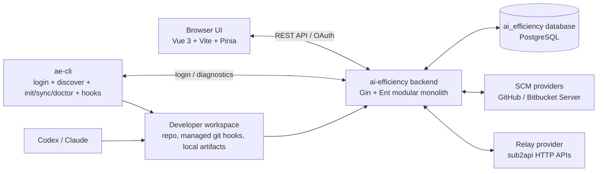
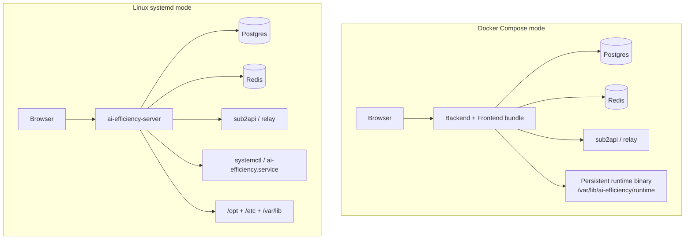
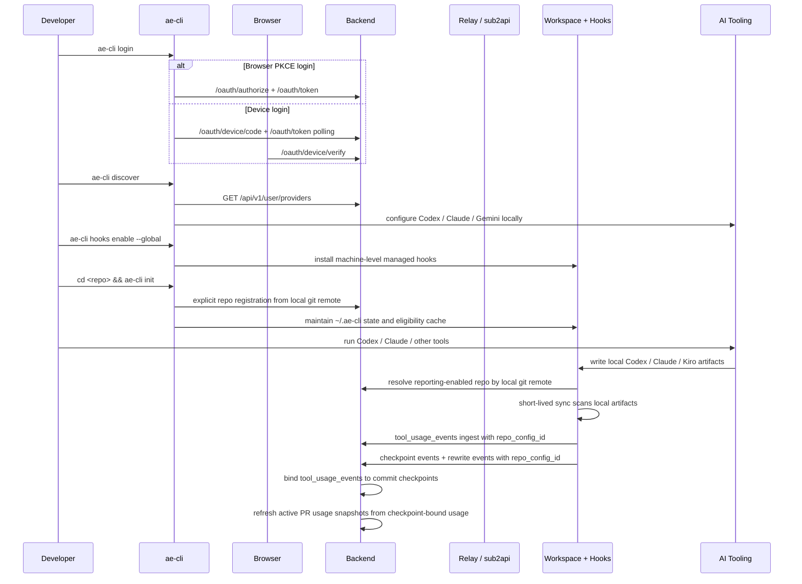
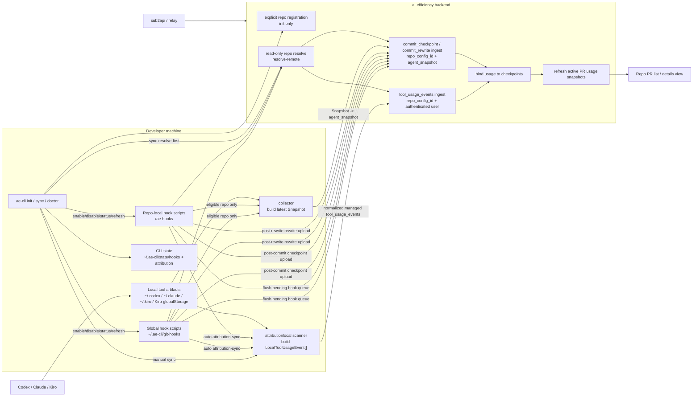

# AI Efficiency Platform Architecture

This document is the project-level architecture overview for `ai-efficiency`.

- Use this file for the current system map, runtime relationships, and module boundaries.
- Use the topic-specific specs in `docs/superpowers/specs/` for detailed contracts.
- When documents disagree, prefer the newest relevant spec plus the current code.
- This file should always reflect the latest implemented project-level architecture.
- Topic specs may intentionally preserve point-in-time design decisions and trade-offs; do not rewrite them wholesale just to mirror the latest code if doing so would erase architectural evolution.
- When newer specs supersede or conflict with older specs, record that relationship in the newer spec rather than back-editing historical specs to mirror the latest implementation.

## Source-of-Truth Order

1. Topic-specific current specs:
   - `docs/superpowers/specs/2026-05-19-ae-cli-deterministic-tool-configuration-design.md`
   - `docs/superpowers/specs/2026-05-14-legacy-session-staged-cutover-design.md`
   - `docs/superpowers/specs/2026-05-13-sessionless-local-tool-attribution-design.md`
   - `docs/superpowers/specs/2026-04-15-oauth-device-login-design.md`
   - `docs/superpowers/specs/2026-04-14-llm-settings-runtime-editing-design.md`
   - `docs/superpowers/specs/2026-03-24-oauth-cli-login-design.md`
2. This architecture overview
3. Historical design context when needed:
   - `docs/superpowers/specs/2026-04-02-local-session-proxy-design.md`
   - `docs/superpowers/specs/2026-03-26-session-pr-attribution-design.md`
   - `docs/superpowers/specs/2026-03-17-ai-efficiency-platform-design.md`

## Current System Context

```mermaid
flowchart LR
    Browser["Browser UI<br/>Vue 3 + Vite + Pinia"]
    CLI["ae-cli<br/>login + discover + init/sync/doctor + hooks"]
    Tool["Codex / Claude"]
    Backend["ai-efficiency backend<br/>Gin + Ent modular monolith"]
    DB[("ai_efficiency database<br/>PostgreSQL")]
    SCM["SCM providers<br/>GitHub / Bitbucket Server"]
    Relay["Relay provider<br/>sub2api HTTP APIs"]
    Workspace["Developer workspace<br/>repo, managed git hooks, local artifacts"]

    Browser <-->|REST API / OAuth| Backend
    CLI <-->|login / diagnostics| Backend
    CLI --> Workspace
    Tool --> Workspace
    Workspace --> Backend
    Backend <--> DB
    Backend <--> SCM
    Backend <--> Relay
```

### Notes

- `ai-efficiency` is a standalone system. It integrates with `sub2api` through relay/provider HTTP APIs rather than direct database coupling.
- The backend is the central orchestration point for auth, repo configuration, attribution, provider management, and SCM/webhook workflows.
- Runtime config remains a startup bootstrap input, not the user-facing provider source of truth. On first startup the backend can seed the primary `RelayProvider` row from `relay.*` config, but `/user`, settings, and normal provider surfaces operate on DB-backed `RelayProvider` records rather than a runtime fallback provider contract.
- The frontend is built separately and embedded into the backend binary during Docker build, so the backend process serves both API routes and the SPA entrypoint in deployed images.
- The embedded SPA now exposes a regular-user `/user` surface for profile summary, provider-aware CLI install/login/discover guidance, machine-level global hook setup, per-repo `init` / `doctor` readiness guidance, and provider-first, group-second credential self-serve driven by the current relay user's allowed groups. User-owned API keys are partially masked in the browser but remain copyable when relay returns the key value. Create/regenerate operations require the relay user's own write credential because sub2api's `/api/v1/keys` endpoint requires a user JWT; the RelayProvider admin API key can list user keys and manage relay users but cannot replace user credentials for key creation. Existing relay users, including relay admins, must have an encrypted local `relay_auth_password` captured by Relay SSO before `/user` can create/regenerate their LLM API keys; LDAP logins preserve that saved relay password while updating `auth_source` to `ldap`. If an existing relay user has no stored relay write credential, `/user` returns a clear credential-required error and does not update the relay password. New LDAP users that have no relay account are provisioned during LDAP login with a generated relay-side password, and only that generated password is stored encrypted for later user-JWT key writes. The same page can test the current user's own active provider key through `/api/v1/user/providers/:id/test` using the selected group's `group_id`, platform, and a caller-supplied model; the backend probes sub2api with the platform-native endpoint (`/v1/chat/completions` for OpenAI, `/v1/messages` for Anthropic, and `/v1beta/models/{model}:generateContent` for Gemini). The admin Relay Providers surface is CRUD-only and does not expose this test action. `ae-cli discover` now consumes the same user-provider credential surface at `/api/v1/user/providers`, with `/api/v1/providers` kept only as an older backend compatibility fallback.
- Browser login loads `/api/v1/auth/options` before choosing auth sources. If `auth.ldap.url` is configured it defaults to LDAP and also offers Relay SSO; otherwise it shows only Relay SSO. Dev Login is exposed only when the debug endpoint is explicitly enabled. LDAP passwords are used only for LDAP bind and are never forwarded to relay user create/update APIs. LDAP relay identity resolution prefers an exact relay email match before canonical username provisioning, and when a linked relay user has a valid role the local user role follows that relay role. When a successful LDAP login reuses an existing local `relay_sso` row by username/email, the backend updates the local `auth_source` to `ldap` so `/auth/me` and the `/user` profile reflect the actual latest login provider, while preserving any Relay SSO-captured `relay_auth_password` for later relay user JWT acquisition.
- Official production deployment now has two supported paths: Docker Compose and Linux systemd.
- The business entrypoint remains the backend service that also serves the frontend bundle.
- Docker/Compose mode now runs the backend from a persistent runtime binary under the deployment state directory and updates that runtime binary directly instead of using an updater sidecar.
- When `AE_CONFIG_PATH` is unset, Docker/Compose and local runtime modes materialize a writable config file under the deployment state directory (or the current working directory outside managed deployment) so admin settings can persist.
- Linux systemd mode installs the backend under `/opt/ai-efficiency`, keeps config in `/etc/ai-efficiency/config.yaml`, and performs binary self-update plus `.backup` rollback.
- `deploy/` also includes non-production `dev` / `local` compose paths for local verification.
- Public health endpoints expose liveness/readiness, and admin settings expose deployment status plus update controls.
- `ae-cli login` now supports both browser PKCE and OAuth device flow. Headless Linux environments are expected to use `ae-cli login --device`, while desktop/browser-capable environments still default to PKCE.
- Backend-issued auth tokens currently default to a 2-hour access JWT plus a 7-day refresh token. The frontend retries a non-auth `401` once via `/api/v1/auth/refresh`, and `ae-cli` refreshes `~/.ae-cli/token.json` before authenticated commands when the token is expired or within the refresh window.
- `ae-cli discover` now provides the current user-facing tool-configuration path for supported local agents. It fetches provider-delivered base URLs plus group-scoped credentials from the backend, detects installed tools locally, and writes deterministic local config only for tools whose platform credential exists: Codex uses `openai`, Claude uses `anthropic`, and Gemini uses `gemini`.
- The old ae-cli session runtime/helper packages are no longer present in the active code path. Backend-side legacy `session` schema and runtime compatibility have also been removed; the remaining `matched_session_ids` / `session_ids` fields are historical names that now carry tool-native session identifiers.

## Current Production Deployment

The current deployment model is split by runtime mode.

```mermaid
flowchart TD
    subgraph Compose["Docker Compose mode"]
    Browser["Browser"]
    Backend["Backend + Frontend bundle"]
    Runtime["Persistent runtime binary<br/>/var/lib/ai-efficiency/runtime"]
    DB[("Postgres")]
    Redis[("Redis")]
    Relay["sub2api / relay"]

    Browser --> Backend
    Backend --> DB
    Backend --> Redis
    Backend --> Relay
    Backend --> Runtime
    end

    subgraph Systemd["Linux systemd mode"]
    Browser2["Browser"]
    Backend2["ai-efficiency-server"]
    Systemctl["systemctl / ai-efficiency.service"]
    FS["/opt + /etc + /var/lib"]
    Relay2["sub2api / relay"]
    DB2[("Postgres")]
    Redis2[("Redis")]

    Browser2 --> Backend2
    Backend2 --> DB2
    Backend2 --> Redis2
    Backend2 --> Relay2
    Backend2 --> Systemctl
    Backend2 --> FS
    end
```

### Deployment Notes

- Official deploy assets live under `deploy/`.
- `deploy/docker-compose.yml` is the bundled-infra path.
- `deploy/docker-compose.external.yml` is the external-infra path.
- `deploy/docker-compose.dev.yml` is the source-build local validation path.
- `deploy/docker-compose.local.yml` is the directory-backed local validation path.
- `deploy/docker-deploy.sh` is the preflight entrypoint.
- `deploy/install.sh` is the Linux systemd installer entrypoint.
- `deploy/ai-efficiency.service` is the packaged systemd unit template.
- `deploy/migrate-sqlite-to-postgres.sh` is the one-time bootstrap path from local SQLite data into the local Postgres test environment.
- `deploy/.env.example` is the operator-facing configuration template.
- Backend deployment status, update, rollback, and restart APIs are first-class admin surfaces across Docker and non-Docker modes.

## Current Runtime Flow

The current implementation now uses one formal attribution path:

- sessionless flow centered on `ae-cli init`, `ae-cli sync`, tool-local artifacts, and git checkpoints

```mermaid
sequenceDiagram
    participant Dev as Developer
    participant CLI as ae-cli
    participant Browser as Browser
    participant BE as Backend
    participant Relay as Relay / sub2api
    participant WS as Workspace + Hooks
    participant Tool as AI Tooling

    Dev->>CLI: ae-cli login
    alt Browser PKCE login
        CLI->>BE: /oauth/authorize + /oauth/token
    else Device login
        CLI->>BE: /oauth/device/code + /oauth/token polling
        Browser->>BE: /oauth/device/verify
    end
    Dev->>CLI: ae-cli discover
    CLI->>BE: GET /api/v1/user/providers
    CLI->>Tool: configure Codex / Claude / Gemini locally
    Dev->>CLI: ae-cli hooks enable --global
    CLI->>WS: install machine-level managed hooks
    Dev->>CLI: cd <repo> && ae-cli init
    CLI->>BE: explicit repo registration from local git remote
    CLI->>WS: maintain ~/.ae-cli state and eligibility cache
    Dev->>Tool: run Codex / Claude / other tools
    Tool->>WS: write local Codex / Claude / Kiro artifacts
    WS->>BE: resolve reporting-enabled repo by local git remote
    WS->>WS: short-lived sync scans local artifacts
    WS->>BE: tool_usage_events ingest with repo_config_id
    WS->>BE: checkpoint events + rewrite events with repo_config_id
    BE->>BE: bind tool_usage_events to commit checkpoints
    BE->>BE: refresh active PR usage snapshots from checkpoint-bound usage
```

### Runtime Boundaries

- `ae-cli` owns the sessionless CLI workflow: explicit repo registration, hook management, short-lived attribution sync, and diagnostics.
- `ae-cli discover` is intentionally deterministic in the current codebase: no backend LLM loop and no `/api/v1/tools/discover` endpoint. It uses the selected provider directly (primary by default, `--provider` to override), maps installed tools to the backend-returned `group.platform`, and writes only the matching tool-native config files or environment hooks.
- `ae-cli` login selection is split between browser PKCE and device flow, but both paths still end in the same backend-issued JWT and `~/.ae-cli/token.json` storage model, with automatic refresh against `/api/v1/auth/refresh` when the stored token is nearing expiry.
- The backend owns durable state, repo discovery/ensure from local git remotes, repo configuration, user/provider mapping, attribution, PR usage snapshots, and SCM/webhook handling.
- The backend auth chain prefers LDAP for implicit login requests when the LDAP provider is registered, falls back to relay SSO when registered, and resolves/provisions relay identities for LDAP users with relay-side generated credentials rather than the LDAP login password. LDAP identity resolution first reuses an exact relay email match, then falls back to canonical username or legacy username lookup; a linked relay role of `admin` or `user` is synced into the local user record so LDAP login does not downgrade an existing relay admin account. Relay SSO stores the relay password encrypted for later relay user JWT acquisition, and LDAP logins preserve that saved password when reusing the same local user. New LDAP users provisioned into relay receive a generated relay-side password that is stored encrypted; existing relay users without a stored relay write credential are not password-repaired by `/user` create/regenerate.
- The backend OAuth handler now manages both short-lived authorization codes and short-lived device entries in memory.
- In the current embedded-frontend deployment, OAuth browser entry routes such as `/oauth/authorize` and `/oauth/device` serve the bundled SPA directly by path, so proxy scheme/host rewriting cannot turn `frontend_url` into a self-redirect loop. Deployments without an embedded frontend still use the configured redirect.
- Relay/sub2api remains the upstream auth/LLM/usage integration boundary and attribution fallback source.
- SCM providers now reference reusable credentials instead of storing raw secret blobs inline.
- Repo-to-`scm_provider` binding is an admin-managed lifecycle step rather than a hard precondition for attribution.
- Active SCM-dependent product features such as PR sync and webhook registration require a bound repo and return `repo_unbound` when invoked before binding.
- The repo scan, optimize-preview, and repo-chat product surfaces have been retired from the active API and frontend.
- Repo-level cached AI score summaries are no longer part of the active dashboard or repo UI/API contract.

## Attribution Runtime Status

The formal workflow uses the sessionless local attribution path that reads local tool artifacts and binds them to checkpoints without requiring a long-lived local daemon. The old session/local-proxy runtime has been retired.

```mermaid
flowchart LR
    Tools["Codex / Claude / Kiro"]

    subgraph Local["Developer machine"]
        CLI["ae-cli init / sync / doctor"]
        GlobalHooks["Global hook scripts<br/>~/.ae-cli/git-hooks"]
        RepoHooks["Repo-local hook scripts<br/><git common dir>/ae-hooks"]
        Artifacts["Local tool artifacts<br/>~/.codex / ~/.claude / ~/.kiro / Kiro globalStorage"]
        Collector["collector<br/>build latest Snapshot"]
        Scanner["attributionlocal scanner<br/>build LocalToolUsageEvent[]"]
        State["CLI state<br/>~/.ae-cli/state/hooks + attribution"]
    end

    subgraph Backend["ai-efficiency backend"]
        Register["explicit repo registration<br/>init only"]
        Resolve["read-only repo resolve<br/>resolve-remote"]
        Checkpoint["commit_checkpoint / commit_rewrite ingest<br/>repo_config_id + agent_snapshot"]
        Usage["tool_usage_events ingest<br/>repo_config_id + authenticated user"]
        Bind["bind usage to checkpoints"]
        PRUsage["refresh active PR usage snapshots"]
    end

    UI["Repo PR list / details view"]
    Relay["sub2api / relay"]

    CLI --> Register
    CLI -->|"enable/disable/status/refresh"| GlobalHooks
    CLI -->|"enable/disable/status/refresh"| RepoHooks
    CLI --> State
    CLI -->|"manual sync"| Scanner
    Tools --> Artifacts
    GlobalHooks --> Resolve
    RepoHooks --> Resolve
    CLI -->|"sync resolve-first"| Resolve
    GlobalHooks -->|"eligible repo only"| Collector
    RepoHooks -->|"eligible repo only"| Collector
    GlobalHooks -->|"flush pending hook queue"| Checkpoint
    RepoHooks -->|"flush pending hook queue"| Checkpoint
    GlobalHooks -->|"post-commit checkpoint upload"| Checkpoint
    RepoHooks -->|"post-commit checkpoint upload"| Checkpoint
    GlobalHooks -->|"post-rewrite rewrite upload"| Checkpoint
    RepoHooks -->|"post-rewrite rewrite upload"| Checkpoint
    GlobalHooks -->|"auto attribution-sync"| Scanner
    RepoHooks -->|"auto attribution-sync"| Scanner
    Artifacts --> Collector
    Artifacts --> Scanner
    Collector -->|"Snapshot -> agent_snapshot"| Checkpoint
    Scanner -->|"normalized managed tool_usage_events"| Usage
    Resolve --> Checkpoint
    Resolve --> Usage
    Usage --> Bind
    Checkpoint --> Bind
    Bind --> PRUsage
    PRUsage --> UI
    Relay --> Backend
```

### Status

- Current formal CLI/runtime path:
  `ae-cli hooks enable --global` is the recommended one-time machine-level hook setup in the `/user` guide, while `ae-cli init` remains the per-repo registration/cache bootstrap command and can still optionally enable managed hooks with `--hooks repo` or `--hooks global`; the default is `--hooks none`. `ae-cli sync` remains a manual backfill/recovery command; hooks normally trigger checkpoint and managed tool-usage upload after eligible commits. `ae-cli sync` and managed git hooks are resolve-first paths: they use read-only `resolve-remote`, run only for backend-known reporting-enabled repositories, and never create repos. All checkpoint, rewrite, and managed tool-usage uploads carry `repo_config_id`. The local collection layer is split in two: `ae-cli/internal/collector` builds bounded hook-time `agent_snapshot` caches, while `ae-cli/internal/attributionlocal` extracts `tool_usage_events` for backend ingest. `Codex` is normalized under `tool = "codex"`; the scanner reads global `~/.codex/sessions/**/*.jsonl` plus a compatibility `~/.codex/logs_2.sqlite` branch gated by jsonl-discovered session ids, with first-run sqlite reads limited to a recent row window before normal watermark-based incrementals. `Kiro` is normalized under `tool = "kiro"` across legacy `~/.kiro/sessions/cli/*.json`, modern `~/Library/Application Support/kiro-cli/data.sqlite3`, and Kiro IDE execution metadata under `~/Library/Application Support/Kiro/User/globalStorage/kiro.kiroagent/**`; Kiro IDE attribution uses `workspace-sessions/<workspace>/sessions.json` as the chat-session index and execution detail JSON files with `usageSummary[].unit=credit` as the durable credit fact source, so the current stable Kiro contract is credits/request-count rather than tokens. Backend ingests `tool_usage_events`, binds them to checkpoints, and refreshes PR usage snapshots from checkpoint-bound usage.
- Trigger boundary:
  `collector` is only triggered inside eligible git-hook handling (`post-commit` / `post-rewrite`) and writes hook-time `Snapshot` data into checkpoint `agent_snapshot`. Hook commands run with a short overall timeout and fail open on timeout so local artifact scanning, backend calls, or queued replay cannot block `git commit`. Before a new checkpoint or rewrite is uploaded, the current code replays only queued workspace hook events whose `server_url`, `auth_subject`, `repo_config_id`, `repo_key`, and `workspace_id` match the current stable context. `ae-cli sync` plus hidden `ae-cli hook attribution-sync` use the same resolved context before scanning local artifacts. Managed tool-usage uploads omit raw local source paths, source locators, and raw payloads. `attributionlocal` scanning remains the only source that produces `tool_usage_events` for PR/commit aggregation.
- Local state and hook ownership:
  Active user-level CLI state lives under `~/.ae-cli/`: auth in `~/.ae-cli/token.json`, global managed hook scripts in `~/.ae-cli/git-hooks`, hook eligibility and installation state under `~/.ae-cli/state/hooks`, and attribution state under `~/.ae-cli/state/attribution`. Repo-local managed hooks live under the canonical git common directory at `<git common dir>/ae-hooks`. Managed hooks resolve the runtime binary from `AE_CLI_BIN`, then `~/.local/bin/ae-cli`, then `PATH`. AE-managed hook installation owns the configured `core.hooksPath` layer it writes and does not chain previous hooks; `--force` authorizes overwriting the relevant path.
- Current formal frontend surface:
  repo detail pages show PR usage summaries and commit usage details directly, rather than user-facing attribution status controls.
- Current global event surface:
  `/events` is a protected top-level page for browsing backend-ingested `tool_usage_events`. It shows summary cards plus event-level rows, scopes regular users to their own events, and only exposes full raw source/path/payload detail to admins.
- Remaining direction:
  richer reporting surfaces and any later cleanup of historical attribution-only fields/tables that are no longer product-primary

## Module Responsibilities

### Backend

| Area | Paths | Responsibility |
| --- | --- | --- |
| Auth and identity | `backend/internal/auth`, `backend/internal/oauth` | Config-aware login source exposure, LDAP-first auth when configured, relay SSO fallback, local token issuance, user identity mapping |
| Credentials | `backend/internal/credential` | Reusable encrypted secret assets, payload validation, provider credential migration, and credential masking |
| Relay integration | `backend/internal/relay` | Unified relay/sub2api adapter and usage/API key operations |
| SCM integration | `backend/internal/scm`, `backend/internal/webhook`, `backend/internal/prsync` | SCM provider abstraction, webhook ingestion, PR synchronization, and active-PR usage snapshot refresh |
| Repo and efficiency | `backend/internal/repo`, `backend/internal/efficiency` | Explicit repo registration, read-only hook eligibility resolution, repo binding from configured SCM metadata, PR labeling, and dashboard-facing summary inputs |
| Session and attribution | `backend/internal/checkpoint`, `backend/internal/attribution`, `backend/internal/prusage` | Commit checkpoints, rewrite mapping, checkpoint-bound tool usage propagation, and PR usage summary/detail snapshot generation |
| API surface | `backend/internal/handler`, `backend/internal/middleware` | HTTP handlers, routing, auth middleware, settings endpoints |

### Frontend

| Area | Paths | Responsibility |
| --- | --- | --- |
| Views | `frontend/src/views` | Dashboard, repos, events, oauth, user self-serve, and admin/settings pages |
| Data access | `frontend/src/api`, `frontend/src/stores` | Backend API clients, state management, request orchestration |
| App shell | `frontend/src/components`, `frontend/src/router` | Layout, navigation, route composition |

### ae-cli

| Area | Paths | Responsibility |
| --- | --- | --- |
| Auth and backend access | `ae-cli/internal/auth`, `ae-cli/internal/client` | Login flow, backend API calls, token usage |
| Sessionless runtime | `ae-cli/internal/session`, `ae-cli/internal/hooks`, `ae-cli/internal/hookstate`, `ae-cli/internal/collector`, `ae-cli/internal/attributionlocal` | Git-context workspace identity, hook management, context-bound hook state, hook-time snapshot collection, and local tool-usage event extraction/upload |
| Tool selection | `ae-cli/internal/router` | Lightweight tool-routing helpers used by the current CLI surface |

## Documentation Expectations

Update this file when any of the following changes:

- component boundaries between frontend, backend, ae-cli, SCM, or relay
- runtime flow for login, hooks, attribution, or legacy compatibility boundaries
- source-of-truth precedence across the core specs

Also update the relevant spec in `docs/superpowers/specs/` when the change is contract-level rather than only diagram-level.
