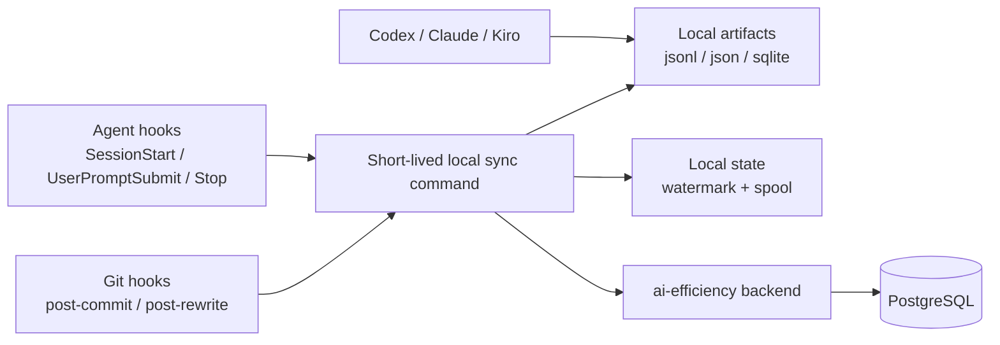

# Sessionless Local Tool Attribution 设计文档

**Date:** 2026-05-13  
**Status:** 部分实现，继续收口中  
**Scope:** `backend/`, `ae-cli/`, `docs/`  
**Related:**  
- [2026-03-26-session-pr-attribution-design.md](./2026-03-26-session-pr-attribution-design.md)  
- [2026-04-02-local-session-proxy-design.md](./2026-04-02-local-session-proxy-design.md)  
- [docs/architecture.md](../../architecture.md)

**Implementation Note:**
- 本文定义的是新的运行时方向，不代表其中所有能力都已完整落地。
- 当前代码已经落地了部分 sessionless local attribution 组件，例如本地 artifact 解析、`tool_usage_events` ingest、checkpoint-time binding。
- 当前 CLI 正式主工作流已收口到 `ae-cli login/init/sync/doctor`、workspace marker、git hooks 与 tool-local artifact 扫描；旧的 `start` / local proxy / runtime bundle 代码仍可能留在代码树中，但不再是项目级当前产品路径。项目级当前状态仍以 [`docs/architecture.md`](../../architecture.md) 和现有代码为准。

**Spec Relationship:**
- 本文修改 [`2026-03-26-session-pr-attribution-design.md`](./2026-03-26-session-pr-attribution-design.md) 中“平台 session 是本地运行时主语”的合同。新的设计改为：`session` 不再是用户必须显式操作的概念，commit / PR attribution 的主事实源改为本地工具落盘数据加 git checkpoint。
- 本文否定 [`2026-04-02-local-session-proxy-design.md`](./2026-04-02-local-session-proxy-design.md) 中“local proxy / daemon 是长期主路径”的方向。新的设计要求：不依赖本地常驻服务，不要求请求经 AE 中转，tool-local artifacts 才是事实源，agent hooks 仅作为触发与修补层。
- 前述历史 spec 保留其各自时间点的背景、权衡和实现演进，不回写其正文伪装成当前合同。

## 概述

用户当前的核心目标不是保留 `ae-cli start/stop/flush` 这一套开发仪式，而是稳定回答四个问题：

1. 某个人消耗了多少 token / credit
2. 某个项目消耗了多少 token / credit
3. 某个 PR 消耗了多少 token / credit
4. 某个 commit 消耗了多少 token / credit

同时存在明确约束：

1. 不希望继续强化 CLI 驱动的开发方式
2. 不接受本地常驻 daemon / proxy / OS service
3. 不希望为了归因去修改 `sub2api`
4. 仍希望结合现有 agent hooks / git hooks 提高同步及时性与恢复能力

在这些约束下，本设计选择一条新的主路径：

- **事实源**：读取本机 `Codex / Claude / Kiro` 实际落盘的 session / usage 数据
- **触发层**：使用 `agent hooks` 和 `git hooks` 触发增量扫描与补传
- **绑定层**：使用 `commit checkpoint` 和 `commit rewrite` 把 usage 绑定到 commit / PR
- **恢复层**：使用本地 watermark 和 spool 保证 fail-open 与可补采

这条链路的重点不是“在请求发出时就把它打进平台 session”，而是：

- 不改变用户日常使用工具的方式
- 不强迫所有请求经过 AE 网关
- 仍然能在 commit / PR 维度上产出稳定、可审计、可恢复的 attribution 结果

## 背景与约束

### 当前实现的问题

当前实现围绕 `ae-cli` session 建模：

1. `ae-cli start` bootstrap backend session
2. workspace marker / runtime bundle 绑定到该 session
3. local proxy 记录 usage
4. `commit checkpoint` 绑定到该 session

这种模型的问题不在于它不能工作，而在于它与用户现在的运行约束冲突：

1. 用户不想保留显式的 `start/stop/flush`
2. 用户不想为了统计而额外启动本地服务
3. 用户不想把 `sub2api` 请求流量改成 AE 中转
4. 用户不想为了 attribution 改造自己的日常交互方式

### 设计约束

本设计必须同时满足：

1. 不修改 `sub2api`
2. 不依赖本地常驻后台进程
3. 不要求工具流量改走 AE 网关
4. 不要求用户日常显式创建 / 结束平台 session
5. commit / PR 归因必须建立在真实本地工具数据上，而不是纯时间窗口猜测

### 精度边界

本设计明确区分两类精度：

1. **tool-local usage 精度**
   - 对 `Codex`、`Claude` 可做到接近逐 response / 逐 message usage
   - 对 `Kiro` 当前只能稳定拿到 `credit` / `request_count` / `context_usage_percentage`
2. **commit 绑定精度**
   - 第一版以 **checkpoint window binding** 为准
   - 即：将“上一个 checkpoint 之后，到本次 commit 之前”的新 usage events 绑定到本次 commit
   - 第一版**不承诺**“请求发出当下就预先知道它未来一定属于哪个 commit”

若未来需要“请求发出时即显式声明未来 commit 归属”，那需要引入额外的 `change_id` 工作流；本文不把它纳入第一版主合同。

## 方案对比与决策

### 方案 A：保留 hidden internal session row

- 优点：复用现有代码与数据模型最多
- 缺点：本质仍是旧模型的隐藏包装；用户不再显式 `start`，但系统核心仍然围绕平台 session 运转

### 方案 B：本地 daemon / proxy + hooks

- 优点：请求级 usage 采集最直接
- 缺点：违反“不要常驻进程 / 不要平台差异处理”的核心约束

### 方案 C：AE 远端 gateway 中转

- 优点：请求级 usage 可集中观测
- 缺点：违反“不改日常请求路径 / 不想让网关走 AE 中转”的约束

### 方案 D：tool-local artifacts + hooks + commit checkpoints

- 优点：
  - 符合全部运行时约束
  - 不改 `sub2api`
  - 不引入常驻进程
  - 用户无需显式 start/stop
  - 仍可结合 hooks 提升同步质量
- 缺点：
  - 需要做 provider-specific parser
  - 不同工具的数据粒度不完全一致
  - commit 绑定是 checkpoint window 语义，而不是 request 发出时即带未来 commit 标签

**结论：第一版采用方案 D。**

## 观测到的本地工具数据

以下是当前本机已验证存在的本地数据形态。实现必须以这些真实落盘 artifacts 为准，而不是想象中的统一协议。

### Codex

主要数据源：

1. `~/.codex/logs_2.sqlite`
2. `~/.codex/sessions/**/*.jsonl`

已观察到的关键信号：

- `sessions/*.jsonl`
  - `session_meta.id`
  - `session_meta.cwd`
  - `token_count.info.total_token_usage.*`
  - 新格式里还有 `last_token_usage.*`
- `logs_2.sqlite`
  - `feedback_log_body` 中存在 `codex.sse_event`
  - `response.completed`
  - `response.id`
  - `conversation.id`
  - `input_token_count`
  - `output_token_count`
  - `cached_token_count`
  - `reasoning_token_count`

已观察到的风险：

1. sqlite transport log 可能对同一 `response.completed` 产生重复记录
2. jsonl `token_count` 有累计值与最近一次 usage 两种语义，不能直接把总量当作逐 request usage

### Claude

主要数据源：

1. `~/.claude/projects/**/*.jsonl`

已观察到的关键信号：

- `timestamp`
- `cwd`
- `sessionId`
- `gitBranch`
- `message.id`
- `message.usage.*`

已观察到的风险：

1. 同一个 `message.id` 可能在本地日志中出现多次
2. 某些记录是 thinking / 中间态，某些记录是最终 `end_turn` 结果，不能直接全量累加

### Kiro

主要数据源：

1. Kiro IDE execution store：`~/Library/Application Support/Kiro/User/globalStorage/kiro.kiroagent/**`
2. 现代 `kiro-cli` 会话存储：`~/Library/Application Support/kiro-cli/data.sqlite3`
3. 旧摘要文件路径：`~/.kiro/sessions/cli/*.json`
4. 辅助 transcript 路径：`~/.kiro/sessions/cli/*.jsonl`

当前正式主路径需要区分三类实现：

1. Kiro IDE 会话以 `workspace-sessions/<workspace>/sessions.json -> execution detail JSON` 为主
2. `kiro-cli` 终端会话以 `data.sqlite3 -> conversations_v2` 为主
3. 旧桌面摘要文件仍可作为兼容路径保留

已观察到的关键信号：

- `Kiro/User/globalStorage/kiro.kiroagent`
  - `workspace-sessions/<workspace>/sessions.json`
    - `sessionId`
    - `workspaceDirectory`
  - execution detail JSON
    - `chatSessionId`
    - `executionId`
    - `startTime`
    - `endTime`
    - `usageSummary[]`
    - `contextUsagePercentage`
- `kiro-cli/data.sqlite3`
  - `conversations_v2.key` = workspace cwd
  - `conversations_v2.conversation_id`
  - `value.history[].request_metadata.*`
  - `value.user_turn_metadata.usage_info[]`
- 根级：
  - `session_id`
  - `cwd`
  - `created_at`
  - `updated_at`
- `session_state.rts_model_state.conversation_id`
- `session_state.conversation_metadata.user_turn_metadatas[]`
  - `message_ids`
  - `total_request_count`
  - `turn_duration`
  - `context_usage_percentage`
  - `metering_usage[]`
  - `input_token_count`
  - `output_token_count`

已观察到的限制：

1. Kiro IDE 的 `workspace-sessions/*.json` 主要承载 chat transcript，本身不稳定提供 token / credit 真值；真正的 credit 事实落在 execution detail JSON 的 `usageSummary[]`
2. `dev_data/tokens_generated.jsonl` 当前机器样本主要提供 `promptTokens`，`generatedTokens` 基本为 `0`，不能直接作为最终 token 真值源
3. 当前机器样本中的旧摘要文件 `input_token_count` / `output_token_count` 也基本为 `0`
4. `kiro-cli` 的 `user_turn_metadata.usage_info[]`、Kiro IDE execution detail 的 `usageSummary[]` 与旧摘要文件中的 `metering_usage[]` / `total_request_count` 都能稳定提供 credit / request 事实
5. 因此 `Kiro` 第一版适合作为 **credit / request_count** 数据源，而不是 token 真值源
6. 当前实现不会把 `kiro-cli` 或 Kiro IDE 单独写成后端 `tool` 维度；三条来源最终都聚合到 `tool = "kiro"`

## 目标

1. 用户不再需要显式执行 `ae-cli start/stop/flush`
2. 不引入本地常驻 daemon / proxy / service
3. 通过一次性安装把 attribution 接管到机器级 hooks 与本地扫描逻辑
4. 稳定产出 `人 / 项目 / PR / commit` 维度的 usage 聚合
5. `Codex` / `Claude` 以 token 为主，`Kiro` 以 credit 为主
6. hooks 失败不能阻塞正常 git 流程
7. 任意失败都必须可补采、可重放、可去重

## 非目标

1. 第一版不修改 `sub2api`
2. 第一版不要求流量走 AE 中转
3. 第一版不引入本地后台服务
4. 第一版不要求工具原生支持新的显式 `change_id`
5. 第一版不把 `Kiro credit` 强行折算成 token
6. 第一版不把所有历史 session / usage 全量回填到新模型

## 核心决策

| Topic | Decision | Reason |
| --- | --- | --- |
| 运行时主语 | 不再以平台 session 为用户主语 | 用户不想保留 start/stop 式运行时 |
| 事实源 | tool-local artifacts 是主事实源 | 不改 `sub2api`，不走 AE 中转 |
| 本地进程 | 不引入 daemon / proxy / system service | 符合运行时约束 |
| hooks 定位 | `agent hooks` 仅做触发/修补，`git hooks` 做 commit 绑定 | hooks 不足以单独成为事实源 |
| commit 绑定 | 采用 checkpoint window binding | 无额外 change workflow 时最稳妥 |
| Kiro 记账单位 | `credit` / `request_count` | 本地样本 token 字段不可靠 |
| 本地恢复 | watermark + spool | fail-open 且可补采 |
| rewrite 处理 | 通过 `commit_rewrites` 解析最终有效 commit | 避免直接重写 usage 历史 |

## 运行时架构

### 运行时原则

1. 工具正常工作时不依赖 AE 本地后台进程
2. 所有同步动作都由短命命令完成
3. hooks 负责在合适时机触发 sync，而不是直接承担持久化真值
4. 后端只接收已经归一化、已去重、带 workspace/commit 绑定语义的 usage events

## 一次性安装与接管

### 机器级初始化

第一次安装只做以下动作：

1. 完成 AE 登录 / 身份绑定
2. 安装一个轻量本地命令行入口，供 hooks 调用
3. 安装共享 git hooks：
   - `post-commit`
   - `post-rewrite`
4. 为支持 hooks 的工具安装/更新最小 hook 配置：
   - Codex：`SessionStart` / `UserPromptSubmit` / `Stop`
   - Claude：同类 event hooks

这里的本地命令行入口不是用户日常工作入口，而是 hook 执行目标。  
用户不需要围绕它执行 start/stop 生命周期命令。

### 日常使用

用户日常流程保持不变：

1. 正常使用 `Codex`
2. 正常使用 `Claude`
3. 正常使用 `Kiro`
4. 正常 `git commit`

归因系统只在以下时机工作：

1. tool session start / resume
2. user prompt submit
3. tool stop / end_turn
4. `post-commit`
5. `post-rewrite`
6. 手动恢复命令（仅在补采时使用）

## Workspace 身份模型

第一版继续复用现有稳定 derivation：

- `workspace_id = UUIDv5("ae-workspace", canonical_repo_root + "\x1f" + canonical_workspace_root + "\x1f" + canonical_git_dir + "\x1f" + canonical_git_common_dir)`

要求：

1. 同一个 worktree 重复打开，`workspace_id` 稳定不变
2. 同一个 repo 的不同 worktree，`workspace_id` 不同
3. hooks、本地 sync 命令、后端都使用一致 derivation

`workspace_id` 是 commit 绑定的本地锚点，不等于工具原生 session id。

## 本地采集与归一化

### 通用归一化输出

所有工具最终都归一化为 `tool_usage_event`：

- `tool`
- `workspace_id`
- `repo_config_id`
- `user_id`
- `tool_session_id`
- `tool_event_id`
- `observed_start_at`
- `observed_end_at`
- `request_count`
- `usage_unit`
- `input_tokens`
- `output_tokens`
- `cached_input_tokens`
- `reasoning_tokens`
- `credit_usage`
- `context_usage_pct`
- `raw_source_path`
- `raw_source_locator`
- `raw_payload`

字段规则：

1. `Codex` / `Claude` 主要填 token 字段
2. `Kiro` 主要填 `credit_usage` / `request_count`
3. 没有的字段留空，不伪造
4. 当前后端聚合维度只使用 `codex` / `claude` / `kiro` 三个归一化 tool key；`codexapp`、`kiro-cli`、`kiro-ide` 只作为本地来源变体存在于 parser / dedupe key 中，不是独立的 summary 维度

### Codex 解析规则

主次顺序：

1. 当前 `tool_usage_events` 扫描实际会同时接入：
   - `~/.codex/sessions/**/*.jsonl`
   - `~/.codex/logs_2.sqlite`
2. 其中 jsonl 仍承担当前主合同里的 workspace/session 识别、无 `response_id` 时的稳定行级 identity，以及 collector snapshot 的主真值语义
3. sqlite 分支是兼容路径：
   - 当前实现只有在 sqlite `conversation.id` 命中 jsonl 中发现的 workspace session id 时才会 ingest
   - 它不应被描述成独立的 `codexapp` 后端 tool 维度
   - 也不应被描述成当前 PR / commit usage 路径唯一必需依赖

归一化规则：

1. `tool_session_id = session_meta.id`
2. 若某条 `token_count` 带 `response_id`：
   - `tool_event_id = response_id`
3. 若某条 `token_count` **不带** `response_id`：
   - `tool_event_id` 必须从同一 session 文件中的稳定位置派生
   - 当前实现使用 `line:<n>`，即该 `token_count` 在源 `jsonl` 文件中的行号
   - 目标是避免“同一个 session 文件内多次 usage 更新被压成一条 event”
4. 若 jsonl `token_count` 同时包含累计值和最近一次 usage：
   - 优先使用 `last_token_usage`
   - 仅在 `last_token_usage` 缺失时，才直接回退到该行的 `total_token_usage`
5. `raw_source_locator` 应记录稳定源定位信息，当前实现使用 `line:<n>`
6. `dedupe_key` 当前按来源分 namespace：
   - jsonl：`codex-jsonl:<tool_session_id>:<tool_event_id>`
   - sqlite 兼容分支：`codex:<tool_session_id>:<tool_event_id>`

### Claude 解析规则

主数据源：

1. `~/.claude/projects/**/*.jsonl`

归一化规则：

1. `tool_session_id = sessionId`
2. `tool_event_id = message.id`
3. 每条 assistant message 从 `message.usage` 读取 usage
4. 若同一 `(sessionId, message.id)` 出现多条记录：
   - 优先保留最终 `stop_reason = end_turn` 的记录
   - 若无明确最终态，则保留 usage 总量最大的记录
5. thinking / 中间态记录不能与最终态重复累计

### Kiro 解析规则

主数据源：

1. Kiro IDE：`~/Library/Application Support/Kiro/User/globalStorage/kiro.kiroagent/**`
2. `kiro-cli`：`~/Library/Application Support/kiro-cli/data.sqlite3`
3. 兼容路径：`~/.kiro/sessions/cli/*.json`

归一化规则：

1. Kiro IDE 路径：
   - `workspace-sessions/<workspace>/sessions.json` 提供当前 workspace 下的 `chatSessionId` 集合
   - execution detail JSON 提供：
     - `chatSessionId`
     - `executionId`
     - `usageSummary[]`
     - `contextUsagePercentage`
     - `startTime/endTime`
   - `tool_session_id = chatSessionId`
   - `tool_event_id = executionId`
   - `credit_usage = sum(usageSummary[].usage where unit == "credit")`
   - `request_count = 1`
   - `context_usage_pct = contextUsagePercentage`
   - `ObservedAt` 取 `startTime/endTime`
2. `kiro-cli` 路径：
   - `tool_session_id = conversation_id`
   - `tool_event_id` 优先取最近一次 assistant turn 的 `request_metadata.message_id`
   - `credit_usage = sum(user_turn_metadata.usage_info[].value where unit == "credit")`
   - `request_count` 至少为 1；若底层显式记录多次 request，则按记录值写入
   - `context_usage_pct = request_metadata.context_usage_percentage`
   - `ObservedAt` 优先取 `request_start_timestamp_ms` / `stream_end_timestamp_ms`
3. 旧摘要文件路径：
   - `tool_session_id` 优先取 `session_state.rts_model_state.conversation_id`
   - 若缺失，回退到根级 `session_id`
   - 每个 `user_turn_metadata` 视为一个 turn-level usage event
   - `request_count = total_request_count`
   - `credit_usage = sum(metering_usage[].value where unit == "credit")`
   - `context_usage_pct = context_usage_percentage`
4. `dedupe_key` 当前按来源分 namespace：
   - 旧摘要：`kiro:<tool_session_id>:<turn-identity>`
   - `kiro-cli`：`kiro-cli:<tool_session_id>:<tool_event_id>`
   - Kiro IDE：`kiro-ide:<tool_session_id>:<tool_event_id>`
5. `input_tokens` / `output_tokens` 仅在非零且可信时写入；当前代码里只有旧摘要路径会机会性写入 token，`kiro-cli` 与 Kiro IDE 仍只产出 `credit_usage` / `request_count` / `context_usage_pct`
6. 第一版不从 `Kiro` 推导 token 总量

## hooks 的角色

### Agent hooks

Agent hooks 只承担“触发与修补”职责：

1. `SessionStart` / `startup` / `resume`
   - 记录当前 workspace 的活跃 tool session
   - 触发一次轻量 backfill
2. `UserPromptSubmit`
   - 只打 dirty mark
   - 不做重解析，不阻塞用户交互
3. `Stop` / `end_turn`
   - 尝试触发一次 session 末尾 flush

约束：

1. hooks 不能作为唯一事实源
2. 某次 hook 缺失、崩溃、插件失效时，后续 commit / 手动 sync 必须还能补回来
3. `Kiro` 第一版不要求依赖等价 hooks；其主路径是 commit 时扫描本地摘要文件

### Git hooks

Git hooks 是权威绑定层：

1. `post-commit`
   - 创建 / 上报新的 checkpoint
   - 触发本地增量扫描
   - 将新 usage events 绑定到当前 commit
2. `post-rewrite`
   - 记录 `old_commit_sha -> new_commit_sha`
   - 处理 amend / rebase / squash

要求：

1. hooks 必须链式保留已有仓库 hook 逻辑
2. 任何归因失败都不能阻塞正常 commit

## 本地状态与恢复

### 本地状态目录

为淡化“CLI 会话”语义，新的本地状态目录不再以 runtime session 为中心命名。  
第一版建议使用独立目录，例如：

- `~/.ai-efficiency/attribution/`

至少包含：

1. `workspaces/`
2. `watermarks/`
3. `spool/`
4. `hook-health/`

### Watermark

每个工具维护独立 watermark：

1. Codex sqlite：
   - 上次已处理的 log row id 或等价单调位点
2. Codex jsonl：
   - 文件偏移或最后处理的 `(path, timestamp, line)`
3. Claude jsonl：
   - 文件偏移或最后处理的 `(sessionId, message.id)`
4. Kiro json：
   - `(session file, turn index)` 或 `(tool_session_id, loop_id)`

### Spool

本地 spool 存：

1. 已抽取但未上传成功的 `tool_usage_event`
2. 已生成但未上传成功的 checkpoint binding
3. rewrite 事件

原则：

1. 任意上传失败都先落 spool
2. 后续 commit、SessionStart、Stop 或手动 `sync` 都尝试重放

## 后端数据模型

### 复用现有表

继续复用：

1. `users`
2. `repo_configs`
3. `commit_checkpoints`
4. `commit_rewrites`
5. `pr_records`
6. `pr_attribution_runs`

### 新增 `workspaces`

字段：

- `workspace_id`
- `user_id`
- `repo_config_id`
- `first_seen_at`
- `last_seen_at`
- `last_branch`
- `last_head_sha`

责任：

1. 表示“这个人在哪个工作区里产生了 usage”
2. 不是 session 表的翻版
3. 不承载 token/cost 事实本身

### 新增 `tool_usage_events`

字段：

- `id`
- `tool`
- `workspace_id`
- `repo_config_id`
- `user_id`
- `tool_session_id`
- `tool_event_id`
- `observed_start_at`
- `observed_end_at`
- `request_count`
- `usage_unit`：`token` / `credit`
- `input_tokens`
- `output_tokens`
- `cached_input_tokens`
- `reasoning_tokens`
- `credit_usage`
- `context_usage_pct`
- `commit_checkpoint_id`（nullable）
- `dedupe_key`（unique）
- `raw_payload`
- `created_at`

约束：

1. 一条 usage event 最终最多绑定到一个 checkpoint
2. 一条 usage event 的幂等性由 `dedupe_key` 保证
3. `dedupe_key` 由 provider-specific identity 生成，例如：
   - Codex jsonl：`codex-jsonl:<tool_session_id>:<tool_event_id>`
   - Codex sqlite：`codex:<tool_session_id>:<tool_event_id>`
   - Claude：`claude:<tool_session_id>:<tool_event_id>`
   - Kiro 旧摘要：`kiro:<tool_session_id>:<turn-identity>`
   - `kiro-cli`：`kiro-cli:<tool_session_id>:<tool_event_id>`
   - Kiro IDE：`kiro-ide:<tool_session_id>:<tool_event_id>`

### 为什么不再以 `session` 为主外键

原因：

1. 用户不再显式操作平台 session
2. 事实源变成工具本地 artifacts，而不是 bootstrap session
3. 继续强绑平台 session 只会保留旧模型的复杂度

兼容策略：

1. 第一版允许历史 `session` 相关 UI 与接口继续存在
2. 新 attribution 主链路不以 `session_usage_events` 为中心扩展
3. 后续如需迁移历史页面，应通过新 spec 单独定义

## Commit / PR 绑定语义

### Commit 绑定

`post-commit` 时：

1. 解析当前 workspace 的稳定 `workspace_id`
2. 找到该 workspace 的上一个 checkpoint
3. 扫描并抽取“自上次 watermark 以来的新 usage events”
4. 过滤出：
   - 同一 workspace
   - `observed_at <= 当前 commit captured_at`
   - 尚未绑定到其他 checkpoint
5. 将其绑定到当前 checkpoint

这一定义的含义是：

- **这批 usage events 归属于当前 commit 对应的开发区间**

### Rewrite / Amend / Rebase

`post-rewrite` 不直接回改 `tool_usage_events` 历史行，而是：

1. 记录 `old_commit_sha -> new_commit_sha`
2. PR 归因与 commit 查询在读取时沿 rewrite 图解析“当前有效 commit”

好处：

1. 避免直接重写 usage 历史
2. 对 amend / squash / rebase 更稳
3. 审计面更清晰

### PR 汇总

PR attribution 时：

1. 取 PR 当前有效 commit 集
2. 沿 `commit_rewrites` 解析最新有效 sha
3. 汇总这些 commits 对应 checkpoint 上绑定的 `tool_usage_events`
4. 分别输出：
   - token 指标（Codex / Claude）
   - credit 指标（Kiro）

## 报表语义

### 人 / 项目 / PR / commit

统一支持四层聚合：

1. 人：按 `user_id`
2. 项目：按 `repo_config_id`
3. commit：按 `commit_checkpoint_id`
4. PR：按 PR 当前有效 commit 集

### 指标类型

输出不强行混成一个数字，而是保留两类 usage unit：

1. `token`
2. `credit`

展示规则：

1. `Codex` / `Claude` 主要进入 token 报表
2. `Kiro` 主要进入 credit 报表
3. 汇总页允许同一项目同时显示：
   - token 消耗
   - credit 消耗
   - request_count

## 失败处理

### 失败原则

1. 所有 hooks fail-open
2. 任何解析失败、网络失败、后端失败都不阻塞正常开发流程
3. 失败只影响“数据何时补齐”，不影响“数据最终是否可恢复”

### 恢复入口

需要提供一个手动恢复命令，例如：

- `ae sync`

用途：

1. 主动补采本地 usage
2. 回放 spool
3. 重建缺失 watermark

该命令不是日常 start/stop 生命周期的一部分，仅作为恢复工具存在。

## 测试与验证

### 解析层单测

必须覆盖：

1. Codex sqlite `response.completed` 去重
2. Codex jsonl `last_token_usage` 优先级
3. Claude 同一 `message.id` 重复记录去重
4. Kiro `credit_usage` 聚合与 `conversation_id` 提取

### 绑定层集成测试

必须覆盖：

1. 多次 commit 的 checkpoint window 绑定
2. 同一 workspace 连续 commit 不重复计数
3. amend / rebase / squash 后 PR 汇总仍稳定
4. 重跑 sync 不重复写入

### 手工验收

至少验证三条真实链路：

1. `Codex`：
   - 做一次真实对话
   - commit 后看到 token usage 绑定到新 checkpoint
2. `Claude`：
   - 做一次真实对话
   - commit 后看到 message-level usage 绑定到新 checkpoint
3. `Kiro`：
   - 做一次真实对话
   - commit 后看到 `credit_usage` / `request_count` 绑定到新 checkpoint

### 验证口径

对外必须明确：

1. `Codex` / `Claude`：token attribution
2. `Kiro`：credit attribution
3. commit attribution：checkpoint window 语义
4. PR attribution：当前有效 commit 集语义

## 分阶段落地

1. 新增 `workspaces` 与 `tool_usage_events`
2. 实现本地 watermark / spool 框架
3. 实现 `Codex` parser：
   - sqlite 主路径
   - jsonl fallback
4. 实现 `Claude` parser：
   - message-level usage 去重
5. 实现 `Kiro` parser：
   - credit / request_count 路径
6. 接入 `agent hooks` 触发轻量 sync
7. 接入 `post-commit` / `post-rewrite` 权威绑定
8. 在 attribution / report 读取链路中加入新 usage source

## 为什么第一版不强推 `change_id`

`change_id -> commit_sha` 两阶段绑定在理论上更接近“每条请求在请求发出时就声明未来 commit 归属”，但它需要：

1. 在同一 workspace 内维护当前 active change
2. 用户或工具在并行开发多个未来 commit 时显式切换 change
3. 额外的本地状态机与交互语义

这与当前约束冲突：

1. 用户希望尽可能规避新的开发动作
2. 用户不想让 attribution 反过来塑造开发流程

因此：

- 第一版先用 checkpoint window binding
- `change_id` 作为后续精度升级方向，在未来新 spec 中单独定义
