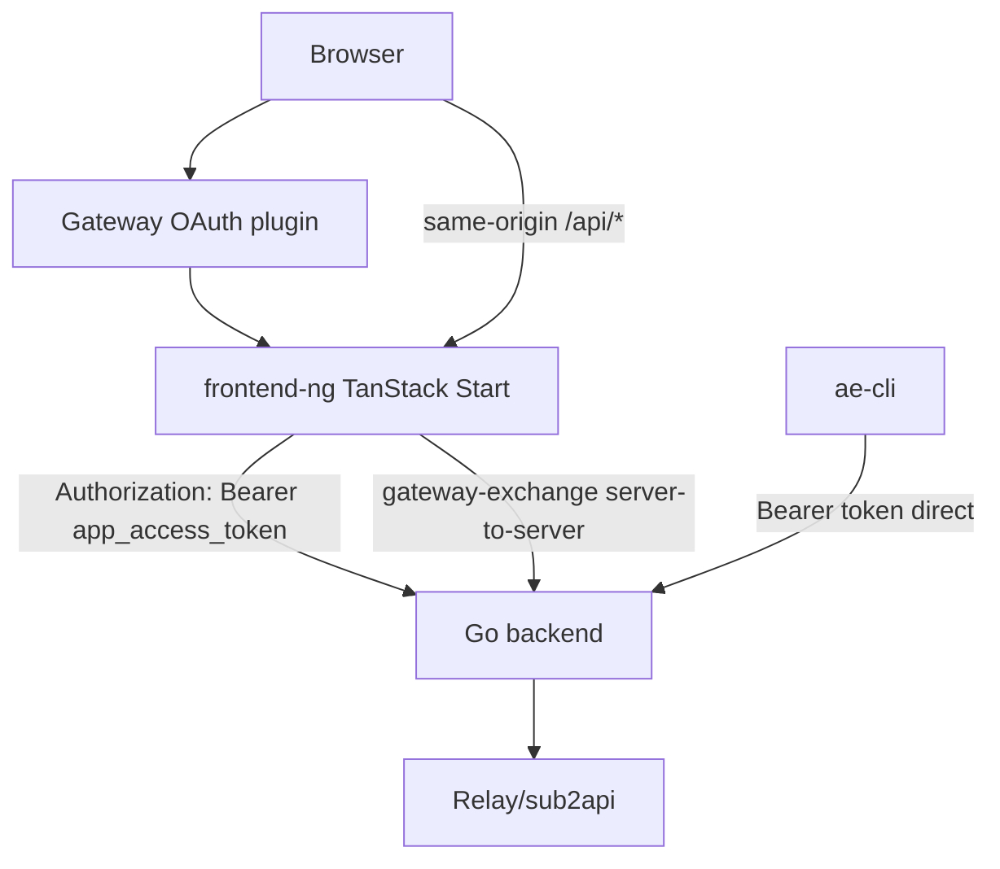

# Frontend-NG TanStack Start Migration Design

**Date:** 2026-06-05
**Status:** Implementation aligned with current `main` frontend capabilities in `frontend-ng/`; production cutover and backend gateway-exchange follow-through remain incomplete
**Scope:** `frontend-ng/`, future frontend deployment, future gateway-aware browser auth, future frontend API proxy
**Related:**
- [2026-03-24-oauth-cli-login-design.md](./2026-03-24-oauth-cli-login-design.md)
- [2026-05-21-user-page-cli-self-serve-design.md](./2026-05-21-user-page-cli-self-serve-design.md)
- [2026-05-29-company-wide-user-home-ux-design.md](./2026-05-29-company-wide-user-home-ux-design.md)
- [2026-05-29-history-pages-task-zone-ui-redesign-design.md](./2026-05-29-history-pages-task-zone-ui-redesign-design.md)
- [2026-05-30-company-wide-usability-hardening-design.md](./2026-05-30-company-wide-usability-hardening-design.md)
- [docs/architecture.md](../../architecture.md)

## Spec Relationship

- 本文定义一个新的 `frontend-ng/` TanStack Start 迁移方向，作为未来前端替换合同。
- 当前实现已在 `frontend-ng/` 落地第一批迁移代码，但这不改变当前生产架构。当前生产架构仍以 [`docs/architecture.md`](../../architecture.md) 为准：Vue frontend 构建产物仍在 Docker build 阶段嵌入 Go backend，并由 backend serve SPA。
- 当前实现阶段不修改现有 `frontend/`、backend embedded frontend、当前 deploy/Dockerfile 主链路，也不删除旧 Vue frontend。
- 如果未来实现使 `frontend-ng/` 成为正式生产入口，必须同步更新 `docs/architecture.md`，并在对应实现计划中明确 current implementation change 与 design documentation update 的边界。
- 本文不回写历史 frontend UX specs。历史 specs 保留当时的 Vue/task-zone 背景；`frontend-ng/` 实现应继承其中的业务合同，而不是逐像素继承旧组件实现。

## Problem

当前 Vue frontend 已经承载了登录、OAuth CLI 授权、用户自助接入、repo/PR、usage events、admin users、settings 等核心能力，但它与 Go backend 的部署和浏览器认证耦合较强：

1. 当前部署把 frontend dist 嵌入 backend binary，backend 同时 serve API 与 SPA。
2. 浏览器代码直接管理 app access token / refresh token，并通过 `Authorization: Bearer` 调 backend API。
3. 未来线上入口前面会先经过 gateway OAuth plugin，浏览器侧会存在 gateway auth 与 AI Efficiency app auth 两层。
4. 新 frontend 计划独立部署，不再依赖 backend host 静态页面。
5. Local development 仍必须能复现 gateway 登录后的真实使用体验，而不是退化成独立的 mock login。
6. UI/UX 将由单独设计流程给出；实现必须使用标准化 shadcn/ui 组件与 MiSans 字体，不能在每个页面散写硬编码 UI。

本迁移需要解决的不只是 React 替换 Vue，而是浏览器入口、auth 边界、proxy 边界、localdev handoff、组件治理与全路由 parity。

## Goals

1. 在 `frontend-ng/` 下建立独立 TanStack Start 项目，使用 Bun 管理依赖和脚本。
2. 保持当前业务 URL contract，完整迁移现有 Vue 路由，而不是只做样板页。
3. Browser 只访问 TanStack Start frontend origin；业务 API 通过 TanStack server 同源 proxy 转发到 Go backend。
4. AI Efficiency app auth authority 仍属于 Go backend；TanStack 只持有 HttpOnly cookies、执行 bootstrap/refresh/proxy，不引入自己的 session database。
5. Gateway OAuth 只证明外层身份；AI Efficiency role 和业务权限只信 Go backend `/api/v1/auth/me`。
6. Localdev 支持从线上 gateway 登录态生成一次性 handoff code，本地 redeem 后写 localhost HttpOnly app cookie，并通过本地 TanStack proxy 访问配置的 backend。
7. `frontend-ng` 使用 shadcn/ui、MiSans、项目级标准组件和业务 patterns 落地设计规范。
8. 迁移保留当前后端 API response shape、危险操作确认、权限 guard、空态、错误态和业务行为。

## Non-Goals

1. 不在本阶段修改现有 `frontend/`。
2. 不在本阶段修改 backend embedded frontend serve 逻辑。
3. 不在本阶段修改当前 deploy/Dockerfile 主链路。
4. 不把 TanStack Start 变成第二套业务后端；业务事实、权限和数据写入仍由 Go backend 决定。
5. 不让 Browser 直接访问真实 Go backend origin 作为主路径。
6. 不把 gateway cookie、gateway JWT 或完整 gateway 登录信息复制到 localhost。
7. 不复活历史 `local proxy` / session runtime 语义。本文的 proxy 只指 frontend dev/API proxy。
8. 不在 Claude design 交付前实现具体页面视觉布局。
9. 不逐像素复刻 Vue；验收重点是 behavior parity、route parity、data parity 和 permission parity。

## Reviewed Alternatives

### Option A: Browser Calls Go Backend Directly

浏览器直接配置 Go backend API origin，通过 Bearer token 调用 `/api/v1/*`。

优点：

- 最接近当前 Vue frontend API client。
- TanStack server 参与度低，首轮迁移代码少。

缺点：

- 与 HttpOnly cookie 目标冲突，浏览器仍需要理解 token。
- CORS、真实 backend origin、gateway 与 app auth 边界会继续泄露到浏览器代码。
- localdev 需要额外模拟线上 backend/gateway 行为。

### Option B: TanStack BFF-Lite Proxy

浏览器只打 TanStack 同源 `/api/*`，TanStack server 从 HttpOnly app cookie 取 Go app access token，转发到 Go backend。

优点：

- 浏览器不读 token，不知道真实 backend origin。
- 线上和 localdev 使用同一条 API 路径。
- Go 仍是 auth authority，TanStack 不需要 session DB。
- `ae-cli` 继续直接使用 Go backend Bearer token，不受影响。

缺点：

- TanStack server 需要实现 allowlist proxy、refresh retry、cookie 管理和 bootstrap。
- 前端部署从纯静态站点变成 server-capable app。

### Option C: Full TanStack Business Backend

TanStack server 直接实现 typed server actions、聚合业务逻辑和部分权限判断。

优点：

- 前端调用体验可高度定制。
- 可以减少部分 Go API roundtrip。

缺点：

- 形成第二套业务后端，权限、错误处理和数据合同容易漂移。
- 与当前 Go modular monolith 边界冲突。
- 迁移风险过高。

### Decision

采用 **Option B: TanStack BFF-Lite Proxy**。

TanStack server 负责 frontend-origin auth/bootstrap/proxy，但不拥有业务事实。Go backend 继续拥有 app JWT、user role、relay identity、repo、events、settings、admin users、OAuth protocol 和 CLI contracts。

## Route Parity

`frontend-ng` 第一版必须保持当前 Vue 路由路径不变：

| Route | Migration Target |
| --- | --- |
| `/login` | Fallback/manual login page |
| `/oauth/authorize` | Browser authorization approval page |
| `/oauth/device` | Device verification page |
| `/` | Current dashboard / user-home route parity, final layout follows approved design |
| `/repos` | Repository list and binding workflows |
| `/repos/:id` | Repository detail, PR sync, PR usage freshness |
| `/events` | Usage/event records with filters and detail |
| `/user` | User setup, CLI guidance, provider/group credential self-serve |
| `/admin/users` | Admin user management and subscription jobs |
| `/settings` | Admin settings task zones |

Internal module names may change, but external URLs, query semantics that are already used by backend/CLI/browser flows, and role access expectations must remain compatible.

## High-Level Architecture



Frontend browser code must not know the real Go backend origin in normal operation. The configured backend URL is a TanStack server concern.

## Auth Model

### Ownership

- Gateway OAuth proves outer identity.
- Go backend remains AI Efficiency app auth authority.
- TanStack server stores Go-issued access/refresh JWTs in HttpOnly cookies.
- Browser JS never reads access token or refresh token.
- TanStack does not create a Redis/session-store backed identity layer.
- `ae-cli` continues to store and use Go-issued Bearer tokens directly.

### Cookies

`frontend-ng` should use HttpOnly cookies for app tokens:

- access cookie: short lived, used by TanStack proxy.
- refresh cookie: longer lived, used only by TanStack server refresh route/proxy retry.
- cookies should use `Secure` in production, `SameSite=Lax` by default, path scoped to frontend origin, and explicit names that distinguish AI Efficiency app cookies from gateway cookies.

The browser-facing API client does not attach `Authorization` headers. It calls same-origin routes and relies on cookies.

### Bootstrap

Normal online flow:

1. User opens frontend origin.
2. Gateway OAuth plugin ensures gateway identity exists before frontend handler runs.
3. TanStack server checks for existing app cookies.
4. If app cookies are missing or invalid, TanStack server reads gateway identity and calls Go `gateway-exchange`.
5. Go creates/syncs the local user, resolves/provisions relay identity, signs app JWT pair, and returns tokens.
6. TanStack server writes HttpOnly app cookies.
7. Browser loads app data through same-origin `/api/v1/auth/me`.

`/login` remains as fallback/manual/debug UI. Gateway-authenticated users should not normally see a second AI Efficiency login prompt.

### Gateway Exchange

`gateway-exchange` is a narrow backend capability for TanStack server only:

- Browser must not call it directly.
- The request must include server-to-server credential accepted by Go, such as shared secret/internal token.
- Gateway claims supplied to Go must come from TanStack server after gateway validation, not browser JSON.
- Required gateway claim: `email`.
- Optional gateway claims: `name`, `username`, `displayName`, gateway subject/id.
- Missing email must fail bootstrap.

User mapping rules:

- Existing local user is primarily found by email.
- `username` is a secondary display/login field. Prefer gateway `name` / `username`; otherwise derive from email local-part.
- If email matches an existing user, reuse that user and do not randomly suffix username.
- Add `gateway_oauth` as a future `auth_source` enum value.
- Updating `auth_source` to `gateway_oauth` must not clear `relay_user_id` or encrypted `relay_auth_password`.

Role rules:

- Gateway only proves identity.
- Go backend decides AI Efficiency role.
- Existing local user role is preserved.
- New gateway users default to `user`.
- Frontend route guards and admin navigation only trust `/api/v1/auth/me.role`.
- Gateway permissions/groups must not auto-promote users to admin unless a later backend-owned, explicit mapping spec defines it.

Relay identity rules:

- `gateway-exchange` must synchronously ensure relay identity before issuing app session.
- If local user has no `relay_user_id`, Go should use LDAP-like relay identity resolver behavior: resolve by email/username or provision a relay user with generated relay-side password.
- Gateway tokens/passwords must not be stored in Go or forwarded to relay as relay credentials.
- Existing relay binding and encrypted relay password must be preserved.
- Relay resolution failure should fail bootstrap rather than issue a partial session that later breaks `/user`.

## API Proxy

### Proxy Path

Browser calls:

```text
/api/v1/*
```

on the TanStack frontend origin.

TanStack server forwards to configured Go backend:

```text
{BACKEND_URL}/api/v1/*
```

and attaches:

```text
Authorization: Bearer <app_access_token>
```

when an app access cookie exists.

### Allowlist

The proxy must not blindly expose every backend path. First implementation should use coarse allowlist prefixes:

- `/api/v1/auth/*`
- `/api/v1/user/*`
- `/api/v1/repos*`
- `/api/v1/events*`
- `/api/v1/admin/*`
- `/api/v1/settings*` or the concrete settings/admin config prefixes discovered during implementation
- additional current Vue API prefixes only after route-by-route audit

OAuth protocol endpoints are not part of the generic `/api/v1/*` proxy decision.

### Refresh Retry

If Go returns `401` for a proxied request:

1. TanStack server uses the refresh cookie to call Go `/api/v1/auth/refresh`.
2. The refresh token is sent server-to-server in the JSON body expected by current Go code.
3. If refresh succeeds, TanStack resets cookies and retries the original proxied request once.
4. If refresh fails, TanStack clears app cookies and returns an auth failure that route guards convert into bootstrap/login flow.

This avoids requiring Browser JS to hold refresh tokens and avoids requiring Go auth middleware to read browser cookies in the first migration slice.

## OAuth CLI Browser Routes

CLI OAuth protocol ownership remains split:

- Browser UI pages move to TanStack routes:
  - `GET /oauth/authorize`
  - `GET /oauth/device`
- Protocol/write endpoints remain Go backend contracts and are reached through TanStack proxy or direct CLI calls as appropriate:
  - `POST /oauth/authorize/approve`
  - `POST /oauth/device/verify`
  - `POST /oauth/device/code`
  - `POST /oauth/token`

`ae-cli` must continue to call Go backend protocol endpoints directly. The TanStack frontend must not reimplement OAuth code issuance, token exchange, or device code state.

## Local Development

Localdev must work without weakening the production auth model.

### Handoff

Use a frontend-owned app-token handoff rather than copying gateway cookies:

1. Developer opens the gateway-compatible online frontend route `/oauth2/local?target=http://localhost:3000`.
2. The gateway OAuth plugin may first complete its registered `/oauth2/callback` redirect and then return to `/oauth2/local`.
3. Gateway-authenticated online TanStack server reads the current Go-issued app token cookies.
4. Online server redirects to `http://localhost:3000/oauth2/local?access_token=...&refresh_token=...`.
5. Local TanStack server writes localhost HttpOnly app cookies.
6. Local browser uses `localhost:3000/api/v1/*` and local TanStack proxy forwards to the configured backend.

`/api/local?target=...` and `/api/local/callback` remain same-origin API compatibility paths, but gateway deployments should prefer `/oauth2/local` because the gateway OAuth client is registered around the `/oauth2/callback` convention.

Handoff constraints:

- Do not serialize gateway cookie values into query parameters.
- Do not store gateway raw tokens on localhost.
- Only Go-issued app tokens are transferred.
- `target` must be validated against allowed localhost origins.

### Backend Target

Localdev proxy should support:

- default target: staging or configured shared backend for realistic gateway/app auth behavior.
- optional target: local Go backend for backend debugging.

The selected backend URL is server-side config only. Browser code should still call same-origin `/api/*`.

## UI and Component Governance

Claude design will define the final UI/UX direction. Until that design is delivered and accepted, implementation should avoid concrete page layout decisions.

Mandatory implementation constraints:

- Use shadcn/ui for base components.
- Use MiSans as the product font.
- Use project-level reusable components before page-specific markup.
- Do not scatter hardcoded colors, spacing, badges, dialogs, tables, forms, empty states, loading states, or confirmation flows across pages.
- Use semantic design tokens and shadcn variants before custom Tailwind styling.
- Use lucide icons unless the accepted design specifies a different installed icon system.

Recommended component layering:

- `components/ui/*`: shadcn CLI-managed source components.
- `components/primitives/*`: small project-level primitives such as `PageHeader`, `StatusBadge`, `ConfirmAction`, `RoleGate`.
- `components/patterns/*`: reusable product patterns such as `DataToolbar`, `FilterBar`, `SettingsSection`, `CredentialRevealDialog`, `JobProgressPanel`.
- `features/*`: route/domain components, grouped by `auth`, `oauth`, `home`, `events`, `repos`, `user-setup`, `admin-users`, `settings`.
- `lib/api/*`: typed client modules that call same-origin proxy.
- `lib/auth/*`: server/client auth bootstrap, cookie and guard helpers.
- `lib/design/*`: tokens, navigation model, role visibility, status mapping, shared copy primitives.

The design system should be established before full page implementation. Page code should consume patterns rather than inventing local variants.

## Migration Order

Full route migration is required, but implementation should proceed in layers:

1. Foundation:
   - Bun + TanStack Start project under `frontend-ng/`.
   - shadcn/ui initialization.
   - MiSans integration.
   - route files for the full parity URL set.
   - server config for backend URL and gateway/localdev settings.
2. Auth and proxy:
   - HttpOnly app cookies.
   - gateway bootstrap route.
   - localdev handoff routes.
   - allowlist `/api/v1/*` proxy.
   - refresh retry.
3. Data contracts:
   - port current Vue `src/api/*` into typed `lib/api/*`.
   - preserve response shapes and error behavior.
4. Shell and guards:
   - app shell from accepted design.
   - `/auth/me` query.
   - route guards and admin guards.
   - shared loading/error/empty states.
5. Low-complexity route migration:
   - `/login`
   - `/oauth/authorize`
   - `/oauth/device`
   - `/events`
6. Medium-complexity route migration:
   - `/repos`
   - `/repos/:id`
7. High-complexity route migration:
   - `/admin/users`
   - `/settings`
   - `/user`
8. Parity regression:
   - role access checks.
   - dangerous action confirmations.
   - error and empty states.
   - mobile/responsive behavior.
   - OAuth CLI browser flow.
   - localdev handoff.

## Current Implementation Snapshot

As of the `frontend-ng` mainline alignment work on 2026-06-09:

- `frontend-ng/` contains a Bun-managed TanStack Start project with MiSans assets, shadcn/ui-style source components, shared primitives, and route files for the full Vue URL set.
- Browser data calls go through same-origin `/api/*`; browser code does not store tokens in `localStorage` and does not attach Bearer tokens.
- TanStack server-side API routes implement app-token HttpOnly cookies, login/dev-login/logout/bootstrap, coarse `/api/v1/*` proxy allowlisting, and refresh retry.
- Gateway bootstrap is wired through a server-side `gateway-exchange` call path, but the Go backend endpoint and deployment gateway header contract still need backend/deploy follow-through before production cutover.
- Local handoff routes now support a pragmatic development transfer: an authenticated online `GET /oauth2/local?target=http://127.0.0.1:4317` redirects to the local `/oauth2/local` callback with app tokens, and the local TanStack server writes localhost-scoped HttpOnly app cookies. `/api/local` remains as a same-origin compatibility path. This copies Go-issued app tokens only; it does not copy gateway cookies or gateway tokens.
- First-pass route migration exists for `/login`, `/oauth/authorize`, `/oauth/device`, `/`, `/repos`, `/repos/:id`, `/events`, `/user`, `/admin/users`, and `/settings`.
- React i18n is now installed through `i18next` / `react-i18next`, locale preference is stored in the `ae.locale` cookie, and a regression guard enforces locale key parity, prevents Chinese copy outside the zh-CN resource table, and blocks page-level visible English copy outside message resources except for explicit product/protocol literals.
- Existing pages now use shadcn primitives for alerts, confirmation dialogs, empty states, selects, checkboxes, accordion sections, tables, and cards instead of browser-native selects/details/confirm flows.
- `/` includes the current personal usage dashboard capability backed by `GET /api/v1/user/usage/dashboard`, with shadcn chart composition and locale-aware formatting.
- `/login` and `/oauth/*` now preserve safe same-origin redirects, current backend login source casing, unauthenticated OAuth redirect-to-login behavior, OAuth approve payload semantics, defensive missing-redirect handling, and normalized device codes.
- `/repos` now preserves binding filter URL state, page/page-size list queries, health summary, SCM/org grouping, two-step delete confirmation, auto-bind summary messages, direct repo creation from parsed GitHub/Bitbucket URLs, current repo inventory workbench data from `GET /api/v1/repos/inventory`, and batch failed-webhook repair through `POST /api/v1/repos/repair-webhooks`.
- `/events` now preserves the Vue filter contract for time range, tool, binding status, text query, admin user filter, URL query state, limit/offset pagination, and structured usage event detail sections including matched PRs and admin-only raw metadata.
- `/repos/:id` now preserves the PR list months filter, limit/offset pagination, PR sync job recovery/polling, sync progress/status messages, unbound-repository sync gating, PR detail expansion, commit usage snapshots/freshness, usage refresh, backend PR attribution settle action, and admin-only webhook repair through `POST /api/v1/repos/:id/repair-webhook`.
- `/user` now preserves the core user setup contract for provider/group selection, session-scoped credential reveal/copy, create/regenerate key actions, backend model discovery, and provider test requests.
- `/admin/users` now preserves search/page/page-size URL query state, visible-row selection, subscription-job payload semantics, active job recovery/polling, job result summaries, encrypted relay password copy, and confirmed plaintext relay password reveal/copy.
- `/settings` now preserves relay providers, SCM providers, advanced credentials, deployment/runtime actions, organization login LDAP get/save/test contracts, and `?section=` deep-link navigation.
- Existing `frontend/`, backend embedded frontend serving, and current deploy mainline are untouched.

## Acceptance Criteria

1. `frontend-ng` has full route parity with current Vue routes.
2. Browser business requests use same-origin `/api/*`; browser code does not reference real Go backend origin.
3. Browser JS cannot read access or refresh tokens.
4. TanStack server can bootstrap app auth from gateway identity and set app cookies.
5. `gateway-exchange` maps users by email, preserves backend-owned role, sets `gateway_oauth` auth source, and ensures relay identity before issuing app tokens.
6. Localdev can obtain app cookies through frontend-owned local handoff and proxy API requests to the configured backend.
7. `ae-cli` direct Go backend auth/OAuth/token flows continue to work.
8. `/user` remains the user setup and provider/group credential self-serve surface; it is not reduced to a profile page.
9. `/admin/users` preserves job-based subscription management and separate relay password reveal behavior.
10. `/settings` preserves current admin configuration capabilities and confirmation requirements.
11. UI implementation uses shadcn/ui, MiSans, and shared project components/patterns.
12. No existing `frontend/`, backend embedded serve, or current deploy mainline logic is modified until a later implementation plan explicitly asks for that phase.

## Open Implementation Notes

- The exact gateway claim extraction mechanism should be copied from the real gateway environment once available. The Metis TanStack Start frontend is a useful reference for gateway cookie/header handling and local handoff shape, but this project should not copy raw cookie handoff behavior.
- The exact shadcn preset/theme remains reviewable after the external design pass; current implementation uses shadcn source components and project primitives so the design tokens can be updated centrally.
- The `/api/v1` allowlist has been audited for the current migrated surfaces and includes the current auth, user, repos, events, admin, and settings prefixes used by route parity.
- If future production deployment makes Go backend inaccessible from the public browser but reachable from TanStack server, CORS can become a compatibility/debug concern rather than the main browser path.
